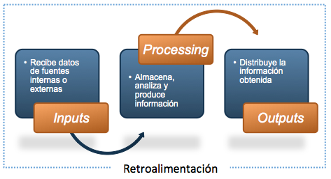
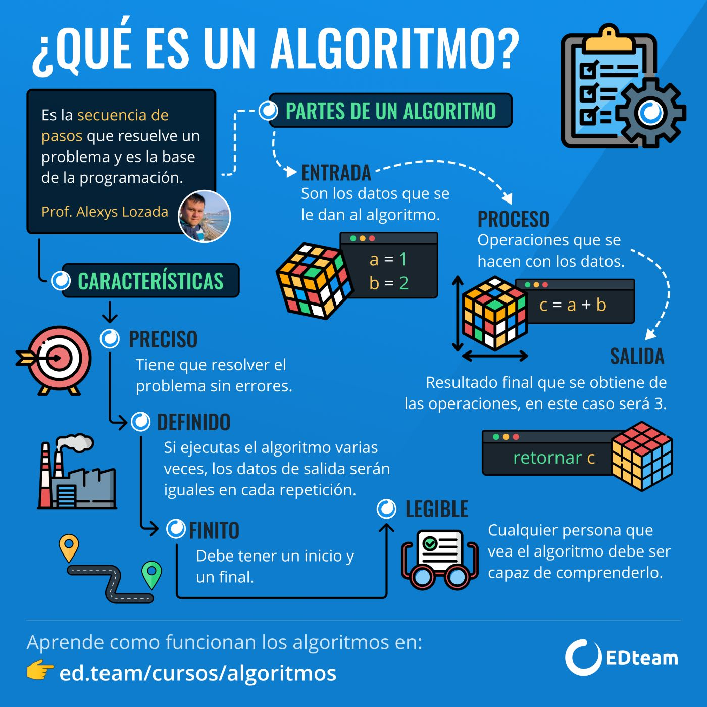
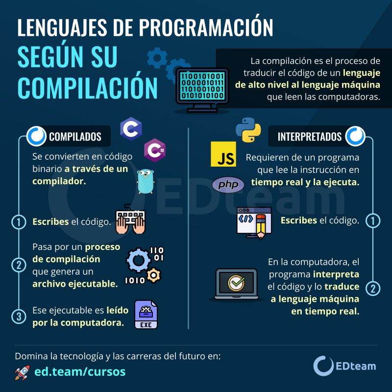

# 01 - Introducción a la Programación Software

!!! tip "Información de la unidad"

    === "Contenidos"

        Introducción a la programación:

        - Concepto de programa y lenguaje de programación.
        - Paradigmas de programación (introducción a la POO).
        - Entornos integrados de desarrollo (IDE): interfaz, creación de proyectos, compilación y ejecución.

        Elementos básicos del lenguaje:

        - Tipos de datos primitivos y su utilidad.
        - Declaración y uso de variables, constantes y literales.
        - Operadores (aritméticos, relacionales, lógicos, asignación) y expresiones.
        - Conversiones de tipo (explícitas e implícitas).
        - Comentarios en el código.

    === "Propuesta didáctica"

        En esta unidad vamos a comenzar a trabajar el **RA1: Reconoce la estructura de un programa informático, identificando y relacionando los elementos propios del lenguaje de programación utilizado.**

        Criterios de evaluación clave que abordaremos:

        - **CE1a**: Se han identificado los bloques que componen la estructura de un programa informático.
        - **CE1b**: Se han creado proyectos de desarrollo de aplicaciones.
        - **CE1c**: Se han utilizado entornos integrados de desarrollo.
        - **CE1d**: Se han identificado los distintos tipos de variables y la utilidad específica de cada uno.
        - **CE1e**: Se ha modificado el código de un programa para crear y utilizar variables.
        - **CE1f**: Se han creado y utilizado constantes y literales.
        - **CE1g**: Se han clasificado, reconocido y utilizado en expresiones los operadores del lenguaje.
        - **CE1h**: Se ha comprobado el funcionamiento de las conversiones de tipo explícitas e implícitas.
        - **CE1i**: Se han introducido comentarios en el código.

<iframe width="780" height="440"  src="https://www.youtube.com/embed/4h7z0VSSMas?list=PLGIH-7eZDbVw6q2AdcAUe2r6YxJYBkfCi" title="(PROG) Programación (1º DAW). UD01. Introducción a la Programación de Software. Ejemplo de Java" frameborder="0" allow="accelerometer; autoplay; clipboard-write; encrypted-media; gyroscope; picture-in-picture; web-share" referrerpolicy="strict-origin-when-cross-origin" allowfullscreen></iframe>

## 1. Fundamentos de la Programación

### 1.1. ¿Qué es Programar?

**Programar** es el proceso de crear software. Esta disciplina abarca desde la concepción inicial de una idea hasta que el programa está implementado y funcionando en un ordenador, enfocándose en los principios y metodologías para el desarrollo y mantenimiento de sistemas de software. Algunos autores consideran que el término "desarrollo de software" es más apropiado que "ingeniería de software".

**Definición de Programa Software**

Un **programa software** es la parte intangible o lógica de un sistema informático, un conjunto de programas que actúan sobre el hardware para ejecutar las tareas deseadas por el usuario. Los programas son métodos para resolver problemas, procesando información para obtener un resultado a partir de datos de entrada. Para que un programa comience a funcionar, sus instrucciones deben ser traducidas a un lenguaje que la máquina entienda.

<figure>
    
    <figcaption align="center">Proceso de Entrada, Proceso y Salida en un Programa</figcaption>
</figure>

**El Proceso de Desarrollo de Software**

El desarrollo de software implica una serie de etapas obligatorias para construir software fiable y de calidad. Estas fases se dividen en tres pasos genéricos: definición (qué desarrollar), desarrollo, y mantenimiento.

Las fases principales del desarrollo de una aplicación informática son:

- **Fase de Resolución del Problema**:

  - **Análisis**: Requiere que el problema sea definido y comprendido claramente. Se establecen los objetivos, el alcance y se realiza un estudio de viabilidad y costes. Se identifican los requisitos funcionales (qué funciones realizará la aplicación) y no funcionales (características de calidad del sistema). También implica analizar la documentación, investigar y recopilar información útil. La culminación es el Documento de Especificación de Requisitos del Software (ERS), que actúa como contrato entre cliente y desarrollador.
  - **Diseño**: Se define "cómo" hacer la solución. Se convierte la especificación del análisis en un diseño detallado, indicando el comportamiento o la secuencia lógica de instrucciones que resuelvan el problema. Se descompone la aplicación en operaciones más sencillas y se asignan a módulos. Incluye el diseño arquitectónico, diseño detallado, diseño de datos y de interfaz de usuario. Es crucial realizar una **prueba o traza del programa** para asegurar la solución antes de la implementación.

  <br/>

- **Fase de Implementación**:

  - **Codificación o Construcción**: Consiste en transformar o traducir los resultados obtenidos a un determinado lenguaje de programación. Se escribe el **código fuente** siguiendo las reglas gramaticales y la sintaxis del lenguaje. El código debe ser modular, correcto, legible, eficiente y portable.
  - **Pruebas de Ejecución y Validación**: Se implanta la aplicación en el sistema y se verifica su funcionamiento. Se utilizan diferentes datos de prueba para ver si el programa responde a los requerimientos. Incluye pruebas unitarias, de integración, funcionales, estructurales y beta testing.
  - **Documentación**: Es vital para el desarrollo y mantenimiento. Se distinguen la **documentación interna** (comentarios en el código fuente) y **documentación externa** (manuales técnicos, de usuario, de instalación, diagramas).

  <br>

- **Fase de Explotación y Mantenimiento**:
  - **Explotación (Despliegue)**: Los usuarios finales utilizan la aplicación. Implica instalación, puesta a punto y funcionamiento en el equipo del cliente.
  - **Mantenimiento**: Periódicamente, se realizan evaluaciones y modificaciones para adaptar el programa a nuevas necesidades, corregir errores o actualizarlo.
  - **Retirada del Software**: Ocurre cuando el software llega al final de su vida útil y no es rentable mantenerlo.

A lo largo de todo el proceso de desarrollo de software, se debe aplicar siempre un **modelo de ciclo de vida**. Estos modelos son la serie de pasos a seguir para desarrollar un programa.

<figure>
    
    <figcaption align="center">Ciclo de Vida del Software</figcaption>
</figure>

### 1.2. Algoritmos: La Receta para Resolver Problemas 🍳

Imagina que quieres hacer una tortilla de patatas. ¿Qué haces? No empiezas a echar ingredientes al azar, ¿verdad? Sigues una serie de pasos ordenados: pelar y cortar las patatas, batir los huevos, freír las patatas, mezclarlo todo y cuajar la tortilla.

Pues bien, un algoritmo es exactamente eso: una secuencia de pasos finitos, claros y ordenados que nos llevan a la solución de un problema o a la consecución de una tarea.

Los algoritmos están por todas partes en nuestra vida, no solo en la informática.

**Concepto de Algoritmo y sus Características**

Un **algoritmo** es una serie de pasos claros y ordenados que te permiten resolver un problema específico. No es un programa de computadora en sí mismo, sino la **idea** detrás del programa. Piensa en él como una receta de cocina: sin importar si la preparas en una estufa de gas, eléctrica o de leña, el resultado es el mismo porque la receta (el algoritmo) es independiente de la herramienta. Un algoritmo te dice **qué hacer** y en qué **orden**, sin importar la máquina o el lenguaje de programación.

!!! tip "Ejemplos de Algoritmos de la Vida Cotidiana"

    -   **Receta de cocina:** Como hemos visto, una receta es un algoritmo perfecto. Te dice qué ingredientes necesitas (datos de entrada) y qué pasos seguir (proceso) para obtener un plato concreto (resultado).

    -   **Montar un mueble de IKEA:** Las instrucciones son un algoritmo. Si te saltas un paso o lo haces en el orden incorrecto, lo más probable es que el mueble no quede bien.

    -   **Seguir una ruta en Google Maps:** Le dices a dónde quieres ir (problema), y la aplicación calcula una serie de instrucciones paso a paso ("gira a la derecha en 200 metros", "continúa recto"...) para que llegues a tu destino (solución).

    -   **Sacar dinero de un cajero:**

        1.  Introducir tarjeta.
        2.  Teclear el PIN.
        3.  Seleccionar "Sacar dinero".
        4.  Elegir la cantidad.
        5.  Recoger el dinero.
        6.  Recoger la tarjeta.
        7.  Finalizar.

    En programación, antes de escribir una sola línea de código, primero pensamos en el algoritmo que resolverá nuestro problema

#### 1.2.1. Características Esenciales

Para que un algoritmo sea considerado de calidad, debe cumplir con las siguientes características:

- **Finito**: Siempre debe terminar en un número limitado de pasos. No puede ser un proceso infinito.
- **Preciso**: Cada paso debe ser claro y no dar lugar a ambigüedades.
- **Definido**: Si usas los mismos datos de entrada, el algoritmo siempre debe producir el mismo resultado.
- **Eficiente**: Debe utilizar la menor cantidad de recursos (tiempo y memoria) posible.
- **General**: Debe servir para resolver una clase de problemas, no solo un caso particular.
- **Correcto**: Debe resolver el problema para el cual fue diseñado.

Además de estas características fundamentales, un buen algoritmo debe ser **comprensible**, **modificable** y **reutilizable**, lo que facilita su uso y mantenimiento a lo largo del tiempo. Para lograrlo, es crucial que esté bien **estructurado** y **documentado** con comentarios. Finalmente, todo algoritmo debe ser **probado** para asegurar que funciona correctamente en todos los casos posibles.

<figure>
    
    <figcaption align="center">Diagrama de flujo de un algoritmo</figcaption>
</figure>

<!-- { width="40%", align="center" } -->

**Reglas para el Diseño de Algoritmos (Abstracción, Modularidad)**

Para diseñar soluciones correctas y eficientes, se deben considerar los siguientes conceptos:

1.  **Abstracción**: Realizar un análisis del problema para descomponerlo en problemas más pequeños y de menor complejidad, describiendo cada uno de manera precisa.
2.  **Divide y vencerás**: Una filosofía general para resolver problemas, central en el enfoque de abstracción y modularidad.
3.  **Encapsulación**: Ocultar la información para poder implementarla de diferentes maneras sin que esto influya en el resto de elementos.
4.  **Modularidad**: Estructurar cada parte en módulos independientes, donde cada uno tendrá su función correspondiente. El diseño modular (top-down design) descompone un problema en subproblemas más sencillos.

Para representar los algoritmos gráficamente, se pueden usar herramientas como **diagramas de flujo** (que usan símbolos gráficos y se utilizan en fases de análisis) y **pseudocódigo** (basado en palabras clave en lenguaje natural y es la técnica más utilizada).

#### 1.2.2. Diferencia entre Algoritmo y Programa

La **diferencia fundamental entre algoritmo y programa** radica en que el algoritmo es una descripción de los pasos para resolver un problema de forma genérica e independiente de la máquina y del lenguaje de programación. En cambio, el **programa** consiste en esos mismos pasos, pero escritos en un lenguaje de programación específico para que puedan ser ejecutados en un ordenador y obtener la solución. Los lenguajes de programación son solo un medio para expresar el algoritmo, y el ordenador es el procesador para ejecutarlo.

**Tabla 1: Comparación entre Algoritmo y Programa**

| Característica           | Algoritmo                                                     | Programa                                                 |
| :----------------------- | :------------------------------------------------------------ | :------------------------------------------------------- |
| **Nivel de Abstracción** | Genérico, independiente de la máquina y el lenguaje.          | Específico, escrito en un lenguaje de programación.      |
| **Formato**              | Secuencia de pasos lógicos, pseudocódigo, diagramas de flujo. | Código fuente, instrucciones en un lenguaje concreto.    |
| **Ejecución**            | No ejecutable directamente por una máquina.                   | Ejecutable por un ordenador después de ser traducido.    |
| **Objetivo**             | Describir la solución a un problema.                          | Implementar la solución para que una máquina la ejecute. |

## 2. Lenguajes de Programación

### 2.1. Conceptos Fundamentales del Lenguaje

Un **lenguaje de programación** es un idioma artificial, un conjunto de reglas sintácticas y semánticas, símbolos y palabras especiales establecidas para la construcción de programas. Estos elementos permiten al programador escribir secuencias de comandos para que una máquina realice un comportamiento deseado.

Los elementos que componen un lenguaje de programación son:

- **Léxico (Alfabeto)**: Es el conjunto finito de símbolos permitidos y palabras especiales, el vocabulario del lenguaje: letras, dígitos, operadores, signos de puntuación y palabras reservadas. Estos símbolos se combinan para formar los elementos básicos del lenguaje, como identificadores, literales y operadores. Ejemplos de léxico son: `+`, `-`, `*`, `/`, `=`, `;`, `{}`, `()`, `if`, `else`, `while`, `for`, `int`, `decimal`, `string`, `bool`, etc.
- **Sintaxis**: Son las normas de construcción que rigen la estructura de las declaraciones y expresiones válidas en el lenguaje. Se refiere a las posibles combinaciones de los símbolos y palabras especiales. Define cómo se deben organizar los elementos léxicos para formar sentencias correctas. Por ejemplo, en muchos lenguajes, una sentencia de asignación debe seguir la estructura `identificador = expresión;`. La sintaxis es crucial para que el compilador o intérprete pueda entender y procesar el código correctamente. Ejemplo de una sentencia sintácticamente correcta: `int numero = 10;`.
- **Semántica**: Es el significado de las construcciones y define las acciones que se llevarán a cabo con las combinaciones de los símbolos. Es importante tener en cuenta que pueden existir sentencias sintácticamente correctas, pero semánticamente incorrectas. Por ejemplo, la sentencia `int numero = "texto";` es sintácticamente correcta, pero semánticamente incorrecta porque intenta asignar un valor de tipo cadena a una variable de tipo entero. La semántica asegura que las operaciones y combinaciones de elementos tengan sentido dentro del contexto del lenguaje y el problema que se está resolviendo.

### 2.2. Paradigmas de Programación

Un **paradigma de programación** es un modelo fundamental o una filosofía para el diseño y la implementación de programas. Este modelo determina cómo será el proceso de diseño y la estructura final del código. Son como las "reglas del juego" que guían cómo se aborda la solución de un problema. El objetivo es reducir la dificultad para el mantenimiento, mejorar el rendimiento del programador y, en general, mejorar la productividad y calidad de los programas.

**Tipos de Paradigmas**

Existen diversos paradigmas, y muchos lenguajes modernos son multiparadigma, combinando características de varios para ofrecer flexibilidad (ej. Python, JavaScript, Java, Kotlin, C#).

- **Programación Imperativa/Estructurada**: Se basa en una serie de comandos que la computadora ejecuta en orden para cambiar el estado del programa. Utiliza estructuras como sentencias secuenciales, selectivas (condicionales) y repetitivas (bucles). Ejemplos incluyen C y Pascal.
- **Programación Procedimental**: Un subtipo del paradigma imperativo. Los programas se organizan en procedimientos (o funciones) que manipulan el estado global del programa, buscando la modularidad. Ejemplos incluyen C, Pascal y BASIC.
- **Programación Orientada a Objetos (POO)**: Es el paradigma más utilizado. Los programas se construyen como una colección de **objetos** que interactúan entre sí. Un objeto es una instancia de una **clase** que contiene datos (atributos) y métodos para operar sobre ellos. La POO promueve la reutilización de código, depuración más sencilla y mejor mantenimiento, basándose en pilares como el polimorfismo, la herencia y la encapsulación. Ejemplos: C++, Python, Kotlin, C#. Java es un lenguaje totalmente orientado a objetos.
- **Programación Declarativa**: Los programas describen el **resultado deseado**, no el proceso paso a paso para lograrlo. Suelen ser lenguajes interpretados.
  - **Lógica**: Utiliza reglas y afirmaciones de lógica formal para que la computadora deduzca la respuesta, muy usada en inteligencia artificial. Ejemplo: Prolog.
  - **Funcional**: Se enfoca en el uso de **funciones matemáticas** que no cambian el estado ni los datos externos, promoviendo código modular y estructurado. Ejemplos: Lisp, Haskell, Scala.
- **Programación de Eventos**: El flujo del programa es impulsado por **eventos** (clics, movimientos del ratón, etc.). Común en interfaces gráficas de usuario (GUI) y servidores.
- **Programación Reactiva**: Un subtipo de la programación de eventos que gestiona flujos de datos asincrónicos y la propagación de cambios, ideal para aplicaciones en tiempo real.
- **Programación Multiparadigma**: Lenguajes que admiten y combinan múltiples paradigmas, permitiendo elegir el mejor enfoque para cada parte del problema. Ejemplos: C++, JavaScript, Python, Kotlin, C#.

### 2.3. Clasificación de Lenguajes de Programación

Los lenguajes de programación pueden ser clasificados en función de lo cerca que estén del lenguaje humano o del lenguaje de los computadores.

!!! info "Según su cercanía al lenguaje humano (Nivel de Abstracción)"

    === "Lenguajes de Bajo Nivel"

        Totalmente dependientes de la máquina; un programa no puede migrarse a otras máquinas. Aprovechan al máximo las características del hardware.

          - **Lenguaje Máquina**: Instrucciones en combinaciones de unos y ceros (código binario). Es el único lenguaje que el ordenador entiende directamente (no necesita traducción). Fue el primer lenguaje, único para cada procesador (no portable), rápido pero difícil de manejar y depurar.

            | Operación | Lenguaje máquina | Decimal |
            | :-------- | :--------------- | :------ |
            | SUMAR     | 00101101         | 45      |
            | RESTAR    | 00010011         | 19      |
            | MOVER     | 00111010         | 58      |

          - **Lenguaje Ensamblador**: Sustituyó al lenguaje máquina, utilizando mnemotécnicos (códigos de operación) en lugar de binarios. Necesita un programa ensamblador que lo traduzca a lenguaje máquina para ejecutarse. Aunque más legible, sigue siendo de bajo nivel, dependiente del hardware y difícil de usar, interpretar y modificar.

            | Operación   | Mnemotécnico |
            | :---------- | :----------- |
            | MULTIPLICAR | MUL          |
            | DIVIDIR     | DIV          |
            | MOVER       | MOV          |

    === "Lenguajes de Bajo Medio"

        **Lenguajes de Medio Nivel**: Término no universalmente aceptado, se refiere a lenguajes como C que pueden acceder a registros del sistema y direcciones de memoria (características de bajo nivel) mientras realizan operaciones de alto nivel.

    === "Lenguajes de Alto Nivel"

        **Lenguajes de Alto Nivel**: Cercanos al lenguaje natural (inglés), independientes de la arquitectura del ordenador. Permiten al programador abstraerse del funcionamiento interno de la máquina. Utilizan sentencias y órdenes derivadas del idioma inglés. Necesitan un traductor para ser entendidos por la máquina. Incorporan librerías, funciones predeterminadas y suelen ofrecer *frameworks*. La mayoría de los lenguajes actuales se engloban aquí. Ejemplos: C++, Java, Python, JavaScript, PHP.

<br/>

### 2.3.2. Según su mecanismo de traducción (Compilados, Interpretados, Mixtos)

Los programas se traducen a código binario ejecutable mediante compilación o interpretación.

- **Lenguajes Compilados**: Necesitan un **compilador** que traduce el código fuente completo a código objeto (o código máquina) en un solo paso, antes de la ejecución. La ejecución es eficiente. Requieren un enlazador para unir el código objeto con librerías. El código es más seguro, ya que el código fuente no es directamente accesible. Ejemplos: C y C++.

  Un compilador realiza varias fases:

  1.  Análisis Léxico: Agrupa el código fuente en _tokens_.
  2.  Análisis Sintáctico: Comprueba la estructura gramatical y genera un árbol sintáctico.
  3.  Análisis Semántico: Verifica la lógica y compatibilidad de tipos.
  4.  Generación de Código Intermedio: Un código de bajo nivel independiente de la arquitectura.
  5.  Optimización de Código: Mejora el código para mayor eficiencia.
  6.  Generación de Código Objeto: Convierte el código a lenguaje máquina específico.
  7.  Enlazador (Linker): Une el código objeto con librerías.

- **Lenguajes Interpretados**: No generan código objeto. Un **intérprete** lee y ejecuta el código fuente línea a línea, o instrucción por instrucción, en el momento. Son menos eficientes en ejecución que los compilados, ya que se traducen en tiempo de ejecución. Requieren que el intérprete esté cargado en memoria. El código fuente es legible, lo que puede comprometer la seguridad. Ejemplos: Perl, PHP, Python, JavaScript.

- **Lenguajes Mixtos o Virtuales (Intermediarios)**: Combinan características de ambos. El código fuente se compila a un código binario intermedio (no ejecutable) llamado **bytecode**. Este bytecode es luego interpretado por una **máquina virtual** para ejecutarlo en cualquier plataforma compatible. Son más portables, buscando "compilar una vez y ejecutar en cualquier sistema". Java y C# son ejemplos clave de lenguajes mixtos.

<figure>
    
    <figcaption align="center">Diferencias entre lenguajes compilados, interpretados y mixtos</figcaption>
</figure>

#### 2.3.3. Según su sistema de tipos (Rigidez, Momento de Verificación, Declaración, Sin Tipado)

Un **tipo de dato** es una clasificación que define el conjunto de valores que una variable puede tomar y las operaciones válidas que se pueden realizar sobre esos valores. Esta clasificación es fundamental porque **determina la cantidad de memoria que el sistema operativo debe reservar** para la variable.

El **sistema de tipos** de un lenguaje de programación es un conjunto de reglas que definen cómo se manejan y verifican estos tipos de datos.

!!! tip "Sistemas de Tipado"

    *   **Rigidez (Tipado Fuerte vs. Tipado Débil)**:
        *   **Tipado Fuerte**: Requiere que los tipos de datos sean compatibles para realizar operaciones, evitando conversiones automáticas o "implícitas" entre tipos no relacionados. Esto previene errores inesperados y hace el código más robusto. Ejemplos: Python, Java, C#, Ruby.
        *   **Tipado Débil**: Permite conversiones de tipo automáticas, lo que puede llevar a errores difíciles de detectar. Ejemplos: JavaScript, PHP, VBScript.
    *   **Momento de Verificación (Tipado Estático vs. Tipado Dinámico)**:
        *   **Tipado Estático**: La verificación de tipos se realiza en **tiempo de compilación**. El tipo de cada variable debe ser conocido y, a menudo, declarado explícitamente antes de ejecutar el programa. Si hay un error de tipo, el programa no compilará. Garantiza mayor seguridad y rendimiento. Ejemplos: C++, Java, C#, Swift.
        *   **Tipado Dinámico**: La verificación de tipos se realiza en **tiempo de ejecución**. No es necesario declarar el tipo de una variable explícitamente; el intérprete lo determina automáticamente. Una misma variable puede cambiar de tipo durante la ejecución. Ofrece flexibilidad, pero los errores de tipo solo se descubren en ejecución. Ejemplos: Python, JavaScript, Ruby, PHP.
    *   **Declaración (Tipado Explícito vs. Implícito - Inferencia)**:
        *   **Tipado Explícito**: El programador debe declarar manualmente el tipo de cada variable. Ejemplo en C++: `int numero = 10;`.
        *   **Tipado Implícito (Inferencia de Tipos)**: El compilador o intérprete deduce el tipo de la variable a partir del valor asignado, sin que el programador tenga que declararlo. Esto hace el código más conciso y rápido de escribir. Ejemplo en Python: `numero = 10;`.
    *   **Lenguajes sin Tipado (Tipado Nulo)**: En lenguajes de muy bajo nivel, como el ensamblador, no existe un sistema de tipos formal. Las variables se manejan como secuencias de bits, y es responsabilidad del programador interpretar los datos.

    <br/>

    _Tabla: Clasificación de Lenguajes según su Sistema de Tipado_

    | Sistema de Tipado     | Descripción                                                       | Ejemplos de Lenguajes |
    | :-------------------- | :---------------------------------------------------------------- | :-------------------- |
    | **Estático y Fuerte** | Tipos verificados en compilación; no hay conversiones implícitas. | C++, Java, C#         |
    | **Dinámico y Fuerte** | Tipos verificados en ejecución; no hay conversiones implícitas.   | Python, Ruby          |
    | **Estático y Débil**  | Tipos verificados en compilación; sí hay conversiones implícitas. | C, VBScript (algunos) |
    | **Dinámico y Débil**  | Tipos verificados en ejecución; sí hay conversiones implícitas.   | JavaScript, PHP       |

#### 2.3.4. Según Generaciones

La evolución de los lenguajes de programación se puede dividir en 5 etapas o generaciones:

- **Primera Generación**: Lenguaje máquina.
- **Segunda Generación**: Creación de los primeros lenguajes ensambladores.
- **Tercera Generación**: Creación de los primeros lenguajes de alto nivel (C, Pascal, Cobol).
- **Cuarta Generación**: Lenguajes capaces de generar código por sí solos (RAD), con los cuales se pueden realizar aplicaciones sin ser experto. Incluyen lenguajes orientados a objetos, permitiendo la reutilización de código. Suelen tener acceso a bases de datos, capacidades gráficas y generación de código automática. Ej. Visual Studio, IntelliJ.
- **Quinta Generación**: Lenguajes orientados a la inteligencia artificial (LISP).

<br>

## 3. Elementos Fundamentales en la Programación

### 3.1. Estructura y Bloques Fundamentales de un Programa

Para escribir programas, es importante seguir una estructura definida que facilite su comprensión y mantenimiento. A lo largo de este tema usaremos el pseudocódigo especial o [lenguaje de DAW](#4-el-lenguaje-de-programación-pseudocódigo-daw). Este lenguaje de nuestro curso es estructurado, similar a C# y Java, pero con una sintaxis simplificada y adaptada para el aprendizaje.

<iframe width="780" height="440" src="https://www.youtube.com/embed/xu9iVQpgxvc?list=PLGIH-7eZDbVw6q2AdcAUe2r6YxJYBkfCi" title="(PROG) Programación (1º DAW). UD01. Introducción a la Programación de Software. Lenguaje DAW I" frameborder="0" allow="accelerometer; autoplay; clipboard-write; encrypted-media; gyroscope; picture-in-picture; web-share" referrerpolicy="strict-origin-when-cross-origin" allowfullscreen></iframe>

<br>

**Estructura General de un Programa (Función Principal `Main()`)**

Un programa se organiza alrededor de una bloque principal que sirve como punto de entrada para su ejecución. Este bloque se denomina `Main()` en el lenguaje DAW. Todo programa debe tener este bloque principal, que contiene las instrucciones que se ejecutan al iniciar el programa. Es decir, la lógica del programa y/o algoritmo se escribe dentro de este bloque.

```c#
// Mi primer programa en pseudocódigo DAW
Main() {
  // Aquí se escribirá el código principal del programa
  writeLine("¡Hola, mundo de la programación!");
}
```

**Reglas de Sintaxis Básicas (Bloques de Código `{ }`, Punto y Coma `;`)**

- **Bloques de código `{ }`**: Son conjuntos de instrucciones que se agrupan, marcadas por la apertura y cierre de llaves. El código dentro de ellas es considerado interno al bloque.
- **Punto y coma `;`**: Cada instrucción o sentencia (que no sea un bloque de código o una declaración de bloque) debe finalizar con un punto y coma. Su omisión resulta en errores sintácticos.
- **Comentarios `//` y `/* */`**: Se utilizan para agregar notas explicativas al código. Los comentarios de una línea comienzan con `//`, mientras que los de varias líneas se encierran entre `/*` y `*/`.
- **Espacios en blanco**: Se pueden usar espacios en blanco y tabulaciones para mejorar la legibilidad del código. No afectan la ejecución, pero es importante ser consistente. Es obligatorio usar tabulaciones o espacios para la indentación del código dentro de bloques. Se recomienda usar 4 espacios por nivel de indentación.
- **Saltos de línea**: Se pueden usar para separar instrucciones y mejorar la legibilidad. Cada instrucción debe estar en una línea separada.
- **Identación**: Es la práctica de alinear el código dentro de bloques para reflejar su estructura jerárquica. Mejora la legibilidad y facilita la comprensión del flujo del programa.

```c#
// Ejemplo de indentación correcta
Main() {
  writeLine("Inicio del programa");
  if (true) {
      writeLine("Condición verdadera");
  } else {
      writeLine("Condición falsa");
  }
  writeLine("Fin del programa");
}
```

**Sensibilidad a Mayúsculas y Minúsculas**

El pseudocódigo, al igual que muchos lenguajes de programación reales, es sensible a mayúsculas y minúsculas. Esto significa que `variable` y `Variable` serían consideradas dos elementos distintos. Es una buena práctica mantener una convención de nomenclatura consistente.

```c#
Main() {
  int numero = 10; // Variable en minúsculas
  int Numero = 20; // Variable en mayúscula, diferente de 'numero'
  writeLine(numero); // Imprime 10
  writeLine(Numero); // Imprime 20
}
```

### 3.2. Tipos de Datos Básicos

<iframe width="780" height="440" src="https://www.youtube.com/embed/5qcnOjamqTk?list=PLGIH-7eZDbVw6q2AdcAUe2r6YxJYBkfCi" title="(PROG) Programación (1º DAW). UD01. Introducción a la Programación de Software. Tipos de Datos" frameborder="0" allow="accelerometer; autoplay; clipboard-write; encrypted-media; gyroscope; picture-in-picture; web-share" referrerpolicy="strict-origin-when-cross-origin" allowfullscreen></iframe>

<br>

#### 3.2.1. Concepto de Tipo de Dato: Valores válidos, operaciones y espacio en memoria\*\*

Un **tipo de dato** es una clasificación fundamental que especifica:

- El **conjunto de valores válidos** que una variable puede tomar.
- Las **operaciones permitidas** sobre esos valores.
- La **cantidad de memoria** que el sistema operativo debe reservar para la variable.

En un lenguaje fuertemente tipado, como el que se simula, a todo dato se le asigna un tipo que se conoce antes de la ejecución del programa, y el lenguaje controla exhaustivamente la compatibilidad de tipos. esto ayuda a prevenir errores y garantiza que las operaciones se realicen de manera segura y predecible. En lenguajes de tipado dinámico, los tipos se determinan en tiempo de ejecución, lo que ofrece mayor flexibilidad pero puede introducir errores si no se manejan adecuadamente.

#### 3.2.2. Tipos de Datos Comunes (y su uso de memoria)

Los tipos de datos que más utilizaremos en el pseudocódigo son `int`, `decimal`, `string` y `bool`.

- **Enteros (`int`)**:
  - Almacena números enteros (sin decimales), positivos y negativos.
  - **Valores**: Un rango amplio, por ejemplo, de aproximadamente -2.147.483.648 a 2.147.483.647. Se utilizan para contar o en operaciones matemáticas sin fracciones.
  - **Uso de memoria**: Generalmente ocupan **32 bits (4 bytes)** en la mayoría de los sistemas.
- **Reales (`decimal`)**:
  - Almacena números con decimales. Se usan para operaciones financieras o científicas.
  - **Valores**: Con alta precisión (hasta 15 o 16 dígitos decimales). Los números reales se representan de forma aproximada en un ordenador debido a su capacidad finita de almacenamiento.
  - **Uso de memoria**: Generalmente ocupan **64 bits (8 bytes)**.
- **Cadenas (`string`)**:
  - Almacena una secuencia de caracteres. Se utiliza para texto, nombres, frases.
  - **Valores**: Cualquier texto entre comillas dobles.
  - **Uso de memoria**: Las cadenas son tipos de referencia, lo que significa que su tamaño varía según la longitud de la cadena, ya que almacenan una dirección de memoria a la cadena real.
- **Booleanos (`bool`)**:
  - Almacena un valor lógico. Se utiliza para condiciones de verdadero o falso.
  - **Valores**: Solo `true` o `false`.
  - **Uso de memoria**: Generalmente ocupan **1 bit**, pero suelen almacenarse en un **byte** para eficiencia.

**Tabla 5: Tipos de Datos Básicos, Valores y Uso de Memoria**

| Tipo de Dato | Descripción             | Rango/Valores Comunes             | Uso de Memoria (Típico)    |
| :----------- | :---------------------- | :-------------------------------- | :------------------------- |
| `int`        | Números enteros         | ± 2 mil millones (aprox. 32 bits) | 4 bytes (32 bits)          |
| `decimal`    | Números con decimales   | ± 1.7E+308 (aprox. 64 bits)       | 8 bytes (64 bits)          |
| `string`     | Secuencia de caracteres | Texto entre comillas dobles       | Variable (tipo referencia) |
| `bool`       | Valores lógicos         | `true`, `false`                   | 1 byte (para 1 bit)        |

#### 3.2.3. Tipos de Datos Enumerados (`enum`)

Los tipos enumerados (`enum`) permiten definir un nuevo tipo cuyos valores posibles son un conjunto de nombres simbólicos predefinidos. Son útiles para representar un conjunto fijo de constantes con significado.
Para declararlos se usa la palabra reservada `enum`, seguida del nombre del `enum` y la lista de valores que puede tomar entre llaves `{}`. Los valores se consideran constantes, van separados por comas y deben ser únicos.

```c#
enum Dias { LUNES, MARTES, MIERCOLES, JUEVES, VIERNES, SABADO, DOMINGO };

Main() {
  Dias diaActual = Dias.MARTES;
  Dias diaSiguiente = Dias.MIERCOLES;

  writeLine("Hoy es: " + diaActual);
  writeLine("Mañana es: " + diaSiguiente);
}
```

El `enum` permite definir un nuevo tipo cuyos valores posibles son los que nosotros definamos.

#### 3.2.4. Control de Nulos (`null`) en Tipos de Datos (operador `?` para tipos de valor)

En muchos lenguajes de programación, incluido el pseudocódigo que estamos utilizando, es importante manejar la posibilidad de que una variable no tenga un valor asignado, es decir, que sea `null`. Esto es especialmente relevante para evitar errores en tiempo de ejecución cuando se intenta acceder a una variable que no ha sido inicializada. Null implica que la variable no apunta a ningún valor válido en memoria.

- Los tipos de valor (como `int`, `decimal`, `bool`) no pueden ser `null` por defecto. Para permitir que almacenen la ausencia de valor (nulo), se les puede añadir el símbolo `?`.
- Los tipos de referencia (como `string`) pueden ser `null` por defecto.

```c#
Main() {
  int? numeroNulo = null; // Un entero que puede ser nulo
  string textoOpcional = null; // Una cadena que puede ser nula

  if (numeroNulo == null) {
      writeLine("NumeroNulo es nulo.");
  }

  if (textoOpcional == null) {
      writeLine("TextoOpcional es nulo.");
  }
}
```

### 3.3. Variables, Constantes y Literales

#### 3.3.1. Identificadores y Palabras Reservadas

- **Identificadores**: Son los nombres que se les dan a las variables, constantes, funciones y otros elementos en un programa. Un identificador es una secuencia de letras y dígitos, donde el primer símbolo debe ser una letra, un guion bajo (`_`) o el símbolo de dólar (`$`). En el pseudocódigo se recomienda seguir convenciones de nomenclatura como `camelCase` para variables y funciones (ej. `nombreVariable`) y mayúsculas con guiones bajos para constantes (ej. `MAX_VALUE`).

  !!! info "Reglas y Convenciones para Identificadores"

      *   **Reglas Obligatorias:**
          *   Comienza con una letra, `_` o `$`.
          *   No incluye espacios en blanco.
          *   No puede ser una palabra reservada ni los literales `true`, `false`, `null`.
          *   Es sensible a mayúsculas y minúsculas (ej. `edad` y `Edad` son distintos).
          *   Puede tener cualquier longitud.

      *   **Convenciones Recomendadas (pseudocódigo):**

          *   **Variables**: `camelCase` (ej. `cantidadAlumnos`, `longitudPiscina`).
          *   **Constantes**: `MAYUSCULAS_CON_GUIONES_BAJOS` (ej. `MAXIMO_PLANTAS`, `PI`).
          *   **Nombres de Funciones/Métodos**: `camelCase` (ej. `calculaArea()`, `obtenerDato()`).
          *   Evitar `$` o `_` al principio para identificadores de usuario.

- **Palabras Reservadas**: Son secuencias de caracteres cuyo uso está reservado por el lenguaje y no pueden utilizarse para crear identificadores. Ejemplos de palabras reservadas pueden incluir `const`, `var`, `if`, `else`, `while`, `for`, `true`, `false`, `int`, `decimal`, `string`, `bool`, `Funcion`, `Main`, `enum`, `writeLine`, `readLine`, etc..

  !!! info "Palabras Reservadas y Literales Especiales"

      | Categoría            | Palabras / Literales                         | Descripción                                                      |
      | :------------------- | :------------------------------------------- | :--------------------------------------------------------------- |
      | **Tipos de datos**   | `int`, `decimal`, `string`, `bool`            | Tipos de datos primitivos.                                      |
      | **Modificadores**    | `const`, `var`, `readonly`                   | Para constantes, inferencia de tipos, variables de solo lectura. |
      | **Control de flujo** | `if`, `else`, `switch`, `for`, `while`, `do` | Estructuras para la lógica del programa.                         |
      | **Funciones**        | `Funcion`, `Main`, `writeLine`, `readLine`   | Para definir funciones, el punto de entrada, salida y entrada.   |
      | **Literales**        | `true`, `false`, `null`                      | Valores booleanos y valor nulo.                                  |
      | **Enumeraciones**    | `enum`                                       | Para definir tipos enumerados.                                   |

#### 3.3.2. Variables: Concepto, Declaración e Inicialización, Inferencia de Tipos (`var`)

Una **variable** es un contenedor cuyo valor puede cambiar a lo largo de la ejecución de un programa.

- **Concepto**: Representan valores en el programa y tienen atributos como nombre (identificador), tipo, valor y mutabilidad.
- **Declaración e Inicialización**: Antes de usar una variable, debe ser **declarada**, indicando su identificador y su tipo de dato. Opcionalmente, se puede **inicializar** asignándole un valor inicial en el momento de la declaración o posteriormente.

```c#
Main() {
  int cantidadLargos = 10;           // Declaración e inicialización
  decimal longitudPiscina;            // Declarada pero no inicializada
  string nombre = "Juan";            // Declaración e inicialización
  bool encontrado = false;           // Declaración e inicialización
  int edad;                          // Declaración
  edad = 30;                         // Inicialización posterior
}
```

- **Inferencia de Tipos (`var`)**: El pseudocódigo permite usar la palabra clave `var` para que el sistema infiera el tipo de la variable a partir del valor que se le asigna. Cuando se usa `var`, la variable siempre debe ser inicializada al declararse.

```c#
Main() {
  var edad = 30;         // El sistema infiere que es de tipo int
  var precio = 99.99;    // El sistema infiere que es de tipo decimal
  var mensaje = "Hola";  // El sistema infiere que es de tipo string
}
```

#### 3.3.3. Constantes (`const`) y Variables de solo lectura (`readonly`)

- **Constantes (`const`)**: Son valores fijos que no pueden cambiar su contenido a lo largo de la ejecución del programa. Deben ser inicializadas al declararse. Se utilizan para facilitar la modificabilidad de programas y dar nombre a valores concretos. Se conocen como **constantes literales** (tiempo de compilación).

```c#
Main() {
  const int MAXIMO_NUMERO_PLANTAS = 12;
  const decimal PI = 3.1415926536;

  writeLine("El número máximo de plantas es: " + MAXIMO_NUMERO_PLANTAS);
  writeLine("El valor de PI es: " + PI);
}
```

- **Variables de solo lectura (`readonly`)**: Se inicializan una sola vez y su valor no puede ser modificado después. A diferencia de `const`, el valor puede ser asignado en tiempo de ejecución.

#### 3.3.4. Literales: Concepto y ejemplos (booleanos, enteros, caracteres, cadenas)

Un **literal**, **valor literal** o **constante literal** es un valor concreto que se escribe directamente en el código.

- **Literales booleanos**: Son `true` y `false`.
- **Literales numéricos**: Son los números que se escriben directamente, como `12` (entero), `3.14` (real). Se pueden usar `_` para mejorar la legibilidad.
- **Literales de cadenas**: Una secuencia de caracteres encerrada entre comillas dobles, como `"Hola Mundo"`.

```c#
Main() {
  // Literales booleanos
  bool estaActivo = true;
  bool tienePermiso = false;

  // Literales numéricos (enteros y reales)
  int numeroEntero = 123;
  decimal numeroReal = 45.67;
  decimal numeroCientifico = 1.23E+5; // 123000.0

  // Literales de cadena
  string saludo = "Hola, ";
  string nombre = "Mundo";
  string fraseCompleta = saludo + nombre + "!";

  writeLine("Activo: " + estaActivo);
  writeLine("Permiso: " + tienePermiso);
  writeLine("Entero: " + numeroEntero);
  writeLine("Real: " + numeroReal);
  writeLine("Científico: " + numeroCientifico);
  writeLine("Frase: " + fraseCompleta);
}
```

### 3.4. Conversiones de Tipo

Las conversiones de tipo son procesos que permiten cambiar un valor de un tipo de dato a otro.

- **Conversiones Implícitas (Automáticas)**: Ocurren automáticamente cuando se asigna un valor de un tipo numérico a una variable de otro tipo numérico que puede contenerlo **sin pérdida de datos**. Por ejemplo, asignar un `int` a un `decimal`. En operaciones aritméticas con valores de distinto tipo, el valor más pequeño se "promociona" al tipo más grande.

  ```c#
  Main() {
      int entero = 10;
      decimal real;

      real = entero; // Conversión implícita: int (4 bytes) a decimal (8 bytes)

      writeLine("Entero: " + entero);   // Salida: Entero: 10
      writeLine("Real (implícito): " + real); // Salida: Real (implícito): 10.0
  }
  ```

- **Conversiones Explícitas (Casting)**: Se deben indicar de forma manual cuando hay una **posible pérdida de datos** (ej. de un tipo con más bits a uno con menos bits). Esto se hace colocando el tipo de dato deseado entre paréntesis delante del valor o expresión a convertir. Hay que tener cuidado con el _casting_, ya que puede suponer pérdida de precisión.

  ```c#
  Main() {
      decimal real = 15.75M;
      int entero;

      entero = (int)real; // Conversión explícita (casting): decimal (8 bytes) a int (4 bytes).
                          // Se pierde la parte decimal (.75)

      writeLine("Real: " + real);           // Salida: Real: 15.75
      writeLine("Entero (explícito): " + entero); // Salida: Entero (explícito): 15
  }
  ```

  También para convertir entradas de `string` a `int` o `decimal`:

  ```c#
  Main() {
      writeLine("Introduce un número entero:");
      string entradaTexto = ReadLine();
      int numero = (int)entradaTexto; // Conversión explícita de string a int (asumiendo valor válido)
      writeLine("Número introducido: " + numero);
  }
  ```

!!! tip "Conversiones de Tipos Primitivos (Pseudocódigo)"

    | Tipo Destino | `bool` | `int` | `decimal`| `string` |
    | :----------- | :----- | :---- | :------- | :------- |
    | **`bool`**   | -      | C     | C        | C        |
    | **`int`**    | N      | -     | C        | C        |
    | **`decimal`**| N      | CI    | -        | C        |
    | **`string`** | CI     | CI    | CI       | -        |

    *   **CI**: Conversión Implícita (automática).
    *   **C**: Conversión Explícita (Casting).
    *   **N**: No es posible la conversión directa (o no tiene sentido).
        *   *Nota*: La conversión a/desde `string` generalmente implica funciones específicas para analizar (`Parse`) o formatear (`ToString`) que se realizarían con *casting* si el lenguaje lo permite de forma concisa.

### 3.5. Operadores y Expresiones

#### 3.5.1. Concepto de Operador y Expresión

- Un **operador** es un símbolo que lleva a cabo operaciones sobre uno o más datos u operandos. Los operadores pueden ser unarios (un operando), binarios (dos operandos) o ternarios (tres operandos). Actúan sobre los tipos de datos y devuelven un resultado de un tipo determinado.
- Una **expresión** es una combinación de operadores y operandos que se evalúa produciendo un único resultado de un tipo determinado. Las expresiones pueden ser parte de otras expresiones o sentencias.

#### 3.5.2. Tipos de Operadores

- **Aritméticos**: Se utilizan para realizar operaciones matemáticas.
  - Suma (`+`), Resta (`-`), Multiplicación (`*`), División (`/`), Módulo (`%`, que devuelve el resto de una división).

```c#
Main() {
  int a = 10, b = 3;
  int suma = a + b;     // 13
  int resta = a - b;    // 7
  int mult = a * b;     // 30
  decimal div = (decimal)a / b; // 3.333... (con casting para división real)
  int modulo = a % b;   // 1 (resto de 10/3)

  writeLine("Suma: " + suma);
  writeLine("Resta: " + resta);
  writeLine("Multiplicación: " + mult);
  writeLine("División: " + div);
  writeLine("Módulo: " + modulo);
}
```

- **Relacionales (o de Comparación)**: Comparan dos operandos y devuelven un valor booleano (`true` o `false`).
  - Igual a (`==`), Diferente de (`!=`), Mayor que (`>`), Menor que (`<`), Mayor o igual que (`>=`), Menor o igual que (`<=`).

```c#
Main() {
  int x = 5, y = 10;
  bool igual = (x == y);      // false
  bool diferente = (x != y);  // true
  bool mayor = (x > y);       // false
  bool menor = (x < y);       // true
  bool mayorIgual = (x >= 5); // true
  bool menorIgual = (y <= 10);// true

  writeLine("X igual a Y: " + igual);
  writeLine("X diferente de Y: " + diferente);
  // ...
}
```

- **Lógicos**: Realizan operaciones sobre valores booleanos o resultados de expresiones relacionales, devolviendo un valor booleano.

  - AND (`&&`): Verdadero si ambas condiciones son verdaderas.
  - OR (`||`): Verdadero si al menos una condición es verdadera.
  - NOT (`!`): Invierte el resultado de una condición.

  ??? tip "Operadores Lógicos y Tablas de Verdad"

      |    A    |    B    | `NOT A` | `A AND B` | `A OR B` |
      | :-----: | :-----: | :-----: | :-------: | :------: |
      | `true`  | `true`  | `false` |  `true`   |  `true`  |
      | `true`  | `false` | `false` |  `false`  |  `true`  |
      | `false` | `true`  | `true`  |  `false`  |  `true`  |
      | `false` | `false` | `true`  |  `false`  | `false`  |

  ```c#
  Main() {
  bool condicion1 = (10 > 5);   // true
  bool condicion2 = (3 == 4);   // false

  bool resultadoAND = condicion1 && condicion2; // false
  bool resultadoOR = condicion1 || condicion2;  // true
  bool resultadoNOT = !condicion1;              // false

  writeLine("AND: " + resultadoAND);
  writeLine("OR: " + resultadoOR);
  writeLine("NOT: " + resultadoNOT);
  }
  ```

- **De Asignación**: Se utilizan para asignar un valor a una variable.

  - Asignación simple (`=`).
  - Asignaciones compuestas (`+=`, `-=`, `*=`, `/=`, `%=`, que realizan la operación y luego asignan el resultado).

  ```c#
  Main() {
  int numero = 5;
  numero += 3; // Equivalente a numero = numero + 3; (numero ahora es 8)
  numero *= 2; // Equivalente a numero = numero * 2; (numero ahora es 16)

  writeLine("Numero: " + numero); // Salida: Numero: 16
  }
  ```

- **Operador Alfanumérico (Concatenación `+`)**: Se utiliza para concatenar (unir) datos de tipo cadena. También puede usarse para combinar cadenas con otros tipos de datos, convirtiendo estos últimos a cadena automáticamente.

  ```c#
  Main() {
  string saludo = "Hola";
  string nombre = "Ana";
  string mensaje = saludo + ", " + nombre + "!"; // Concatenación

  int edad = 25;
  string info = "Tu edad es: " + edad; // Concatena string con int

  writeLine(mensaje); // Salida: Hola, Ana!
  writeLine(info);    // Salida: Tu edad es: 25
  }
  ```

- **Especiales**:

  - **Ternario (`? :`)**: Evalúa una condición y devuelve un resultado u otro en función de si es verdadera o falsa. Es el único operador ternario.

    - Sintaxis: `condicion ? valorSiVerdadero : valorSiFalso;`.

    ```c#
    Main() {
        int x = 10, y = 5;
        string resultado = (x > y) ? "X es mayor" : "Y es mayor o igual";
        writeLine(resultado); // Salida: X es mayor

        int maximo = (x > y) ? x : y;
        writeLine("El máximo es: " + maximo); // Salida: El máximo es: 10
    }
    ```

- **Operador de Nulidad (`??`)**: Devuelve el valor del operando de la izquierda si no es nulo; de lo contrario, devuelve el de la derecha. Útil para proporcionar un valor predeterminado.

  ```c#
  Main() {
      string? nombreUsuario = null;
      string nombreAMostrar = nombreUsuario ?? "Invitado"; // Si nombreUsuario es null, usa "Invitado"
      writeLine("Bienvenido, " + nombreAMostrar); // Salida: Bienvenido, Invitado

      nombreUsuario = "María";
      nombreAMostrar = nombreUsuario ?? "Invitado";
      writeLine("Bienvenido, " + nombreAMostrar); // Salida: Bienvenido, María
  }
  ```

??? tip "Avanzado: Leyes de De Morgan"

    Las Leyes de De Morgan son reglas que te permiten simplificar expresiones lógicas y son muy útiles al trabajar con condiciones en programación. Básicamente, te dicen cómo la negación de una expresión compleja puede ser "distribuida" entre sus componentes.

    === "Primera Ley de De Morgan"

        La negación de una **conjunción** (`AND`) es equivalente a la disyunción (`OR`) de las negaciones de sus componentes. En otras palabras, "no A y B" es lo mismo que "no A o no B".

        * **Expresión original**: `!(A && B)`
        * **Equivalente**: `!A || !B`

        |    A    |    B    | `A AND B` | `NOT (A AND B)` | `NOT A` | `NOT B` | `NOT A OR NOT B` |
        | :-----: | :-----: | :-------: | :-------------: | :-----: | :-----: | :--------------: |
        | `true`  | `true`  |  `true`   |     `false`     | `false` | `false` |     `false`      |
        | `true`  | `false` |  `false`  |     `true`      | `false` | `true`  |      `true`      |
        | `false` | `true`  |  `false`  |     `true`      | `true`  | `false` |      `true`      |
        | `false` | `false` |  `false`  |     `true`      | `true`  | `true`  |      `true`      |

    === "Segunda Ley de De Morgan"

        La negación de una **disyunción** (`OR`) es equivalente a la conjunción (`AND`) de las negaciones de sus componentes. Dicho de otro modo, "no A o B" es lo mismo que "no A y no B".

        * **Expresión original**: `!(A || B)`
        * **Equivalente**: `!A && !B`

        |    A    |    B    | `A OR B` | `NOT (A OR B)` | `NOT A` | `NOT B` | `NOT A AND NOT B` |
        | :-----: | :-----: | :------: | :------------: | :-----: | :-----: | :---------------: |
        | `true`  | `true`  |  `true`  |    `false`     | `false` | `false` |      `false`      |
        | `true`  | `false` |  `true`  |    `false`     | `false` | `true`  |      `false`      |
        | `false` | `true`  |  `true`  |    `false`     | `true`  | `false` |      `false`      |
        | `false` | `false` | `false`  |     `true`     | `true`  | `true`  |      `true`       |

#### 3.5.3. Precedencia de Operadores y Asociatividad

- **Precedencia**: Es la prioridad de los operadores, que determina el orden en que se evalúan en una expresión. Por ejemplo, la multiplicación y división tienen mayor precedencia que la suma y resta.
- **Asociatividad**: Indica qué operador se evalúa primero en caso de que varios operadores tengan la misma precedencia. Generalmente, la mayoría son asociativos por la izquierda (se evalúan de izquierda a derecha), mientras que los de asignación y el condicional son asociativos por la derecha. El uso de paréntesis `()` puede modificar el orden de evaluación, forzando una precedencia específica y mejorando la legibilidad.

!!! info "Precedencia de Operadores (Pseudocódigo DAW)"

    | Operador              | Tipo                 | Asociatividad |
    | :-------------------- | :------------------- | :------------ |
    | `( )`                 | Agrupación           | -             |
    | `!`                   | Lógico Unario        | Derecha       |
    | `* / %`               | Aritméticos          | Izquierda     |
    | `+ -`                 | Aritméticos          | Izquierda     |
    | `< <= > >=`           | Relacionales         | Izquierda     |
    | `== !=`               | Relacionales         | Izquierda     |
    | `&&`                  | Lógico AND           | Izquierda     |
    | `                     |                      | `             | Lógico OR | Izquierda |
    | `? :`                 | Condicional Ternario | Derecha       |
    | `= += -= *= /= %= ??` | Asignación y Nulidad | Derecha       |

### 3.6. Comentarios y Documentación Básica del Código

**Importancia y tipos de Comentarios (una línea `//`, múltiples líneas `/* */`)**
Los **comentarios** son notas que los programadores dejan en el código para explicar su funcionamiento, describir el programa, o cualquier otra indicación útil. El programa ignora los comentarios durante su ejecución. Son esenciales para la legibilidad, el desarrollo y el mantenimiento colaborativo.

Los tipos de comentarios comunes en el pseudocódigo DAW son:

- **Comentarios de una sola línea (`//`)**: Se inician con dos barras y afectan el texto hasta el final de esa línea.

  ```c#
  // Esto es un comentario de una sola línea
  ```

- **Comentarios de múltiples líneas (`/* */`)**: Se inician con `/*` y finalizan con `*/`, abarcando varias líneas.

  ```c#
  /*
  Esto es un comentario
  que ocupa
  varias líneas.
  */
  ```

**Documentación Interna del Código**

La documentación interna se refiere a los comentarios, encabezados, descripciones y declaraciones del problema que se incluyen directamente dentro del código fuente. Una buena práctica es que cada programa comience con comentarios que indiquen, al menos, una breve descripción del programa, el autor y la última fecha de modificación.
Además, en el pseudocódigo, como en lenguajes como Java con Javadoc, podrían emplearse comentarios especiales (`/** */`) para generar documentación automática del programa a partir del código fuente.

```c#
/**
 * Nombre del Programa: CalculadoraSimple
 * Autor: [Tu Nombre]
 * Fecha de Última Modificación: 2024-10-27
 * Descripción: Este programa realiza operaciones aritméticas básicas
 *              solicitando dos números al usuario.
 */
Main() {
  // Declaración de variables
  int num1; // Primer número introducido por el usuario
  int num2; // Segundo número introducido por el usuario
  int resultadoSuma; /* Variable para almacenar
                          el resultado de la suma */

  // El resto del código del programa iría aquí
}
```

## 4. El Lenguaje de Programación Pseudocódigo DAW

El pseudocódigo DAW es un lenguaje de programación diseñado para ser sencillo y fácil de entender, ideal para principiantes en programación. Combina elementos de varios lenguajes de programación populares, como C#, Java y Python, para ofrecer una sintaxis clara y concisa.

Se usará para aprender los conceptos fundamentales de la programación antes de pasar a lenguajes más complejos y con ello facilitar la transición a lenguajes de programación reales. Con él se pueden crear programas estructurados y modulares y resolver problemas de programación comunes.

Esta guía proporciona una visión general de los conceptos básicos del lenguaje DAW, diseñado para ser sencillo y fácil de aprender. Este lenguaje es ideal para principiantes en programación, ya que combina elementos de lenguajes populares como C\#, Java, Kotlin y JavaScript, adaptados a un entorno educativo.

Se usará como base para aprender los fundamentos de la programación estructurada y modular y servirá como base para aprender otros lenguajes más complejos en el futuro.

A continuación, se describen los elementos fundamentales que componen este lenguaje.

---

### A. Comentarios

Los comentarios son notas que el programa ignora. Sirven para explicar el código a otros desarrolladores o a ti mismo.

- **Comentario de una línea:** Se inicia con dos barras (`//`).
  ```csharp
  // Esto es un comentario de una sola línea.
  int edad = 30; // También se puede poner al final de una línea de código.
  ```
- **Comentario de varias líneas:** Se inicia con `/*` y finaliza con `*/`.
  ```csharp
  /*
  Este es un comentario
  que se extiende
  por varias líneas.
  */
  ```

---

### B. Estructura del Programa

El punto de entrada será un bloque principal llamado `Main()`, donde se escribirá todo el código que se ejecutará al iniciar el programa.
Este bloque es obligatorio en todos los programas. Todo programa debe tener este bloque principal, que contiene las instrucciones que se ejecutan al iniciar el programa. Es decir, la lógica del programa y/o algoritmo se escribe dentro de este bloque.

```csharp
Main() {
    // Aquí va el código de nuestro programa.
    // Es el primer código que se ejecuta.
}
```

---

### C. Variables, Constantes y Literales

Seguiremos la convención de nomenclatura **`camelCase`** (`ejemploVariable`, `nombreUsuario`).

- **Variables:** Son contenedores cuyo valor puede cambiar. Se declaran con un tipo de dato y un nombre.
  ```csharp
  int edad;
  int contador = 0;
  string nombre = "Ana";
  ```
- **Inferencia de Tipos con `var`:** Con `var`, el sistema **infiere** el tipo de la variable a partir del valor que se le asigna. Esto hace que el código sea más corto y legible. La única regla es que **siempre** debes inicializar la variable cuando usas `var`.
  ```csharp
  var edad = 30;       // Se infiere que 'edad' es de tipo int.
  var nombreCompleto = "Juan Pérez";  // Se infiere que es de tipo string.
  ```
- **Variables que almacenan nulos:** Para los tipos que normalmente no pueden ser `null` (como `int` o `bool`), se les puede añadir el símbolo `?` para permitirles almacenar la ausencia de valor. Los tipos de referencia como `string` ya pueden ser `null` por defecto.
  ```csharp
  int? edadOpcional = null;
  string apellido = null; // Un string ya puede ser nulo por defecto
  ```
- **Conversiones entre Tipos:**
  - **Conversión Implícita:** Ocurre automáticamente cuando se asigna un valor a una variable de un tipo que puede contenerlo sin pérdida de datos.
    ```csharp
    int numeroInt = 10;
    decimal numeroDecimal = numeroInt; // Conversión implícita de int a decimal.
    ```
  - **Conversión Explícita (Casting):** Se debe indicar de forma manual cuando hay una posible pérdida de datos. Se hace colocando el tipo de dato entre paréntesis delante del valor.
    ```csharp
    decimal numeroDecimal = 10.75m;
    int numeroInt = (int)numeroDecimal; // Conversión explícita, se pierde el .75
    writeLine(numeroInt); // Muestra 10
    ```
- **Constantes:** Son valores fijos que no pueden cambiar. Se utiliza la palabra clave `const` y deben ser inicializados al declararse.
  ```csharp
  const decimal PI = 3.14159m;
  ```
- **Variables de solo lectura:** Se inicializan una sola vez y su valor no puede ser modificado después. Usamos la palabra clave `readonly`.
  ```csharp
  readonly string version = "1.0";
  ```
- **Literales:** Son valores fijos que se escriben directamente en el código (números, texto entre comillas, o los valores `true` y `false`).

---

### D. Tipos de Datos y Control de Nulos

Los tipos de datos que más utilizaremos son `int`, `decimal`, `string` y `bool`.

- **`int` (Entero):** Almacena números enteros sin decimales, positivos y negativos. Se utiliza para contar o en operaciones matemáticas sin fracciones.

  - **Valores:** de `2.147.483.648` a `2.147.483.647` (aprox.).
  - **Operaciones:** Suma, resta, multiplicación, división, etc.

- **`decimal` (Decimal):** Almacena números con decimales. Se usa para operaciones financieras o científicas que requieren alta precisión. A diferencia de `decimal`, no tiene la "m" al final por defecto, pero es una buena práctica añadirla para indicar explícitamente que es un literal de tipo decimal.

  - **Valores:** Con hasta 28 o 29 dígitos decimales de precisión.
  - **Operaciones:** Las mismas que los enteros, pero con manejo de decimales.

- **`string` (Cadena):** Almacena una secuencia de caracteres. Se utiliza para texto, nombres, frases.

  - **Valores:** Cualquier texto entre comillas dobles.
  - **Operaciones:** Concatenación (`+`), búsqueda de subcadenas, etc.

- **`bool` (Booleano):** Almacena un valor lógico. Se utiliza para condiciones de verdadero o falso.

  - **Valores:** Solo `true` o `false`.
  - **Operaciones:** Operadores lógicos (`&&`, `||`, `!`).

- Los tipos de valor (`int`, `decimal`, `bool`, etc.) no pueden ser `null` a menos que se use el operador `?`.

- Los tipos de referencia (`string`) pueden ser `null` por defecto.

---

### E. Enumeraciones (`enum`)

Una enumeración es un tipo de dato que consiste en un conjunto de constantes nombradas. Se utiliza para hacer el código más legible y menos propenso a errores, ya que en lugar de usar números "mágicos" (como `1` o `2`), se usan nombres con significado.

- **Sintaxis:**
  ```csharp
  enum DiasSemana {
      Lunes,     // Se le asigna 0 por defecto
      Martes,    // Se le asigna 1 por defecto
      Miercoles,
      Jueves,
      Viernes,
      Sabado,
      Domingo
  }
  ```
- **Ejemplo de uso:**

  ```csharp
  Main() {
      var hoy = DiasSemana.Miercoles;

      if (hoy == DiasSemana.Miercoles) {
          writeLine("Hoy es mitad de semana");
      }
  }
  ```

---

### F. Operadores

- **Operadores Matemáticos:**

  - `+` : Suma
  - `-` : Resta
  - `*` : Multiplicación
  - `/` : División
  - `%` : Módulo (devuelve el resto de una división)

    <br>

- **Operadores de Asignación:** Sirven para asignar un valor a una variable.

  - `=` : Asigna el valor (ej: `x = 5;`)
  - `+=` : Suma y asigna
  - `-=` : Resta y asigna
  - `*=` : Multiplica y asigna
  - `/=` : Divide y asigna

    <br>

- **Operadores Lógicos y de Comparación:**

  - `==` : Es igual a
  - `!=` : Es diferente de
  - `>` : Mayor que
  - `<` : Menor que
  - `>=` : Mayor o igual que
  - `<=` : Menor o igual que
  - `&&` (AND): Verdadero si ambas condiciones son verdaderas.
  - `||` (OR): Verdadero si al menos una condición es verdadera.
  - `!` (NOT): Invierte el resultado de una condición.

    <br>

- **Operadores Especiales:**
  - **Operador Ternario (`? :`):** Es una forma abreviada de escribir una sentencia `if-else` simple.
    - **Sintaxis:** `condicion ? valorSiVerdadero : valorSiFalso;`
    <!-- end list -->
    ```csharp
    var esMayorDeEdad = (edad >= 18) ? "Sí" : "No";
    ```
  - **Operador de Nulidad (`??`):**
    - **`??` (Null-Coalescing):** Devuelve el valor del operando de la izquierda si no es nulo; de lo contrario, devuelve el de la derecha. Es útil para proporcionar un valor predeterminado.
    <!-- end list -->
    ```csharp
    var nombreCompleto = nombre ?? "Desconocido";
    ```

---

### G. Entrada y Salida

- **Salida (`writeLine`):** Muestra texto en la consola.
  ```csharp
  writeLine("Hola, esto es un mensaje.");
  var resultado = 10;
  writeLine("El resultado es: " + resultado);
  ```
- **Entrada (`readLine` y casting):** Lee una cadena de texto desde la consola. Se debe hacer un casting explícito para convertirla a otro tipo, asumiendo que el valor es válido.

  ```csharp
  writeLine("Introduce tu edad:");
  // Se lee una cadena y se convierte a int
  var edadUsuario = (int)readLine();

  writeLine("Introduce tu peso (en kg):");
  // Se lee una cadena y se convierte a decimal
  var pesoUsuario = (decimal)readLine();
  ```
