# **UT3. Estructuras de control**

!!! tip "Información de la unidad"

    === "Contenidos"

        Estructuras de selección:

        - Sentencias `if-else`, `if-else if-else`.
        - Sentencia `switch` (o similar).
        - Operador condicional (ternario).

        Estructuras de repetición (bucles):

        - Bucles `for`.
        - Bucles `while`, `do-while`.
        - Sentencias de salto: `break`, `continue`, `return`.

        Control de excepciones:

        - Bloques `try-catch`, `finally`.
        - Creación y lanzamiento de excepciones personalizadas.
        - Uso de aserciones para depuración.

        Depuración y buenas prácticas:

        - Herramientas de depuración del IDE.
        - Documentación y comentarios de código.

    === "Propuesta didáctica"

        En esta unidad vamos a comenzar a trabajar el **RA3: Escribe y depura código, analizando y utilizando las estructuras de control del lenguaje.**

        Criterios de evaluación clave que abordaremos:

        - **CE3a**: Se ha escrito y probado código que haga uso de estructuras de selección.
        - **CE3b**: Se han utilizado estructuras de repetición.
        - **CE3c**: Se han reconocido las posibilidades de las sentencias de salto.
        - **CE3d**: Se ha escrito código utilizando control de excepciones.
        - **CE3e**: Se han creado programas ejecutables utilizando diferentes estructuras de control.
        - **CE3f**: Se han probado y depurado los programas.
        - **CE3g**: Se ha comentado y documentado el código.
        - **CE3h**: Se han creado excepciones.
        - **CE3i**: Se han utilizado aserciones para la detección y corrección de errores durante la fase de desarrollo.

En este tema vamos a ver los conceptos básicos de la programación estructurada y modular. Estos conceptos son fundamentales para entender cómo se programan los ordenadores y cómo se pueden resolver problemas de forma eficiente y clara.

Son los primeros paradigmas de programación que debemos aprender y dominar, ya que son la base para entender otros paradigmas más avanzados como la programación orientada a objetos o la programación funcional. Con ello vamos a dotar de comportamiento imperativo, es decir, vamos a indicarle al ordenador qué hacer y cómo hacerlo, paso a paso y darle vida a nuestros algoritmos.

## 🧮 **3. Programación Estructurada**

La **programación estructurada** es un paradigma que busca crear programas más claros y fáciles de mantener. Se basa en el **Teorema de la programación estructurada**, que demuestra que cualquier algoritmo puede ser implementado utilizando únicamente tres estructuras de control básicas:

1.  **Secuencia**: Las instrucciones se ejecutan una después de la otra, en el orden en que están escritas.
2.  **Condicional (o Selección)**: Se ejecuta un bloque de código u otro dependiendo de si se cumple o no una condición.
3.  **Bucle (o Iteración)**: Un bloque de código se repite mientras se cumpla una determinada condición.

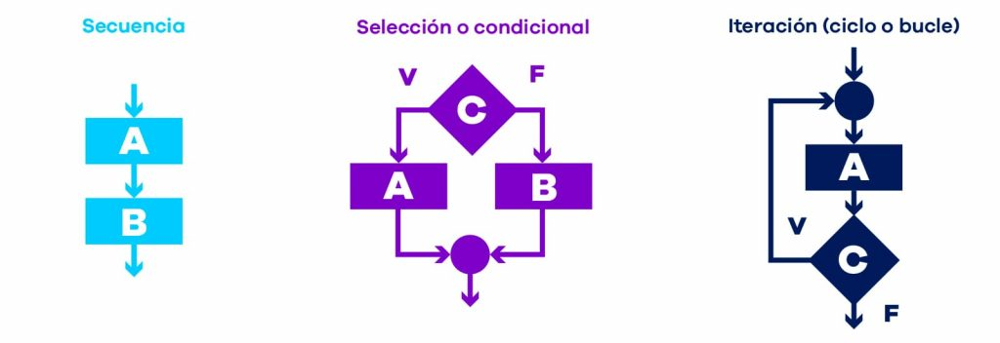

### **3.1. Secuencias**

Es la estructura más simple. El programa ejecuta las instrucciones de arriba hacia abajo, una por una. Es la forma más básica de controlar el flujo de un programa, una instrucción tras otra.

```csharp
Main {
    // Ejemplo de Secuencia
    writeLine("Hola");
    writeLine("¿Cómo estás?");

    // Leemos el nombre del usuario
    writeLine("Por favor, introduce tu nombre:");
    string nombre = readLine();

    // Mostramos un saludo personalizado
    writeLine("Encantado de conocerte, " + nombre);
}
```

### 3.2. Condicionales o Estructuras de selección

Permiten que nuestro programa tome decisiones y se comporte de manera diferente según las circunstancias.

!!! danger "Importante"
Las estructuras de selección **permiten tomar decisiones** sobre qué conjunto de instrucciones a ejecutar en un punto del programa. O sea, seleccionar qué código se ejecuta en un momento determinado **entre caminos alternativos**.

<figure>
    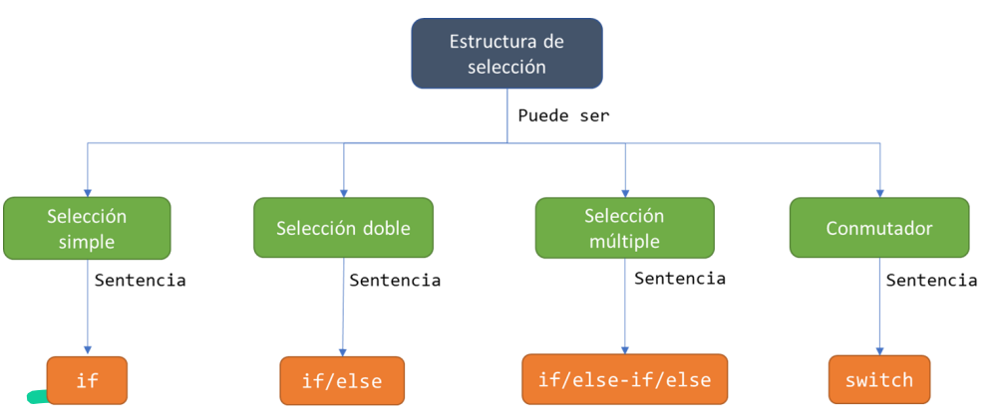
    <figcaption align="center">Tipos de estructuras de selección</figcaption>
</figure>

**Condicional simple (`if`)**

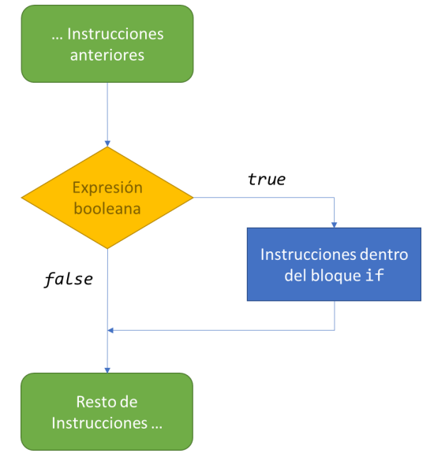

La estructura de selección simple permite controlar el hecho de que se ejecute un conjunto de instrucciones si y sólo si se cumple la condición lógica (es decir, el resultado de evaluar la condición lógica es igual a true). En caso contrario, no se ejecutan.

```csharp
Main {
    // Condicional simple
    var edad = 20;
    if (edad >= 18) {
        writeLine("Eres mayor de edad.");
    }
}
```

<br/>

**Condicional compuesto (`if-else`)**

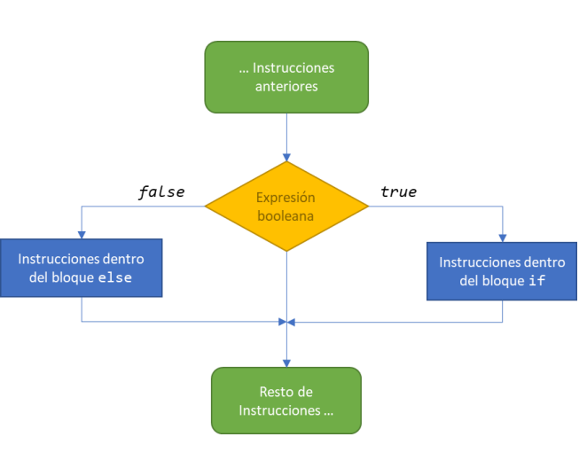

Permite ejecutar un bloque de código si se cumple una condición y otro bloque si no se cumple.

```csharp
Main {
    // Condicional compuesto
    var edad = 16;
    if (edad >= 18) {
        writeLine("Eres mayor de edad.");
    } else {
        writeLine("Eres menor de edad.");
    }
}
```

<br/>
<br/>
<br/>
  
**Condicionales múltiples (`if-else if-else`)**

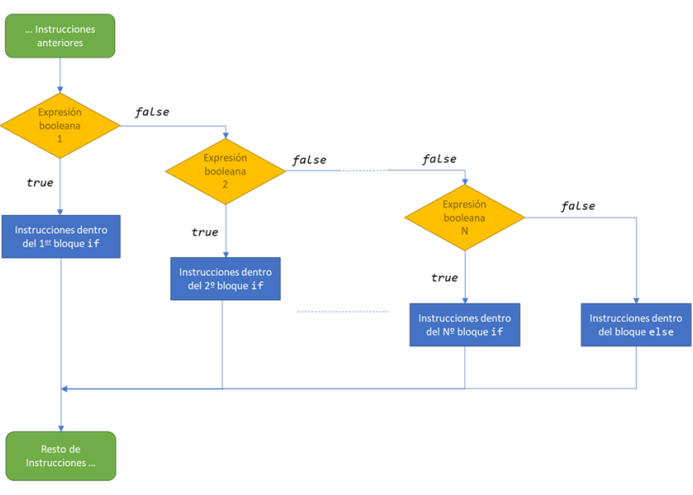

Permiten encadenar varias condiciones. El programa evalúa las condiciones en orden y ejecuta el bloque de la primera que sea verdadera. Si ninguna lo es, se ejecuta el bloque `else` final (si existe).

```csharp
Main {
    // Condicionales múltiples
    var edadAlumno = 16;
    if (edadAlumno >= 18) {
        writeLine("Eres mayor de edad.");
    } else if (edadAlumno >= 16) {
        writeLine("Casi eres mayor de edad.");
    } else {
        writeLine("Eres menor de edad.");
    }
}
```

<br/>

<figure>
    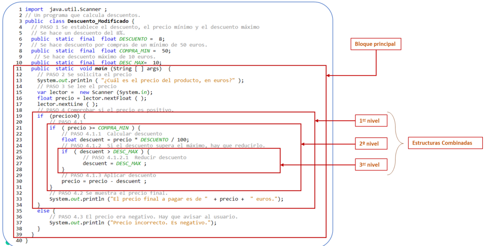
    <figcaption align="center">Ejemplo de Selección múltiple</figcaption>
</figure>

**Estructura `switch`**

Cuando necesitamos comparar una única variable contra múltiples valores posibles, usar una cadena larga de `if-else if` puede ser engorroso y poco legible (efecto "cascada"). La estructura `switch` (o `según` en pseudocódigo) ofrece una alternativa mucho más limpia y organizada. Evalúa una expresión y ejecuta el bloque de código (`case`) que coincida con el valor. Es obligatorio incluir una sección `default` para manejar los casos en que ninguno de los valores coincide.

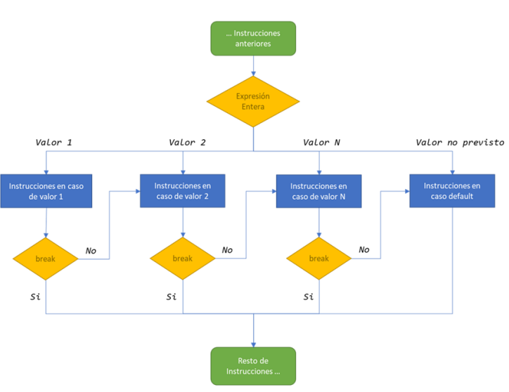

```csharp
Main {
    // Ejemplo de switch para los días de la semana
    var dia = 3; // Suponemos que 1 es Lunes, 2 es Martes, etc.
    string nombreDelDia;

    switch (dia) {
        case 1:
            nombreDelDia = "Lunes";
            break; // 'break' es crucial para salir del switch
        case 2:
            nombreDelDia = "Martes";
            break;
        case 3:
            nombreDelDia = "Miércoles";
            break;
        case 4:
            nombreDelDia = "Jueves";
            break;
        case 5:
            nombreDelDia = "Viernes";
            break;
        case 6:
        case 7:
            nombreDelDia = "Fin de semana";
            break; // Se pueden agrupar casos
        default:
            nombreDelDia = "Día inválido";
            break;
    }
    writeLine("Hoy es: " + nombreDelDia); // Imprimirá "Hoy es: Miércoles"
}
```

Una de las técnicas más útiles para evitar errores comunes en los condicionales es el uso de **paréntesis** para agrupar condiciones complejas. Esto mejora la legibilidad y asegura que las condiciones se evalúan en el orden correcto.

```csharp
Main {
    var edad = 20;
    var tieneDNI = true;
    // Uso de paréntesis para mayor claridad
    if ((edad >= 18) && (tieneDNI)) {
        writeLine("Puedes votar.");
    } else {
        writeLine("No puedes votar.");
    }
}
```

<br/>

### **3.3. Estructuras de repetición o Bucles**

<iframe width="560" height="315" src="https://www.youtube.com/embed/3QaCQsjTRW8" title="Bucles" frameborder="0" allow="accelerometer; autoplay; clipboard-write; encrypted-media; gyroscope; picture-in-picture; web-share" referrerpolicy="strict-origin-when-cross-origin" allowfullscreen></iframe>

Los **bucles nos permiten repetir un bloque de código varias veces**, ahorrándonos escribir la misma lógica una y otra vez.

<figure>
    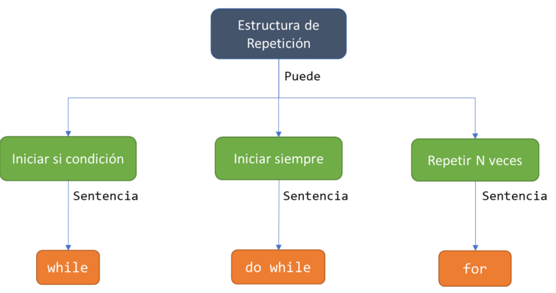
    <figcaption align="center">Estructuras de repetición</figcaption>
</figure>

**3.3.1 Bucles indefinidos (`while` y `do-while`)**:

Se ejecutan mientras se cumpla una condición. Son útiles cuando no sabemos cuántas iteraciones se necesitarán. `while` evalúa la condición antes de cada iteración, mientras que `do-while` la evalúa después, garantizando al menos una ejecución. Esto es muy útil para menús o entradas de usuario.

---

#### **Bucle While**

---

La sentencia **while** permite repetir la ejecución del bucle mientras se verifique la condición lógica. Esta verificación se produce antes de entrar, al principio de cada iteración. Si la primera vez, justo cuando se ejecuta la sentencia por primera vez, ya no se cumple, no se ejecuta ninguna iteración.

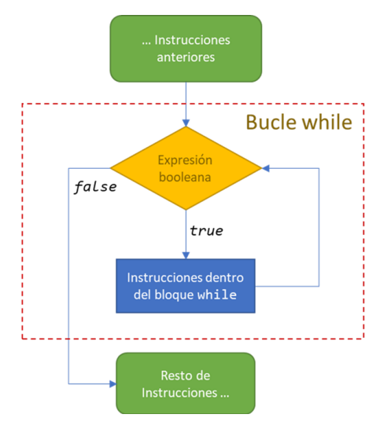

```csharp
Main {
    // Ejemplo de bucle while
    var contador = 0;
    while (contador < 5) {
        writeLine("Contador: " + contador);
        contador = contador + 1; // Incrementamos el contador
    }
    // Ejemplo de bucle do-while
    var opcion;
    do {
        writeLine("Menú:");
        writeLine("1. Opción 1");
        writeLine("2. Opción 2");
        writeLine("3. Salir");
        opcion = readLine();
        writeLine("Has seleccionado la opción: " + opcion);
    } while (opcion != "3");
}
```

**Control del Bucle**

Un bucle infinito es una secuencia de instrucciones dentro de un programa que itera indefinidamente, normalmente porque se espera que se alcance una condición que nunca se llega a producir.

!!! danger "Importante"

    Forzosamente dentro de todo bucle debe haber instrucciones que manipulen el valor de lagunas variables que nos permitan controlar la repetición o el final del cuble. Estas variables se conocen como **variables de control**.


Ejemplos de cada tipo:

<div class="grid cards" markdown>

- 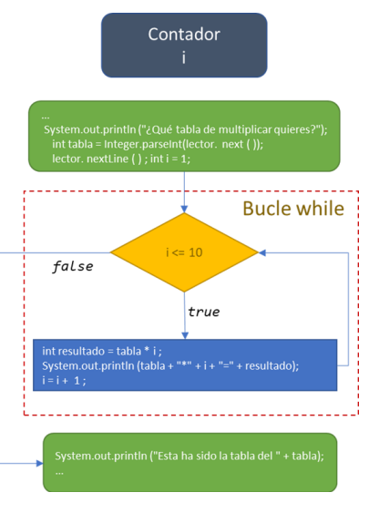
  <p class="text-center">Contador</p>

- 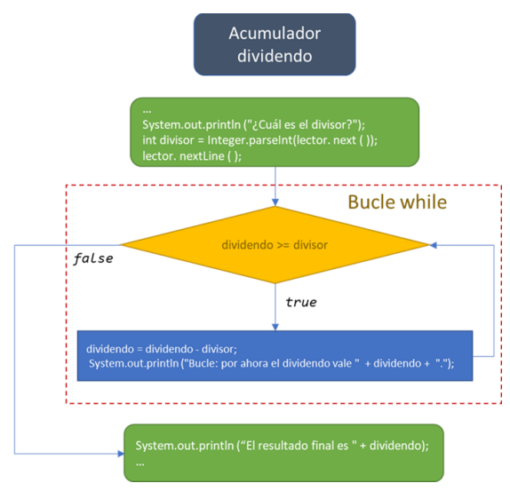
  <p class="text-center">Acumulador</p>

- 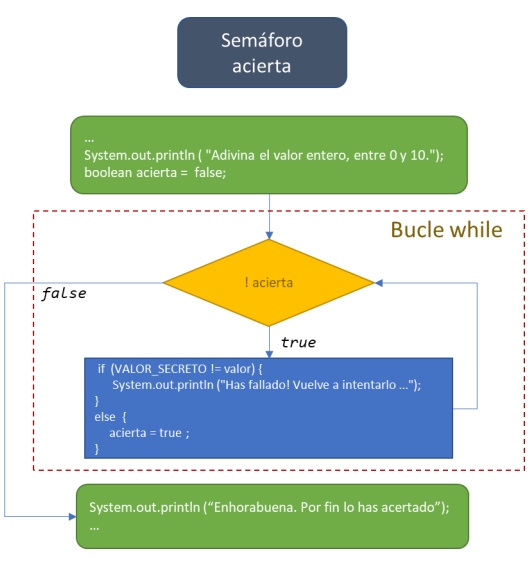
  <p class="text-center">Semáforo</p>

</div>

<br/>
<br/>
    
---
#### **Bucle do-While**
---

La sentencia **do-while** permite repetir la ejecución del bucle mientras se verifique la condición lógica. Esta verificación se produce antes de entrar, al principio de cada iteración. Si la primera vez, justo cuando se ejecuta la sentencia por primera vez, ya no se cumple, no se ejecuta ninguna iteración.

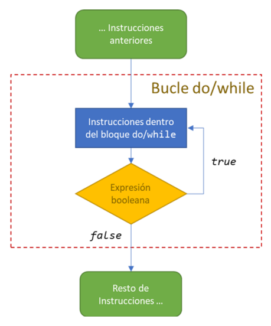

```csharp
Main {
    // Ejemplo de bucle while
    var contador = 0;
    while (contador < 5) {
        writeLine("Contador: " + contador);
        contador = contador + 1; // Incrementamos el contador
    }
    // Ejemplo de bucle do-while
    var opcion;
    do {
        writeLine("Menú:");
        writeLine("1. Opción 1");
        writeLine("2. Opción 2");
        writeLine("3. Salir");
        opcion = readLine();
        writeLine("Has seleccionado la opción: " + opcion);
    } while (opcion != "3");
}
```

---

#### **Bucle definidos FOR**

---

Los bucles definidos se utilizan cuando sabemos de antemano cuántas veces queremos repetir un bloque de código. La estructura `for` incluye la inicialización, la condición y el incremento/decremento en una sola línea, lo que facilita su lectura y escritura. A continuación se muestran varios ejemplos para dominar su funcionamiento.

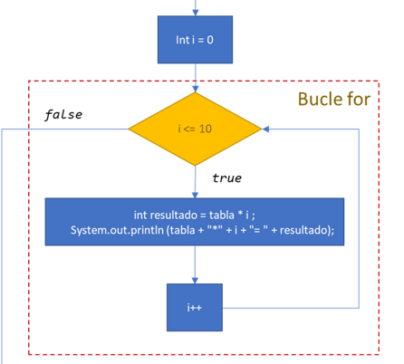

```csharp
Main {
    // 1. Bucle 'for' ascendente de 1 en 1
    writeLine("Contando hacia adelante de 1 en 1:");
    for (int i = 0; i <= 5; i = i + 1) {
        writeLine(i); // Imprime 0, 1, 2, 3, 4, 5
    }

    // 2. Bucle 'for' descendente de 1 en 1
    writeLine("Contando hacia atrás de 1 en 1:");
    for (int i = 5; i >= 0; i = i - 1) {
        writeLine(i); // Imprime 5, 4, 3, 2, 1, 0
    }

    // 3. Bucle 'for' con saltos positivos (de 2 en 2)
    writeLine("Contando hacia adelante de 2 en 2:");
    for (int i = 0; i <= 10; i = i + 2) {
        writeLine(i); // Imprime 0, 2, 4, 6, 8, 10
    }

    // 4. Bucle 'for' con saltos negativos (de 3 en 3)
    writeLine("Contando hacia atrás de 3 en 3:");
    for (int i = 15; i >= 0; i = i - 3) {
        writeLine(i); // Imprime 15, 12, 9, 6, 3, 0
    }
}
```

### **3.4. Mecanismos de Control de Bucles**

Existen **tres formas típicas** de controlar cuándo se ejecuta un bucle: bucles con contador, bucles controlados por indicadores (banderas o _flags_), y bucles controlados por centinela.

- **A. Bucles controlados por Indicadores (Banderas o Flags)** 📬

  Las **banderas** (_flags_) son variables que suelen ser de tipo lógico (`bool`) y se utilizan para controlar la ejecución de un bucle. Se inicializan antes del bucle y cambian de valor dentro del mismo cuando se cumple la condición de parada.

  _Ejemplo 1: Estructura básica de una bandera dentro de `Main`_

  ```csharp
  Main {
      // Declaración de variables dentro del ámbito local de Main
      bool continuar = true;

      // Mientras la bandera 'continuar' sea verdadera
      while (continuar)
      {
          // Simulamos instrucciones
          // ...

          // Si se cumple una condición (ej. leer ‘N’ del usuario), cambiamos el indicador
          if (condicionParaAcabar)
          {
              continuar = false;
          }
          // ...
      }
  }
  ```

  _Ejemplo 2: Determinar si un número contiene solo cifras menores que cinco_

  ```csharp
  Main {
      // Declaración de variables
      bool menor;
      int num;

      writeLine("Introduce un número:"); // Salida
      num = (int)readLine(); // Entrada que requiere casting

      menor = true; // Inicializacion del indicador

      // El bucle se mantiene mientras el indicador sea true Y el número tenga cifras
      while (menor && (num > 0))
      {
          // Utilizamos el operador módulo (%) para revisar la última cifra
          if (num % 10 >= 5)
          {
              menor = false; // Cambiamos la bandera a false
          }
          num = num / 10; // Eliminamos la última cifra (división entera)
      }

      if (menor)
      {
          writeLine("Todas las cifras son menores que 5");
      }
      else
      {
          writeLine("Hay alguna cifra mayor o igual que 5");
      }
  }
  ```

- **B. Bucles controlados por Centinela**

  Los bucles controlados por centinela utilizan un **valor especial** (el centinela) que indica la parada de la iteración.

  _Ejemplo: Sumar números hasta que se introduce 0 (centinela)_

  ```csharp
  Main {
      // Declaración de variables
      int suma = 0;
      int num;

      writeLine("Introduce números a sumar, 0 para acabar"); // Salida
      num = (int)readLine(); // Entrada que requiere casting

      // El bucle while continúa mientras el número introducido no sea el centinela (0)
      while (num != 0)
      {
          suma = suma + num; // Acumulación

          writeLine("Introduce números a sumar, 0 para acabar");
          num = (int)readLine(); // Nueva entrada
      }

      writeLine(suma); // Salida del resultado final
  }
  ```

- **C. Bucles Anidados**

  Los bucles se pueden **anidar** (un bucle dentro de otro). Esta técnica es especialmente útil para el manejo de matrices.

  _Ejemplo: Generar una tabla de multiplicar (1 a 10) usando bucles `for` anidados_

  ```csharp
  Main {
      // Declaración de variables de control del bucle (i, j)
      int i, j;

      // Bucle externo
      for (i = 1; i <= 10; i++)
      {
          // Bucle interno
          for (j = 1; j <= 10; j++)
          {
              // Usamos concatenación (+) para mostrar el resultado
              writeLine(i + "*" + j + "=" + (i * j));
          }
      }
  }
  ```

## ⏬ **4. Estructuras de Salto**

Las sentencias de salto son herramientas del lenguaje que proporcionan un control más preciso sobre el comportamiento de nuestros bucles, permitiéndonos alterar su ejecución normal bajo ciertas condiciones.

<figure>
    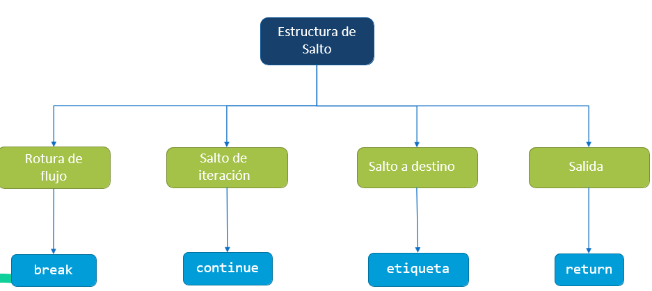
    <figcaption align="center">Estructuras de salto</figcaption>
</figure>

<!--  -->

### **4.1 Break: Interrupción Inmediata del Bucle** 🏁

La sentencia break tiene un propósito claro y contundente: **terminar la ejecución del bucle más interno** en el que se encuentra. Una vez que el flujo del programa encuentra una instrucción break, el bucle se detiene inmediatamente y el control se transfiere a la siguiente instrucción después del bucle.

Es una herramienta poderosa para detener un proceso iterativo cuando **se ha cumplido un objetivo específico**, sin necesidad de completar todas las **iteraciones restantes**.

!!! example "Ejemplo 1: Encontrar el primer múltiplo de 7"

    Imaginemos que queremos contar del 1 al 20, pero deseamos detenernos tan pronto como encontremos el primer número que es divisible por 7.

    ```java
    public class EjemploBreakSencillo {
        public static void main(String[] args) {
            System.out.println("Buscando el primer múltiplo de 7 entre 1 y 20...");

            for (int i = 1; i <= 20; i++) {
                System.out.println("Probando el número: " + i);
                if (i % 7 == 0) { // Si 'i' es divisible por 7
                    System.out.println("¡Encontrado! El número es: " + i);
                    break; // Salimos del bucle inmediatamente
                }
            }

            System.out.println("El bucle ha terminado.");
        }
    }
    ```

    Salida del programa:

    ```text
    Buscando el primer múltiplo de 7 entre 1 y 20...
    Probando el número: 1
    Probando el número: 2
    Probando el número: 3
    Probando el número: 4
    Probando el número: 5
    Probando el número: 6
    Probando el número: 7
    ¡Encontrado! El número es: 7
    El bucle ha terminado.
    ```

!!! example "Ejemplo 2: Imprimir solo los números pares"

    Supongamos que queremos imprimir los números del 1 al 10, pero queremos omitir todos los números pares.

    ```java
    public class EjemploContinueSencillo {
        public static void main(String[] args) {
            System.out.println("Imprimiendo solo los números impares del 1 al 10:");

            for (int i = 1; i <= 10; i++) {
                if (i % 2 == 0) { // Si el número es par
                    continue; // Omitimos el resto de esta iteración y vamos a la siguiente
                }
                // Esta línea solo se ejecutará si el número es impar
                System.out.println(i);
            }
        }
    }
    ```

    Salida del programa:

    ```text
    Imprimiendo solo los números impares del 1 al 10:
    1
    3
    5
    7
    9
    ```
    Aquí, cada vez que i era un número par, la sentencia continue se activaba, evitando que se ejecutara la línea System.out.println(i) y forzando al bucle a comenzar la siguiente iteración.

<br>

### **4.2 Continue: Omitir y Seguir Adelante** ↖️

A diferencia de break, la sentencia continue **no detiene el bucle**. Lo que hace es _detener la iteración actual y saltar directamente al inicio de la siguiente_. Es como decir: "No me interesa lo que queda por hacer en esta vuelta, pasemos a la siguiente".

Esto es muy útil para filtrar u omitir ciertos casos dentro de una secuencia sin necesidad de detener todo el proceso.

!!! example "Ejemplo 2: Imprimir solo los números impares"

    ```java
    public class EjemploContinueSencillo {
        public static void main(String[] args) {
            System.out.println("Imprimiendo solo los números impares del 1 al 10:");

            for (int i = 1; i <= 10; i++) {
                if (i % 2 == 0) { // Si el número es par
                    continue; // Omitimos el resto de esta iteración y vamos a la siguiente
                }
                // Esta línea solo se ejecutará si el número es impar
                System.out.println(i);
            }
        }
    }
    ```

    Salida del programa:

    ```text
    Imprimiendo solo los números impares del 1 al 10:
    1
    3
    5
    7
    9
    ```

    Aquí, cada vez que i era un número par, la sentencia continue se activaba, evitando que se ejecutara la línea System.out.println(i) y forzando al bucle a comenzar la siguiente iteración.

### **4.3 return: Salida Definitiva del Método** ⬅️

La sentencia return es la **más drástica de las tres**. No solo detiene el bucle, sino que **termina la ejecución de todo el método** en el que se encuentra.

Cualquier código que venga después de la instrucción return, tanto dentro como fuera del bucle, **no se ejecutará**.
Generalmente se usa para devolver un valor desde un método, pero también puede usarse en métodos void (que no devuelven nada) para provocar una salida temprana.

!!! example "Ejemplo 1: Buscar un número dentro de un método"

    Para ilustrar esto, crearemos un método separado. Este método buscará un "código de error" específico en un rango de números. Si lo encuentra, informará de ello y saldrá inmediatamente del método.

    ```java
    public class EjemploReturnSencillo {

        // Este método busca un código de error entre 1 y 100
        public static void main(String[] args) {
            int codigoError = 44;

            System.out.println("Iniciando la verificación de códigos...");

            for (int i = 1; i <= 100; i++) {
                if (i == codigoError) {
                    System.out.println("¡Alerta! Código de error " + i + " encontrado. Terminando ejecución.");
                    return; // Salimos del método verificarCodigos() por completo
                }
            }

            // Esta línea NUNCA se ejecutará si se encuentra el código de error
            System.out.println("Verificación completada sin encontrar el código de error.");
        }
    }
    ```
    Salida del programa:

    ```text
    Iniciando la verificación de códigos...
    ¡Alerta! Código de error 44 encontrado. Terminando ejecución.
    Programa principal continúa...
    ```
