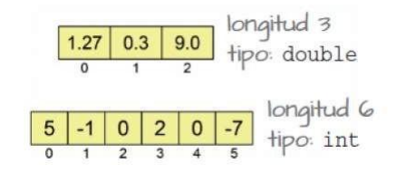

# **UT4. Vectores (Arrays y Matrices)**

### **1. Variables Escalares Vs. Vectores**

Un **vector**, también conocido como array, es un tipo de dato estructurado que permite almacenar un conjunto de datos **homogéneo**, es decir, todos ellos del mismo tipo y relacionados entre sí. Cada uno de los elementos que componen un vector puede ser de tipo simple (como caracteres, enteros o reales) o de tipo compuesto (como otros vectores, estructuras, listas, etc.).

<figure>
    
</figure>

A los datos almacenados en un vector se les denomina **elementos**. Al número total de elementos de un vector se le denomina **tamaño** o **rango** del vector.

Por norma general, emplearemos un vector cuando necesitemos usar un conjunto de datos del mismo tipo que estén relacionados entre sí.

A estas estructuras de datos también se las denomina Tablas, Arrays o Arreglos (este último término se desaconseja).

---

### **2. Índices de un vector**

Distinguimos cada elemento almacenado en un vector por la **posición** que ocupa en el mismo. A esta posición se le denomina **índice**.

Es fundamental recordar que en Java, y en muchos otros lenguajes, la indexación empieza en 0. Por tanto, el primer elemento tendrá el índice 0, el segundo elemento el 1, y así sucesivamente.

[IMAGEN: Un diagrama del vector "edad" con los valores {85, 3, 19, 23, 7}. Debajo, se muestran los índices correspondientes {0, 1, 2, 3, 4}. Una flecha señala que `edad[3]` almacena el valor 23.]

La forma de utilizar un elemento concreto de un vector es por medio del nombre de la variable seguido del índice entre corchetes `[]` que identifica al elemento.

```java
// Muestra el primer elemento: 85
System.out.println(edad[0]);

// Asigna un nuevo valor al quinto elemento (índice 4)
edad[4] = 8;
```

> **¡Atención!** Si empleamos un índice que no se corresponde al rango del vector (por ejemplo, un índice negativo o uno mayor o igual a su longitud), se generará un error en tiempo de ejecución (`ArrayIndexOutOfBoundsException`) y nuestro programa terminará. Por ejemplo: `edad[-1]` o `edad[5]` (en un vector de 5 elementos).

---

### **3. Construcción de vectores**

En el momento de crear un vector deberemos tener en cuenta lo siguiente:

1.  **Decidir qué tipo de datos** vamos a almacenar (`int`, `double`, `String`, etc.).
2.  **Declarar un nombre** para el vector.
3.  **Crear la tabla** especificando su tamaño.

<figure>
    
</figure>

**Declaración:**
Existen dos sintaxis equivalentes para declarar un vector.

```java
// Sintaxis 1: corchetes junto al tipo
int[] edad;

// Sintaxis 2: corchetes junto al nombre (heredada de C/C++)
int edad[];
```
*Recomendación: Es preferible usar la primera sintaxis (`int[] edad;`) ya que deja más claro que el tipo de la variable es "array de enteros".*

**Creación (Instanciación):**
Para crear el vector y reservar su espacio en memoria, usamos la palabra clave `new`.

```java
// variable = new tipo[longitud];
edad = new int[5]; // Creamos un vector de 5 enteros.
```

**Alternativa: Declaración e Inicialización en un paso**
Podemos crear e inicializar el vector con valores directamente en una sola línea. En este caso, el compilador deduce el tamaño automáticamente.

```java
int datos[] = {2, -3, 0, 7}; // Crea un vector de rango 4 con esos valores.
```
<figure>
    
</figure>


---

### **4. Referencia**

En el caso de los vectores, las variables no contienen directamente los valores de los elementos. En su lugar, almacenan una **dirección de memoria** donde se guardan dichos elementos. A esto lo denominamos **referencia**.

[IMAGEN: Un esquema que muestra una variable "edad" que contiene una flecha (referencia) apuntando a una estructura de tabla que contiene los elementos del array.]

Si imprimimos una variable de tipo vector directamente, veremos su referencia en memoria, no su contenido.

```java
int vector[] = new int[4];
System.out.println(vector); // Salida similar a: [I@4617c264
```

Esto tiene una implicación importante: si asignamos un vector a otro, ambas variables apuntarán al **mismo espacio de memoria**. No se está creando una copia.

```java
int d[], e[];
d = new int[6]; // Construimos una tabla referenciada por d
e = d; // Ahora la variable 'e' referencia LA MISMA tabla que 'd'.
       // Ambas guardan la misma dirección de memoria.
```
[IMAGEN: Un diagrama que muestra dos variables, `d` y `e`, apuntando a la misma tabla (array) en memoria.]

---

### **5. Operaciones con vectores (Clase `Arrays`)**

La API de Java nos proporciona la clase `java.util.Arrays`, que contiene funciones estáticas muy útiles para trabajar con vectores.

#### **Obtención del número de elementos de un vector**

Todo vector tiene una propiedad pública llamada `length` que nos devuelve su tamaño.

```java
int notas[] = new int[10];
System.out.println(notas.length); // Muestra 10
```

#### **Inicialización de valores de un vector (2 métodos)**

1.  **Creación y asignación posterior:** Se crea el array con `new` y luego se asignan los valores, normalmente con un bucle.
2.  **Inicialización directa:** Se usan las llaves `{}` para proveer los valores iniciales en la misma línea de la declaración.

```java
// Método 1
float floats[] = new float[5];
char[] chars = new char[5];

// Método 2
String[] cars = {"Volvo", "BMW", "Ford", "Mazda"};
int[] myNum = {10, 20, 30, 40};
```

#### **Recorrer un vector**

Por lo general, para recorrer todos los elementos de un vector emplearemos un bucle `for`. Existen dos formas principales:

```java
int alturas[] = {134, 156, 190, 176, 167};

// 1. El for clásico (usando un índice)
for (int i = 0; i < alturas.length; i++) {
    System.out.println(alturas[i]);
}

// 2. El for-each (o for mejorado)
for (int medida : alturas) {
    System.out.println(medida);
}
```

#### **Mostrar el contenido de un vector**

Aunque podemos mostrar el contenido recorriéndolo con un bucle, la clase `Arrays` nos proporciona el método `Arrays.toString()` para hacerlo de una forma más sencilla y directa.

```java
int alturas[] = {134, 156, 190, 176, 167};
System.out.println(Arrays.toString(alturas));

// Salida: [134, 156, 190, 176, 167]
```

#### **Copia de un vector**

La clase `Arrays` proporciona dos métodos para crear copias de vectores:

*   `Arrays.copyOf(origen, longitud)`: Construye y devuelve una copia del array `origen` con la `longitud` especificada. Si la nueva longitud es mayor, los elementos extra se rellenan con el valor por defecto (0, null, false...).

    ```java
    int t[] = {1, 2, 1, 6, 23};
    // Copia los primeros 3 elementos
    int a[] = Arrays.copyOf(t, 3); // a será [1, 2, 1]
    // Copia todo y añade ceros hasta completar 10
    int b[] = Arrays.copyOf(t, 10); // b será [1, 2, 1, 6, 23, 0, 0, 0, 0, 0]
    ```

*   `Arrays.copyOfRange(origen, desde, hasta)`: Construye y devuelve un nuevo vector donde se han copiado los elementos del array `origen` desde el índice `desde` (incluido) hasta el índice `hasta` (excluido).

    ```java
    int t[] = {7, 5, 3, 1, 0, -2};
    // Copia desde el índice 1 hasta el 3 (el 4 no se incluye)
    int a[] = Arrays.copyOfRange(t, 1, 4); // a será [5, 3, 1]
    ```

La clase `System` también proporciona un método para copiar elementos entre vectores ya existentes:

*   `System.arraycopy(fuente, posFuente, destino, posDestino, longitud)`: Este método es más rápido pero más complejo. No crea un vector nuevo; los vectores `fuente` y `destino` ya deben existir. Los elementos se copian desde `fuente` a `destino`, sobrescribiendo lo que hubiera.

[IMAGEN: Un diagrama que ilustra cómo `System.arraycopy` copia un segmento de un array "fuente" a un array "destino".]

#### **Comparar el contenido de dos vectores**

No podemos comparar el contenido de dos vectores mediante el operador `==`, ya que este solo compara si las referencias son idénticas (es decir, si apuntan al mismo objeto en memoria).

```java
int t1[] = {7, 5, 3, 1};
int t2[] = {7, 5, 3, 1};
System.out.println(t1 == t2); // Muestra FALSE, porque son dos objetos distintos.
```

Para comparar si dos vectores tienen los mismos elementos en el mismo orden, empleamos el método `Arrays.equals(vector1, vector2)`.

```java
System.out.println(Arrays.equals(t1, t2)); // Muestra TRUE
```

---

### **Ejemplo: Array con zona útil**

A veces, un array puede tener una parte "útil" (con datos válidos) y otra parte sin usar. Podemos usar un valor especial (llamado "centinela", como el 0 en este caso) para marcar el final de la zona útil y recorrer solo esa parte.

[IMAGEN: Una tabla que representa el array `array` con los valores {2, 4, 8, 12, 16, 0, 20, 10, 9}. Los valores 20, 10 y 9 están resaltados en rojo, indicando que no son procesados por el bucle.]

```java
int[] array = {2, 4, 8, 12, 16, 18, 20, 10, 9};

// Usamos el valor 0 como marca para el final de la zona útil
array[5] = 0;

int i = 0;
// Recorremos mientras no encontremos el 0 Y no nos salgamos del array
while (array[i] != 0 && i < array.length) {
    System.out.println(array[i]);
    i++;
}
// Salida:
// 2
// 4
// 8
// 12
// 16
```

---

### **6. Vectores n-dimensionales (Matrices)**

Hasta ahora hemos visto vectores de una dimensión (con una longitud). Pero podemos necesitar estructuras con más de una dimensión, como tablas o matrices.

[IMAGEN: Tres diagramas. Uno muestra un array de 1 dimensión (una fila). Otro muestra un array de 2 dimensiones (una tabla con filas y columnas). El tercero muestra un array de 3 dimensiones (un cubo).]

En el caso de los vectores n-dimensionales, los declararemos del mismo modo que los de una dimensión, pero añadiendo un par de corchetes `[]` por cada dimensión extra.

#### **Matrices (Arrays de 2 dimensiones)**

[IMAGEN: Una matriz de 5x5 con valores numéricos.]

**Declaración y Creación:**

```java
// Declaración de una matriz 5x5
int matriz[][];
matriz = new int[5][5]; // 5 filas y 5 columnas
```
*   El primer corchete `[5]` indica el número de **filas**.
*   El segundo corchete `[5]` indica el número de **columnas**.

**Inicialización con valores:**

```java
// Declaración de matriz 5x5 con valores
int matriz[][] = {
    {2, 4, 6, 12, 0},
    {2, -11, 4, 7, 86},
    {0, 1, 6, 5, 3},
    {1, 93, 6, -2, 0},
    {9, 71, 23, 2, 8}
};
```

**Recorrer una matriz:**
Para recorrer una matriz bidimensional necesitaremos dos bucles `for` anidados, uno para las filas (índice `i`) y otro para las columnas (índice `j`).

```java
for (int i = 0; i < 5; i++) {
    for (int j = 0; j < 5; j++) {
        System.out.println(matriz[i][j]);
    }
}
```

**Mostrar una matriz:**
Para mostrar una matriz de forma sencilla, usamos el método `Arrays.deepToString()`, que funciona con arrays anidados.

```java
System.out.println(Arrays.deepToString(matriz));
```

---

### **Tamaño de la matriz**

En una matriz, la variable es una referencia a una serie de arrays. Es decir, una matriz es un "array de arrays".

[IMAGEN: Un esquema que muestra cómo la variable de una matriz 2x3 apunta a un array de 2 elementos. Cada uno de esos elementos es una referencia que apunta a otro array de 3 elementos numéricos.]

*   `matriz.length`: Mide el número de arrays que contiene la matriz, es decir, el **número de filas**.
*   `matriz[i].length`: Mide el número de elementos del array en la fila `i`, es decir, el **número de columnas** de esa fila.

#### **Recorrer una fila**

Para recorrer solo los elementos de una fila específica (por ejemplo, la primera, con índice 0), fijamos el índice de la fila y movemos el de la columna.

[IMAGEN: Una matriz de 2x3 con los valores {{115,12,3},{65,23,9}}.]

```java
int[][] matriz = {{115, 12, 3}, {65, 23, 9}};

// Recorremos la primera fila (índice 0)
for (int i = 0; i < matriz[0].length; i++) {
    System.out.println(matriz[0][i]); // Imprime 115, 12, 3
}
```

#### **Recorrer una columna**

Para recorrer una columna específica (por ejemplo, la primera), fijamos el índice de la columna y movemos el de la fila.

[IMAGEN: La misma matriz 2x3, pero ahora con los elementos de la primera columna (115 y 65) resaltados.]

```java
int[][] matriz = {{115, 12, 3}, {65, 23, 9}};

// Recorremos la primera columna (índice 0)
for (int i = 0; i < matriz.length; i++) {
    System.out.println(matriz[i][0]); // Imprime 115, 65
}
``````