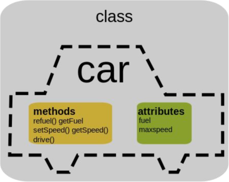
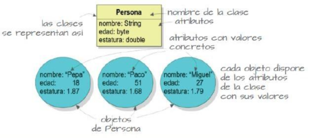
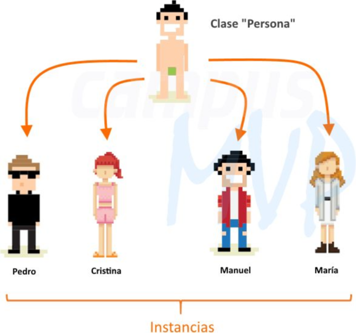
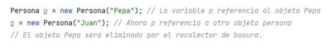
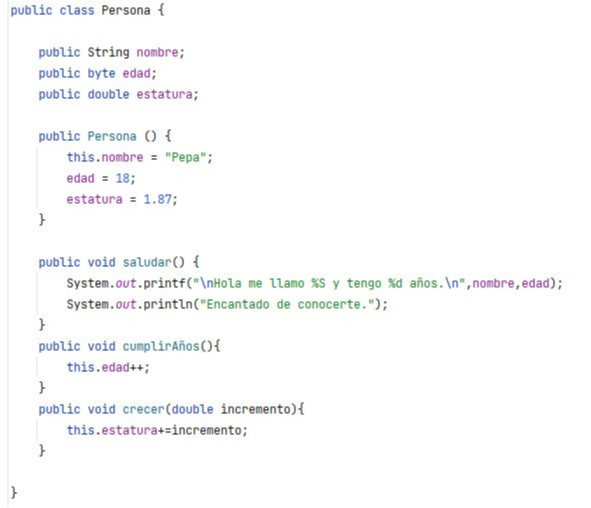
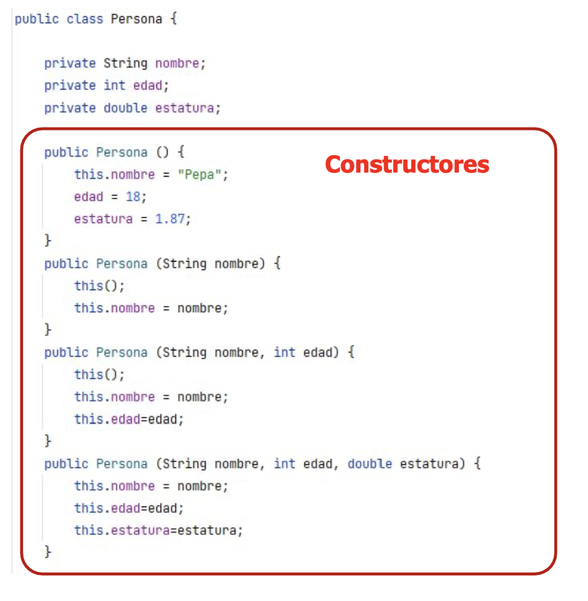
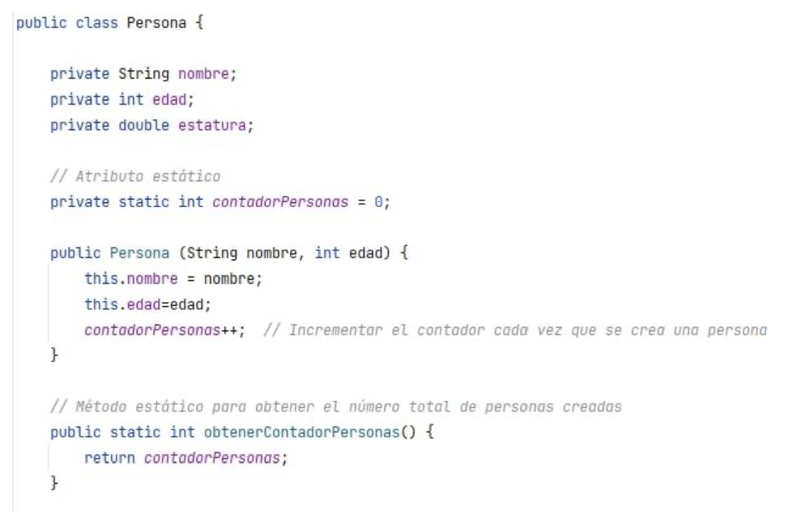

# **UT6: Programación orientada a objetos**

!!! tip "Información de la unidad"

    === "Contenidos"

        Diseño de clases:

        - Sintaxis, estructura y componentes típicos de una clase.
        - Definición de atributos (propiedades) y métodos.
        - Modificadores de acceso (público, privado, protegido).
        - Creación de constructores y sobrecarga de constructores.

        Instanciación y uso de objetos:

        - Creación de objetos a partir de clases definidas.
        - Acceso a propiedades y métodos de los objetos.

        Librerías de clases:

        - Creación y utilización de conjuntos y librerías de clases propias.

    === "Propuesta didáctica"

        En esta unidad vamos a comenzar a trabajar el **RA4: Desarrolla programas organizados en clases analizando y aplicando los principios de la programación orientada a objetos.**

        Criterios de evaluación clave que abordaremos:

        - **CE4a**: Se ha reconocido la sintaxis, estructura y componentes típicos de una clase.
        - **CE4b**: Se han definido clases.
        - **CE4c**: Se han definido propiedades y métodos.
        - **CE4d**: Se han creado constructores.
        - **CE4e**: Se han desarrollado programas que instancien y utilicen objetos de las clases creadas anteriormente.
        - **CE4f**: Se han utilizado mecanismos para controlar la visibilidad de las clases y de sus miembros.
        - **CE4i**: Se han creado y utilizado conjuntos y librerías de clases.

    === "Programación de Aula"

        Esta unidad se imparte en la **segunda evaluación**, con una duración estimada de **12 sesiones lectivas**, aproximadamente entre la **1ª semana de diciembre de 2025 y la 2ª semana de enero de 2026** (considerando el parón navideño).

        | Sesión | Contenidos                                                                        | Criterios trabajados   |
        | ------ | --------------------------------------------------------------------------------- | ---------------------- |
        | 1      | Sintaxis, estructura y componentes típicos de una clase.                          | CE4a                   |
        | 2      | Definición de propiedades (atributos) y tipos de datos.                           | CE4c                   |
        | 3      | Definición de métodos y su implementación.                                        | CE4c                   |
        | 4      | Modificadores de acceso (public, private, protected). Encapsulamiento.            | CE4f                   |
        | 5      | Creación de constructores. Sobrecarga de constructores.                           | CE4d                   |
        | 6      | Práctica guiada: diseño e implementación de una clase simple.                     | CE4b, CE4c, CE4d, CE4f |
        | 7      | Instanciación y uso de objetos a partir de clases definidas.                      | CE4e                   |
        | 8      | Relaciones entre objetos: agregación y composición (introducción).                | CE4e                   |
        | 9      | Creación y utilización de conjuntos y librerías de clases propias.                | CE4i                   |
        | 10     | Práctica autónoma: desarrollo de un programa con varias clases interrelacionadas. | CE4e, CE4i             |
        | 11     | Debugging y testing de clases y objetos.                                          | CE4e                   |
        | 12     | Revisión y evaluación práctica de la unidad.                                      | CE4a-i (Refuerzo)   

## 1 - Conceptos básicos POO

La Programación Orientada a Objetos (POO) hace que los problemas sean más sencillos al favorecer una relación fuerte entre datos y funciones. Esta relación se realiza a partir de estructuras denominadas objetos.

- Un **objeto** es un elemento del programa que posee sus propios datos y su propio funcionamiento.
- Una **clase** describe un grupo de objetos que contienen una información similar (atributos) y un comportamiento común (métodos).
- Antes de poder utilizar un objeto, se debe definir su clase. La clase es la definición de un tipo de objeto.

Este paradigma se basa en la idea de que cualquier programa está formado por objetos y que todo puede ser representado como tal. Así, cualquier elemento que forme parte de una aplicación (un usuario, una factura o pedido en un ERP, un coche para una aplicación de gestión de un taller, ...) se considera que es un objeto de la aplicación con una serie de propiedades y características.

<figcaption>
    
    <figcaption align="center">Conceptos básicos de POO</figcaption>
</figcaption>

A partir del concepto de objeto, el paradigma propone una serie de **características** que lo definen y que se irán comprendiendo a lo largo de este tema, según se vayan exponiendo los diferentes mecanismos de este paradigma para proporcionarlas:

- **Abstracción**: Por el que el programador se abstrae, se despreocupa, de los detalles de implementación de cualquier objeto. Los procesos o métodos que se encuentren definidos funcionan por sí solos y no es necesario saber cómo están implementados si sólo necesitamos hacer que se ejecuten.
- **Encapsulamiento**: Todas las características o propiedades que pertenezcan a un sólo elemento del programa se pueden crear y encapsular dentro de él, aumentando la cohesión de estos componentes.
- **Polimorfismo**: El polimorfismo nos permite utilizar a los objetos de manera genérica, aunque internamente se comporten según su variedad específica.
- **Herencia**: La herencia entre clases permitirá que una clase pueda heredar propiedades (atributos y métodos) de otra.

## 2 - Clases

Una clase describe un grupo de objetos que contienen una información similar (atributos) y un comportamiento común (métodos). Una clase es como un molde. A partir de ella se pueden crear objetos. Es decir, antes de poder utilizar un objeto se debe definir la clase a la que pertenece, esa definición incluye:

- **Atributos**: Las variables miembro de la clase.
- **Métodos**: Las funciones miembro de la clase.

<figcaption>
    
    <figcaption align="center">Clase y objetos, con atributos y métodos de un coche</figcaption>
</figcaption>

### 2.1 - Clases (sintaxis)

<figcaption>
    
    <figcaption align="center">Sintaxis de una clase en Java y notación UML</figcaption>
</figcaption>

- **Public**: Se puede utilizar desde cualquier clase.
- **Private**: Sólo puede utilizarlo la propia clase.
- **Protected**: Puede utilizarlo la propia clase y también las subclases heredadas.

Se llama **interfaz** a los miembros de una clase (atributos y métodos) que son `public`, porque son los que permiten interactuar con la clase desde fuera de ella. Los principios de la programación orientada a objetos indican que para mantener la encapsulación en los objetos debemos aplicar el especificador `public` a las funciones miembro que formen la interfaz pública y denegar el acceso a los datos miembro usados por esas funciones mediante el especificador `private`.

## 3 – Objetos

Los elementos pertenecientes a una clase se denominan instancias u objetos. Cada uno de ellos tendrá sus propios valores de los atributos definidos en la clase.

<figcaption>
    
    <figcaption align="center">Representación de clases, atributos y objetos</figcaption>
</figcaption>

### 3.1 – Objetos (Instanciación)

Antes de construir un objeto necesitamos declarar una variable cuyo tipo sea su clase. La forma de crear los objetos es mediante el operador `new`.

<figcaption>
    
    <figcaption align="center">Ejemplo de instanciación de un objeto Persona</figcaption>
</figcaption>

### 3.2 - Objetos (referencias a null)

El valor literal `null` es una referencia nula. Cuando declaramos una variable de referencia se inicializa por defecto a `null`. Debemos tener la precaución de no acceder a los miembros de una referencia nula ya que esto lanzará una excepción "NullPointerException".

<figcaption>
    
    <figcaption align="center">Manejo de referencias nulas y recolección de basura en Java</figcaption>
</figcaption>

Los objetos no referenciados serán eliminados por el mecanismo automático de recolección de basura de Java. Un objeto se queda sin referencia cuando se asigna su variable de referencia a `null` o a otro objeto.

## 4 - Visibilidad

Los miembros de una clase (atributos y métodos, es decir, sus variables y funciones) pueden definirse como **públicos**, **privados** o **protegidos**. Es importante entender la diferencia:

<figcaption>
    
    <figcaption align="center">Modificadores de acceso (visibilidad) en Java</figcaption>
</figcaption>

## 5 - Métodos

Las clases, además de atributos, también tienen un comportamiento que viene definido por sus métodos. Los métodos no son más que funciones que se implementan dentro de una clase.

<figcaption>
    
    <figcaption align="center">Ejemplo de métodos en una clase Persona</figcaption>
</figcaption>

## 5.1 - Métodos (Constructores)

En programación orientada a objetos (POO), un **constructor** es un método especial dentro de una clase que se utiliza para inicializar los objetos de esa clase. En Java, los constructores tienen el mismo nombre que la clase y no tienen un tipo de retorno explícito.

<figcaption>
    
    <figcaption align="center">Constructores en una clase Java</figcaption>
</figcaption>

El propósito principal de un constructor es asignar valores iniciales a los miembros de la clase o realizar cualquier otra inicialización necesaria cuando se crea un objeto. Los constructores son llamados automáticamente cuando se instancia un objeto de la clase. Este tipo de métodos permiten **sobrecarga**. Dependiendo de los parámetros que use el constructor, éste puede ser por defecto o parametrizado.

## 5.2 – Métodos (Getter y Setter)

Puesto que lo más habitual es hacer que los atributos permanezcan lo más ocultos posible, se hace necesario de algún mecanismo que permita mostrarlos fuera de la implementación de la clase en el caso de que quieran ser leídos o escritos desde nuestro proyecto. Para eso existen lo que se conoce como `setters` y `getters`. Los primeros permiten acceder a los atributos de una clase para modificarlos, mientras que los segundos permiten acceder a los mismos para leerlos.

<figcaption>
    
    <figcaption align="center">Ejemplo de métodos Getter y Setter</figcaption>
</figcaption>

Los `getters` y `setters` en la práctica no son más que métodos que siguen una notación determinada `getAtributo()` para los `getters` y `setAtributo(valor)` para los `setters` que permiten modificar o acceder a los atributos de una forma controlada.

Siempre será posible permitir que se pueda acceder a un atributo (`getter`) pero no para modificarlo.

## 6 - Atributos y Métodos estáticos

Los atributos y métodos estáticos que se definen en una clase como tal permiten que se puedan utilizar sin la necesidad de instanciar objetos de dicha clase. Se declaran con la palabra clave `static`.

<figcaption>
    
    <figcaption align="center">Ejemplo de atributos y métodos estáticos</figcaption>
</figcaption>

**Comparten datos comunes**: Los atributos estáticos son útiles cuando deseamos que todas las instancias de una clase compartan un mismo valor.

**Operaciones independientes**: Los métodos estáticos son convenientes para operaciones que no dependen del estado específico de una instancia.

## 7 – Tipos Enumerados

Los tipos enumerados (`enum`) son una forma de definir un conjunto fijo de constantes con nombre. Los `enums` se introdujeron en Java para proporcionar una manera más robusta y legible de representar conjuntos de valores fijos. Puedes declarar un tipo enumerado mediante la palabra clave `enum`.

<figcaption>
    
    <figcaption align="center">Declaración y uso de tipos enumerados en Java</figcaption>
</figcaption>

Los `enums` proporcionan una manera clara y segura de representar conjuntos de constantes relacionadas. Pueden mejorar la legibilidad y mantenimiento del código, y son especialmente útiles cuando necesitas representar un conjunto fijo de valores relacionados.

## 8 – Arrays de Objetos

En Java, los arrays de objetos permiten almacenar múltiples instancias de una clase en una única estructura de datos. Esto es especialmente útil cuando necesitas manejar conjuntos de objetos del mismo tipo de manera eficiente.

<figcaption>
    
    <figcaption align="center">Declaración y uso de arrays de objetos Persona</figcaption>
</figcaption>
