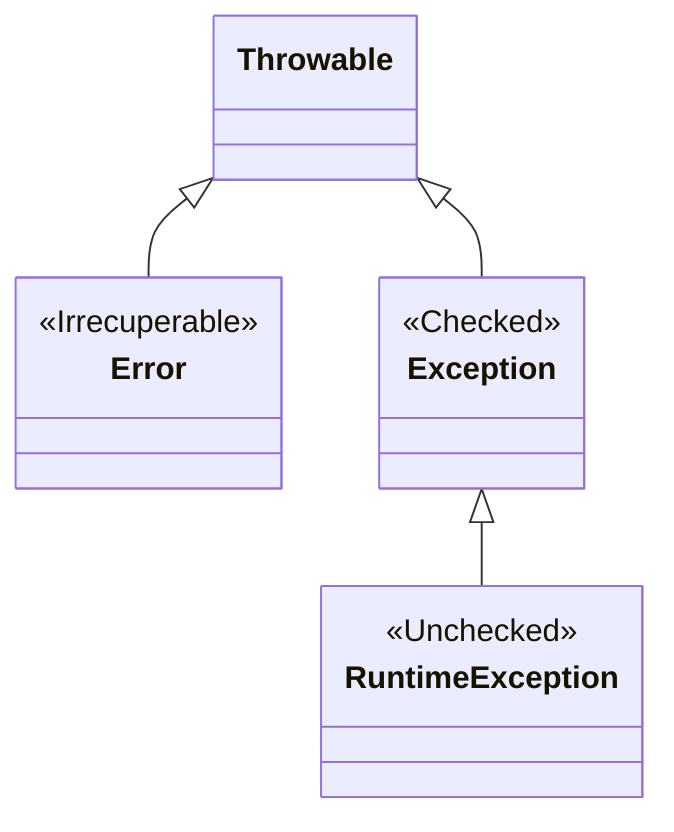

# **UT6: Programación orientada a objetos**

!!! tip "Información de la unidad"

    === "Contenidos"

        Diseño de clases:

        - Sintaxis, estructura y componentes típicos de una clase.
        - Definición de atributos (propiedades) y métodos.
        - Modificadores de acceso (público, privado, protegido).
        - Creación de constructores y sobrecarga de constructores.

        Instanciación y uso de objetos:

        - Creación de objetos a partir de clases definidas.
        - Acceso a propiedades y métodos de los objetos.

        Librerías de clases:

        - Creación y utilización de conjuntos y librerías de clases propias.

    === "Propuesta didáctica"

        En esta unidad vamos a comenzar a trabajar el **RA4: Desarrolla programas organizados en clases analizando y aplicando los principios de la programación orientada a objetos.**

        Criterios de evaluación clave que abordaremos:

        - **CE4a**: Se ha reconocido la sintaxis, estructura y componentes típicos de una clase.
        - **CE4b**: Se han definido clases.
        - **CE4c**: Se han definido propiedades y métodos.
        - **CE4d**: Se han creado constructores.
        - **CE4e**: Se han desarrollado programas que instancien y utilicen objetos de las clases creadas anteriormente.
        - **CE4f**: Se han utilizado mecanismos para controlar la visibilidad de las clases y de sus miembros.
        - **CE4i**: Se han creado y utilizado conjuntos y librerías de clases.

    === "Programación de Aula"

        Esta unidad se imparte en la **segunda evaluación**, con una duración estimada de **12 sesiones lectivas**, aproximadamente entre la **1ª semana de diciembre de 2025 y la 2ª semana de enero de 2026** (considerando el parón navideño).

        | Sesión | Contenidos                                                                        | Criterios trabajados   |
        | ------ | --------------------------------------------------------------------------------- | ---------------------- |
        | 1      | Sintaxis, estructura y componentes típicos de una clase.                          | CE4a                   |
        | 2      | Definición de propiedades (atributos) y tipos de datos.                           | CE4c                   |
        | 3      | Definición de métodos y su implementación.                                        | CE4c                   |
        | 4      | Modificadores de acceso (public, private, protected). Encapsulamiento.            | CE4f                   |
        | 5      | Creación de constructores. Sobrecarga de constructores.                           | CE4d                   |
        | 6      | Práctica guiada: diseño e implementación de una clase simple.                     | CE4b, CE4c, CE4d, CE4f |
        | 7      | Instanciación y uso de objetos a partir de clases definidas.                      | CE4e                   |
        | 8      | Relaciones entre objetos: agregación y composición (introducción).                | CE4e                   |
        | 9      | Creación y utilización de conjuntos y librerías de clases propias.                | CE4i                   |
        | 10     | Práctica autónoma: desarrollo de un programa con varias clases interrelacionadas. | CE4e, CE4i             |
        | 11     | Debugging y testing de clases y objetos.                                          | CE4e                   |
        | 12     | Revisión y evaluación práctica de la unidad.                                      | CE4a-i (Refuerzo)   

## 1 - Conceptos básicos POO

<iframe width="780" height="440"  src="https://www.youtube.com/embed/-ZRm4fGY8DY?list=PLGIH-7eZDbVw6q2AdcAUe2r6YxJYBkfCi" title="Introducción a la Programación de Software" frameborder="0" allow="accelerometer; autoplay; clipboard-write; encrypted-media; gyroscope; picture-in-picture; web-share" referrerpolicy="strict-origin-when-cross-origin" allowfullscreen></iframe>

La Programación Orientada a Objetos (POO) hace que los problemas sean más sencillos al favorecer una relación fuerte entre datos y funciones. Esta relación se realiza a partir de estructuras denominadas objetos.

- Un **objeto** es un elemento del programa que posee sus propios datos y su propio funcionamiento.
- Una **clase** describe un grupo de objetos que contienen una información similar (atributos) y un comportamiento común (métodos).
- Antes de poder utilizar un objeto, se debe definir su clase. La clase es la definición de un tipo de objeto.

Este paradigma se basa en la idea de que cualquier programa está formado por objetos y que todo puede ser representado como tal. Así, cualquier elemento que forme parte de una aplicación (un usuario, una factura o pedido en un ERP, un coche para una aplicación de gestión de un taller, ...) se considera que es un objeto de la aplicación con una serie de propiedades y características.

<figcaption>
    
    <figcaption align="center">Conceptos básicos de POO</figcaption>
</figcaption>

A partir del concepto de objeto, el paradigma propone una serie de **características** que lo definen y que se irán comprendiendo a lo largo de este tema, según se vayan exponiendo los diferentes mecanismos de este paradigma para proporcionarlas:

- **Abstracción**: Por el que el programador se abstrae, se despreocupa, de los detalles de implementación de cualquier objeto. Los procesos o métodos que se encuentren definidos funcionan por sí solos y no es necesario saber cómo están implementados si sólo necesitamos hacer que se ejecuten.
- **Encapsulamiento**: Todas las características o propiedades que pertenezcan a un sólo elemento del programa se pueden crear y encapsular dentro de él, aumentando la cohesión de estos componentes.
- **Polimorfismo**: El polimorfismo nos permite utilizar a los objetos de manera genérica, aunque internamente se comporten según su variedad específica.
- **Herencia**: La herencia entre clases permitirá que una clase pueda heredar propiedades (atributos y métodos) de otra.

## 2 - Clases

Una clase describe un grupo de objetos que contienen una información similar (atributos) y un comportamiento común (métodos). Una clase es como un molde. A partir de ella se pueden crear objetos. Es decir, antes de poder utilizar un objeto se debe definir la clase a la que pertenece, esa definición incluye:

- **Atributos**: Las variables miembro de la clase.
- **Métodos**: Las funciones miembro de la clase.

<figcaption>
    
    <figcaption align="center">Clase y objetos, con atributos y métodos de un coche</figcaption>
</figcaption>

<figcaption>
    
    <figcaption align="center">Ejemplo de métodos en una clase Persona</figcaption>
</figcaption>

### 2.1 - Clases (sintaxis)

<figcaption>
    
    <figcaption align="center">Sintaxis de una clase en Java y notación UML</figcaption>
</figcaption>

- **Public**: Se puede utilizar desde cualquier clase.
- **Private**: Sólo puede utilizarlo la propia clase.
- **Protected**: Puede utilizarlo la propia clase y también las subclases heredadas.

Se llama **interfaz** a los miembros de una clase (atributos y métodos) que son `public`, porque son los que permiten interactuar con la clase desde fuera de ella. Los principios de la programación orientada a objetos indican que para mantener la encapsulación en los objetos debemos aplicar el especificador `public` a las funciones miembro que formen la interfaz pública y denegar el acceso a los datos miembro usados por esas funciones mediante el especificador `private`.

## 3 – Objetos

Los elementos pertenecientes a una clase se denominan instancias u objetos. Cada uno de ellos tendrá sus propios valores de los atributos definidos en la clase.

<figcaption>
    
    <figcaption align="center">Representación de clases, atributos y objetos</figcaption>
</figcaption>

### 3.1 – Objetos (Instanciación)

Antes de construir un objeto necesitamos declarar una variable cuyo tipo sea su clase. La forma de crear los objetos es mediante el operador `new`.

<figcaption>
    
    <figcaption align="center">Ejemplo de instanciación de un objeto Persona</figcaption>
</figcaption>

### 3.2 - Objetos (referencias a null)

El valor literal `null` es una referencia nula. Cuando declaramos una variable de referencia se inicializa por defecto a `null`. Debemos tener la precaución de no acceder a los miembros de una referencia nula ya que esto lanzará una excepción "NullPointerException".

<figcaption>
    
    <figcaption align="center">Manejo de referencias nulas y recolección de basura en Java</figcaption>
</figcaption>

Los objetos no referenciados serán eliminados por el mecanismo automático de recolección de basura de Java. Un objeto se queda sin referencia cuando se asigna su variable de referencia a `null` o a otro objeto.

## 4 - Visibilidad

Los miembros de una clase (atributos y métodos, es decir, sus variables y funciones) pueden definirse como **públicos**, **privados** o **protegidos**. Es importante entender la diferencia:

<figcaption>
    
    <figcaption align="center">Modificadores de acceso (visibilidad) en Java</figcaption>
</figcaption>

## 5 - Métodos

Las clases, además de atributos, también tienen un comportamiento que viene definido por sus métodos. Los métodos no son más que funciones que se implementan dentro de una clase.

<figcaption>
    
    <figcaption align="center">Ejemplo de métodos en una clase Persona</figcaption>
</figcaption>

### 5.1 - Métodos (Constructores)

En programación orientada a objetos (POO), un **constructor** es un método especial dentro de una clase que se utiliza para inicializar los objetos de esa clase. En Java, los constructores tienen el mismo nombre que la clase y no tienen un tipo de retorno explícito.

<figcaption>
    
    <figcaption align="center">Constructores en una clase Java</figcaption>
</figcaption>

El propósito principal de un constructor es asignar valores iniciales a los miembros de la clase o realizar cualquier otra inicialización necesaria cuando se crea un objeto. Los constructores son llamados automáticamente cuando se instancia un objeto de la clase. Este tipo de métodos permiten **sobrecarga**. Dependiendo de los parámetros que use el constructor, éste puede ser por defecto o parametrizado.

### 5.2 – Métodos (Getter y Setter)

Puesto que lo más habitual es hacer que los atributos permanezcan lo más ocultos posible, se hace necesario de algún mecanismo que permita mostrarlos fuera de la implementación de la clase en el caso de que quieran ser leídos o escritos desde nuestro proyecto. Para eso existen lo que se conoce como `setters` y `getters`. Los primeros permiten acceder a los atributos de una clase para modificarlos, mientras que los segundos permiten acceder a los mismos para leerlos.

<figcaption>
    
    <figcaption align="center">Ejemplo de métodos Getter y Setter</figcaption>
</figcaption>

Los `getters` y `setters` en la práctica no son más que métodos que siguen una notación determinada `getAtributo()` para los `getters` y `setAtributo(valor)` para los `setters` que permiten modificar o acceder a los atributos de una forma controlada.

Siempre será posible permitir que se pueda acceder a un atributo (`getter`) pero no para modificarlo.

## 6 - Atributos y Métodos estáticos

### 6.1 Concepto de "Miembro de Clase"

La palabra clave `static` indica que un miembro (método o atributo) **pertenece a la clase misma**, no a ninguna instancia (objeto) particular.

*   No necesitas crear un objeto con `new` para usarlo.
*   Es **compartido** por todos los objetos de esa clase.

!!! tip "Analogía Mental"
    *   **Atributo de instancia (No static):** Como el "Nombre" de un alumno. Cada alumno tiene el suyo propio.
    *   **Atributo de clase (Static):** Como la "Pizarra" del aula. Hay una sola compartida por todos los alumnos.

### 6.2 Usos Comunes

=== "Métodos de Utilidad (Math)"
    Métodos que solo procesan datos de entrada y no dependen de ningún estado de objeto.
    
    ```java
    public class Calculadora {
        // No necesito 'new Calculadora()' para sumar
        public static int sumar(int a, int b) {
            return a + b;
        }
    }
    
    // Uso
    int resultado = Calculadora.sumar(5, 3);
    ```

=== "Contadores Compartidos (State)"
    Variables que mantienen un valor común para todas las instancias.
    
    ```java
    public class Jugador {
        // static: hay UNO solo para todos
        public static int totalJugadores = 0;
        
        public Jugador() {
            totalJugadores++; // Incrementa la variable compartida
        }
    }
    
    new Jugador(); new Jugador(); new Jugador();
    System.out.println(Jugador.totalJugadores); // Imprime 3
    ```

=== "Constantes Globales"
    Valores fijos y universales (`public static final`).
    
    ```java
    public class Fisicas {
        public static final double GRAVEDAD = 9.81;
    }
    ```

### 6.3 Error Frecuente ⚠️

Un método `static` **NO PUEDE acceder** directamente a miembros que no sean estáticos (de instancia), porque "no tiene `this`".

```java
public class Ejemplo {
    int valor = 10; // Instancia

    public static void metodoStatic() {
        // ❌ Error de compilación: 
        // No puedo acceder a 'valor' porque no sé de QÚE objeto es.
        System.out.println(valor); 
    }
}
```

## 7 – Tipos Enumerados

**Características Principales**

Los **Enums** son mucho más que simples listas de constantes. En Java, son **clases completas** que heredan de `java.lang.Enum`.
Permiten restringir una variable a un conjunto de valores predefinidos y pueden tener **campos, constructores y métodos**.

=== "Básico"
    ```java
    public enum Nivel {
        BAJO, MEDIO, ALTO
    }
    ```

=== "Avanzado (Con Propiedades)"
    ```java
    public enum Planeta {
        MERCURIO(3.303e+23, 2.4397e6),
        TIERRA(5.976e+24, 6.37814e6);

        private final double masa;   // kg
        private final double radio;  // m

        // Constructor (siempre privado / package-private)
        Planeta(double masa, double radio) {
            this.masa = masa;
            this.radio = radio;
        }

        public double gravedad() { return 6.67300E-11 * masa / (radio * radio); }
    }
    ```

**Métodos Comunes y Uso**

| Método | Descripción | Ejemplo |
| :--- | :--- | :--- |
| **`values()`** | Devuelve un array con todas las constantes. | `for (Nivel n : Nivel.values())` |
| **`valueOf(String)`** | Busca una constante por su nombre. | `Nivel.valueOf("ALTO")` |
| **`ordinal()`** | Devuelve la posición (índice 0-based). | `Nivel.MEDIO.ordinal()` // 1 |

```java
// Uso en control de flujo
Nivel nivel = Nivel.MEDIO;

switch (nivel) {
    case BAJO -> System.out.println("Nivel seguro");
    case MEDIO, ALTO -> System.out.println("Precaución");
}
```

## 8 – Arrays de Objetos

En Java, los arrays de objetos permiten almacenar múltiples instancias de una clase en una única estructura de datos. Esto es especialmente útil cuando necesitas manejar conjuntos de objetos del mismo tipo de manera eficiente.

<figcaption>
    
    <figcaption align="center">Declaración y uso de arrays de objetos Persona</figcaption>
</figcaption>

## 9 - Paquetes e Importaciones

Organización lógica del código para evitar conflictos y facilitar el uso de librerías.

| Concepto | Sintaxis / Uso | Descripción |
| :--- | :--- | :--- |
| **Package** | `package com.miempresa.app;` | Agrupa clases relacionadas. **Debe ser la 1ª línea**. Convención: minúsculas y dominio invertido. |
| **Import** | `import java.util.List;` | Permite usar clases de otros paquetes sin escribir su nombre completo. `java.lang` se importa solo. |

## 10 - Referencia `this`

Referencia a la **instancia actual**. Se usa para:

1.  **Desambiguar:** Cuando un parámetro se llama igual que un campo (`this.nombre = nombre`).
2.  **Encadenar Constructores:** Llamar a otro constructor de la misma clase (`this(a, b)`). *Debe ser la 1ª línea*.

## 11 - Igualdad e Identidad

!!! failure "Error Común"
    Usar `==` para comparar contenido de objetos es incorrecto. `==` compara referencias (identidad).

### 11.1 Comparación de Objetos

Distinguimos entre **Identidad** (referencia) e **Igualdad** (contenido).

| Operador / Método | Descripción | Ejemplo |
| :--- | :--- | :--- |
| **`==`** (Identidad) | Compara si dos referencias apuntan al **mismo objeto** en memoria. | `a == b` (false si son `new` distintos) |
| **`.equals()`** (Igualdad) | Método para comparar **contenido semántico**. Por defecto usa `==`, se debe sobrescribir. | `a.equals(b)` (true si tienen mismos datos) |

```java
@Override
public boolean equals(Object o) {
    if (this == o) return true;
    if (!(o instanceof Libro)) return false;
    Libro l = (Libro) o;
    return Objects.equals(isbn, l.isbn);
}
```

## 12 - Representación como Cadena

### 12.1 Métodos de Cadena

*   **`toString()`:** Devuelve la representación textual del objeto. Útil para logs/debug.
*   **Formateo:** Uso de `String.format` o `.formatted()` para crear cadenas complejas.

```java
@Override
public String toString() { return "Persona[nombre=" + nombre + "]"; }

// Uso
String s = "Hola %s".formatted(nombre); // Java 15+
```

## 13 - Records

Introducidos en Java 14, definen clases inmutables de datos ("Data Carriers") de forma concisa.

```java
public record Persona(String nombre, int edad) {}
```

!!! check "Ventajas Automáticas"
    *   ✅ **Constructor** canónico explícito.
    *   ✅ Métodos **`equals`, `hashCode`, `toString`**.
    *   ✅ Accessors (ej: `nombre()`, `edad()`).

## 14 - Clases Anidadas

Permiten definir una clase dentro de otra para agrupar lógicamente clases que solo se usan en un lugar, aumentando la encapsulación.

| Tipo | Sintaxis | Descripción | Acceso a Externa |
| :--- | :--- | :--- | :--- |
| **Static Nested** | `static class B` | Asocia con la CLASE externa. | No accede a `this` externo (solo `static`). |
| **Inner Class** | `class B` | Asocia con la INSTANCIA externa. | Accede a miembros `private` de la instancia externa. |

**Ejemplos y Diferencias**

=== "Static Nested Class"
    Útil para clases de utilidad o builders que no dependen de la instancia particular del objeto padre.
    
    ```java
    public class Externa {
        private static int datoStatic = 1;

        // Se comporta como una clase normal, pero dentro del namespace de Externa
        public static class Anidada { 
            void print() { System.out.println(datoStatic); }
        }
    }
    
    // Instanciación (Directa)
    Externa.Anidada obj = new Externa.Anidada();
    ```

=== "Inner Class"
    Útil para crear objetos dependientes, como un Iterador o un Motor de un Coche específico.
    
    ```java
    public class Coche {
        private String modelo = "Tesla";
        
        // Vive SOLO asociada a un objeto Coche concreto
        public class Motor { 
            void encender() { 
                // Accede al campo privado 'modelo' de SU coche contenedor
                System.out.println("Arrancando " + modelo); 
            }
        }
    }
    
    // Instanciación (Requiere objeto externo)
    Coche miCoche = new Coche();
    Coche.Motor motor = miCoche.new Motor();
    ```

## 15 - Excepciones

Las excepciones son eventos que interrumpen el flujo normal del programa. En Java, todas heredan de la clase `Throwable`.

### 15.1 Jerarquía de Excepciones



1.  **Error:** Problemas graves de la JVM (ej: `OutOfMemoryError`). No se suelen capturar.
2.  **Exception (Checked):** Problemas anticipables (Ficheros, Red). El compilador obliga a tratarlas.
3.  **RuntimeException (Unchecked):** Errores de lógica del programador. No es obligatorio tratarlas.

### 15.2 Tipos Principales y Uso

=== "Checked Exceptions 🔴"
    **Obligatorio** `try-catch` o `throws`.

    | Excepción | Causa Común |
    | :--- | :--- |
    | **`IOException`** | Error en entrada/salida (ficheros, sockets). |
    | **`FileNotFoundException`** | Fichero no encontrado al intentar abrirlo. |
    | **`SQLException`** | Error interactuando con base de datos. |
    | **`ClassNotFoundException`** | Intentas cargar una clase que no existe en el classpath. |

=== "Unchecked Exceptions 🟠"
    **Opcional**. Errores que se deberían arreglar en el código.

    | Excepción | Causa Común |
    | :--- | :--- |
    | **`NullPointerException`** | Acceso a miembro de una referencia `null`. |
    | **`IndexOutOfBoundsException`** | Acceso a índice inválido en Array/Lista. |
    | **`IllegalArgumentException`** | Argumento inválido pasado a un método. |
    | **`ArithmeticException`** | División por cero lógica. |
    | **`NumberFormatException`** | Error al convertir String a número (`"hola"` a int). |

### 15.3 Estrategias de Manejo

Es vital entender cuándo usar `try-catch` y cuándo arreglar el código.

=== "Manejo de Checked Exception (IOException)"
    El compilador **obliga** a capturarla o declararla. Se usa para fallos externos recuperables.
    
    ```java
    // Opción A: Capturar (try-catch) -> El programa se recupera
    public void leerArchivo() {
        try {
            var reader = new FileReader("data.txt");
        } catch (FileNotFoundException e) {
            System.out.println("Archivo no encontrado, crea uno nuevo.");
        }
    }
    
    // Opción B: Propagar (throws) -> Pasa el problema al llamador
    public void leerConfig() throws IOException {
        var reader = new FileReader("config.txt"); // Si falla, explota arriba
    }
    ```

=== "Manejo de Unchecked Exception (NullPointer)"
    NO se suelen capturar. Indican un **bug**. La solución es corregir el código, no usar try-catch.
    
    ```java
    // ❌ MAL: Capturar un error de lógica
    try {
        System.out.println(usuario.nombre.toUpperCase());
    } catch (NullPointerException e) {
        // Esto oculta el bug real
    }
    
    // ✅ BIEN: Programación defensiva (evitar el error)
    if (usuario != null && usuario.nombre != null) {
        System.out.println(usuario.nombre.toUpperCase());
    }
    ```
