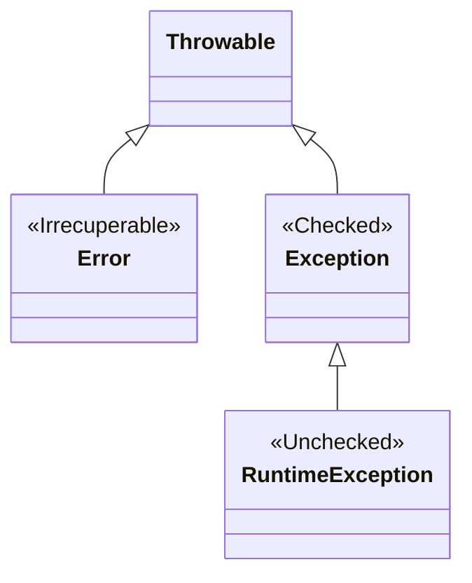

# ☕ **UT6: Programación orientada a objetos**

## 1. 🧩 Conceptos y Principios de la POO

La **Programación Orientada a Objetos (POO)** es una forma de pensar y escribir nuestros programas inspirada en cómo observamos el mundo real.

### 1.1 ¿Qué es la programación orientada a objetos?

La POO gira en torno al **objeto**. Un objeto es como una “caja” que puede guardar información relevante y ofrece acciones que se pueden realizar sobre él.

!!! info "Claves de los Objetos"
    *   📦 **Estado:** Datos que almacena (ej: color, edad).
    *   🔧 **Comportamiento:** Operaciones que ejecuta (ej: frenar, hablar).
    *   🆔 **Identidad:** Unicidad del objeto.

!!! example "Ejemplo Cotidiano: Ordenador"
    *   **Estado:** SO, RAM, Nº Serie.
    *   **Comportamiento:** Encender, Apagar.
    *   **Identidad:** Su número de serie único.

### 1.2 Principios Clave �

A continuación se resumen los pilares fundamentales de la POO:

| Concepto | Icono | Descripción |
| :--- | :---: | :--- |
| **Abstracción** | 💭 | Fijarse solo en lo importante para el contexto, ignorando detalles irrelevantes. <br> *Ej: Título del libro vs gramaje del papel.* |
| **Ocultación** | 🙈 | Los objetos guardan sus secretos. No se debe acceder a los datos internos, solo a la interfaz pública. |
| **Encapsulamiento** | 💊 | Unión de estado y comportamiento en un contenedor, protegiendo datos con modificadores (`private`). |
| **Herencia** | 👨‍👦 | Crear nuevos objetos basados en existentes (`extends`). <br> *Ej: Un Perro **es un** Animal.* |
| **Polimorfismo** | 🎭 | Capacidad de diferentes objetos de responder a la misma orden de forma distinta. |
| **Modularidad** | 🧩 | División en partes independientes para facilitar mantenimiento y reutilización. |
| **Garbage Collector** | ♻️ | Liberación automática de memoria de objetos en desuso. Evita fugas de memoria. |

### 1.3 Resumen

La POO nos permite crear software **robusto**, **reutilizable** y **fácil de mantener**.

---

## 2. 📦 Objetos: Definición y Creación

Un objeto es una **instancia** de una clase.

### 2.1 Definición y Tipos

Un objeto es una **instancia** de una clase. Se compone de **Identidad** (referencia en memoria), **Estado** (atributos) y **Comportamiento** (métodos).

!!! warning "Importante: Primitivos vs Objetos"
    En Java hay una distinción clara por rendimiento:

    | Característica | Tipo Primitivo | Objeto (Referencia) |
    | :--- | :--- | :--- |
    | **Ejemplos** | `int`, `double`, `boolean`... | `String`, `Integer`, `Persona`... |
    | **Almacenamiento** | **Valor** directo | **Referencia** (dirección de memoria) |
    | **Funcionalidad** | No tiene métodos | Hereda de `java.lang.Object` |

### 2.3 La Clase: El Molde 🏗️

La clase define la estructura (atributos) y comportamiento (métodos). Es la plantilla para crear objetos.

<figcaption>
    
    <figcaption align="center">Conceptos básicos de POO</figcaption>
</figcaption>

### 2.4 Creación con `new` ✨

```java
//    Clase      Var         Constructor
//      👇        👇             👇
      Coche    miCoche   =   new Coche();
```

1.  **Reserva memoria** en el Heap.
2.  **Inicializa** (llama al constructor).
3.  **Devuelve la referencia**.

---

## 3. 📦 Paquetes e Importaciones

Organización lógica del código para evitar conflictos y facilitar el uso de librerías.

| Concepto | Sintaxis / Uso | Descripción |
| :--- | :--- | :--- |
| **Package** | `package com.miempresa.app;` | Agrupa clases relacionadas. **Debe ser la 1ª línea**. Convención: minúsculas y dominio invertido. |
| **Import** | `import java.util.List;` | Permite usar clases de otros paquetes sin escribir su nombre completo. `java.lang` se importa solo. |

---

## 4. 📝 Clases: Atributos y Métodos

### 4.1 Definición y Miembros

Una clase define la estructura (**Campos/Atributos**) y el comportamiento (**Métodos**) de los objetos.

<figcaption>
    
    <figcaption align="center">Clase y objetos, con atributos y métodos de un coche</figcaption>
</figcaption>

<br>

!!! info "Clases (sintaxis)"
    <figcaption>
        
        <figcaption align="center">Sintaxis de una clase en Java y notación UML</figcaption>
    </figcaption>

```java title="Gato.java"
public class Gato {
    // 📦 Campos (Estado) - Usar 'private' por encapsulamiento
    private String nombre; 
    
    // 🔧 Métodos (Comportamiento)
    public void maullar() {
        System.out.println("Miau");
    }
}
```

### 4.2 Visibilidad y Modificadores 🔒

Los modificadores controlan el acceso a clases, campos y métodos.

=== "Niveles de Acceso"
    | Modificador | Clase | Paquete | Subclase | Mundo |
    | :--- | :---: | :---: | :---: | :---: |
    | `public` 🟢 | ✅ | ✅ | ✅ | ✅ |
    | `protected` 🟡 | ✅ | ✅ | ✅ | ❌ |
    | *(default)* 🔵 | ✅ | ✅ | ❌ | ❌ |
    | `private` 🔴 | ✅ | ❌ | ❌ | ❌ |

=== "Modificadores Especiales"
    *   **`final`:** Indica inmutabilidad.
        *   En **Variable**: Constante (ej: `PI`).
        *   En **Método**: No se puede sobrescribir.
        *   En **Clase**: No se puede heredar.
    *   **`static`:** Miembro de clase, compartido por todas las instancias.

### 4.6 `instanceof` y Casting

Verificar y convertir tipos.

```java
Object obj = "Hola";

// Pattern Matching (Java 16+)
if (obj instanceof String s) {
    System.out.println(s.toUpperCase());
}
```

---

## 5. 🆕 Creación e Inicialización

Para instanciar objetos se usa el operador `new`, que invoca al constructor.

```java
// Declaración explícita
Gato g1 = new Gato(); 

// Inferencia de tipos (Java 10+)
var g2 = new Gato("Felix"); 
```

> No existen "Object Initializers" directos como en otros lenguajes; la inicialización depende del constructor o setters.

---

## 6. 👉 Referencia `this`

Referencia a la **instancia actual**. Se usa para:

1.  **Desambiguar:** Cuando un parámetro se llama igual que un campo (`this.nombre = nombre`).
2.  **Encadenar Constructores:** Llamar a otro constructor de la misma clase (`this(a, b)`). *Debe ser la 1ª línea*.

---

## 7. ⚖️ Igualdad e Identidad

!!! failure "Error Común"
    Usar `==` para comparar contenido de objetos es incorrecto. `==` compara referencias (identidad).

### 7.1 Comparación de Objetos

Distinguimos entre **Identidad** (referencia) e **Igualdad** (contenido).

| Operador / Método | Descripción | Ejemplo |
| :--- | :--- | :--- |
| **`==`** (Identidad) | Compara si dos referencias apuntan al **mismo objeto** en memoria. | `a == b` (false si son `new` distintos) |
| **`.equals()`** (Igualdad) | Método para comparar **contenido semántico**. Por defecto usa `==`, se debe sobrescribir. | `a.equals(b)` (true si tienen mismos datos) |

```java
@Override
public boolean equals(Object o) {
    if (this == o) return true;
    if (!(o instanceof Libro)) return false;
    Libro l = (Libro) o;
    return Objects.equals(isbn, l.isbn);
}
```

---

## 8. 🔤 Representación como Cadena

### 8.1 Métodos de Cadena

*   **`toString()`:** Devuelve la representación textual del objeto. Útil para logs/debug.
*   **Formateo:** Uso de `String.format` o `.formatted()` para crear cadenas complejas.

```java
@Override
public String toString() { return "Persona[nombre=" + nombre + "]"; }

// Uso
String s = "Hola %s".formatted(nombre); // Java 15+
```

---

## 9. 🏗️ Constructores

El método que nace con el objeto.

*   No tiene retorno (ni `void`).
*   Se llama igual que la clase.
*   Si no defines uno, Java te regala el **constructor por defecto** (sin params).

!!! tip "Tip"
    Si defines cualquier constructor manual, pierdes el constructor por defecto automático.

---

## 10. 🛡️ Encapsulamiento (Getters y Setters)

Se sigue la convención **JavaBean** para proteger el acceso a los datos:

1.  **Campos `private`:** Ocultos al exterior.
2.  **Métodos `public` (Getters/Setters):** Controlan lectura/escritura.

```java title="Usuario.java"
public class Usuario {
    private String name;
    public String getName() { return name; }
    public void setName(String name) { this.name = name; }
}
```

---

## 11. 💿 Records (Java 14+)

Introducidos en Java 14, definen clases inmutables de datos ("Data Carriers") de forma concisa.

```java
public record Persona(String nombre, int edad) {}
```

!!! check "Ventajas Automáticas"
    *   ✅ **Constructor** canónico explícito.
    *   ✅ Métodos **`equals`, `hashCode`, `toString`**.
    *   ✅ Accessors (ej: `nombre()`, `edad()`).


---

## 12. 🗿 Miembros Estáticos

### 12.1 Concepto de "Miembro de Clase"

La palabra clave `static` indica que un miembro (método o atributo) **pertenece a la clase misma**, no a ninguna instancia (objeto) particular.

*   No necesitas crear un objeto con `new` para usarlo.
*   Es **compartido** por todos los objetos de esa clase.

!!! tip "Analogía Mental"
    *   **Atributo de instancia (No static):** Como el "Nombre" de un alumno. Cada alumno tiene el suyo propio.
    *   **Atributo de clase (Static):** Como la "Pizarra" del aula. Hay una sola compartida por todos los alumnos.

### 12.2 Usos Comunes

=== "Métodos de Utilidad (Math)"
    Métodos que solo procesan datos de entrada y no dependen de ningún estado de objeto.
    
    ```java
    public class Calculadora {
        // No necesito 'new Calculadora()' para sumar
        public static int sumar(int a, int b) {
            return a + b;
        }
    }
    
    // Uso
    int resultado = Calculadora.sumar(5, 3);
    ```

=== "Contadores Compartidos (State)"
    Variables que mantienen un valor común para todas las instancias.
    
    ```java
    public class Jugador {
        // static: hay UNO solo para todos
        public static int totalJugadores = 0;
        
        public Jugador() {
            totalJugadores++; // Incrementa la variable compartida
        }
    }
    
    new Jugador(); new Jugador(); new Jugador();
    System.out.println(Jugador.totalJugadores); // Imprime 3
    ```

=== "Constantes Globales"
    Valores fijos y universales (`public static final`).
    
    ```java
    public class Fisicas {
        public static final double GRAVEDAD = 9.81;
    }
    ```

### 12.3 Error Frecuente ⚠️

Un método `static` **NO PUEDE acceder** directamente a miembros que no sean estáticos (de instancia), porque "no tiene `this`".

```java
public class Ejemplo {
    int valor = 10; // Instancia

    public static void metodoStatic() {
        // ❌ Error de compilación: 
        // No puedo acceder a 'valor' porque no sé de QÚE objeto es.
        System.out.println(valor); 
    }
}
```

---

## 13. 🔢 Enums

**Características Principales**

Los **Enums** son mucho más que simples listas de constantes. En Java, son **clases completas** que heredan de `java.lang.Enum`.
Permiten restringir una variable a un conjunto de valores predefinidos y pueden tener **campos, constructores y métodos**.

=== "Básico"
    ```java
    public enum Nivel {
        BAJO, MEDIO, ALTO
    }
    ```

=== "Avanzado (Con Propiedades)"
    ```java
    public enum Planeta {
        MERCURIO(3.303e+23, 2.4397e6),
        TIERRA(5.976e+24, 6.37814e6);

        private final double masa;   // kg
        private final double radio;  // m

        // Constructor (siempre privado / package-private)
        Planeta(double masa, double radio) {
            this.masa = masa;
            this.radio = radio;
        }

        public double gravedad() { return 6.67300E-11 * masa / (radio * radio); }
    }
    ```

**Métodos Comunes y Uso**

| Método | Descripción | Ejemplo |
| :--- | :--- | :--- |
| **`values()`** | Devuelve un array con todas las constantes. | `for (Nivel n : Nivel.values())` |
| **`valueOf(String)`** | Busca una constante por su nombre. | `Nivel.valueOf("ALTO")` |
| **`ordinal()`** | Devuelve la posición (índice 0-based). | `Nivel.MEDIO.ordinal()` // 1 |

```java
// Uso en control de flujo
Nivel nivel = Nivel.MEDIO;

switch (nivel) {
    case BAJO -> System.out.println("Nivel seguro");
    case MEDIO, ALTO -> System.out.println("Precaución");
}
```

---

## 14. 🎎 Clases Anidadas

Permiten definir una clase dentro de otra para agrupar lógicamente clases que solo se usan en un lugar, aumentando la encapsulación.

| Tipo | Sintaxis | Descripción | Acceso a Externa |
| :--- | :--- | :--- | :--- |
| **Static Nested** | `static class B` | Asocia con la CLASE externa. | No accede a `this` externo (solo `static`). |
| **Inner Class** | `class B` | Asocia con la INSTANCIA externa. | Accede a miembros `private` de la instancia externa. |

**Ejemplos y Diferencias**

=== "Static Nested Class"
    Útil para clases de utilidad o builders que no dependen de la instancia particular del objeto padre.
    
    ```java
    public class Externa {
        private static int datoStatic = 1;

        // Se comporta como una clase normal, pero dentro del namespace de Externa
        public static class Anidada { 
            void print() { System.out.println(datoStatic); }
        }
    }
    
    // Instanciación (Directa)
    Externa.Anidada obj = new Externa.Anidada();
    ```

=== "Inner Class"
    Útil para crear objetos dependientes, como un Iterador o un Motor de un Coche específico.
    
    ```java
    public class Coche {
        private String modelo = "Tesla";
        
        // Vive SOLO asociada a un objeto Coche concreto
        public class Motor { 
            void encender() { 
                // Accede al campo privado 'modelo' de SU coche contenedor
                System.out.println("Arrancando " + modelo); 
            }
        }
    }
    
    // Instanciación (Requiere objeto externo)
    Coche miCoche = new Coche();
    Coche.Motor motor = miCoche.new Motor();
    ```

---

## 15. ⚠️ Excepciones

Las excepciones son eventos que interrumpen el flujo normal del programa. En Java, todas heredan de la clase `Throwable`.

### 15.1 Jerarquía de Excepciones



1.  **Error:** Problemas graves de la JVM (ej: `OutOfMemoryError`). No se suelen capturar.
2.  **Exception (Checked):** Problemas anticipables (Ficheros, Red). El compilador obliga a tratarlas.
3.  **RuntimeException (Unchecked):** Errores de lógica del programador. No es obligatorio tratarlas.

### 15.2 Tipos Principales y Uso

=== "Checked Exceptions 🔴"
    **Obligatorio** `try-catch` o `throws`.

    | Excepción | Causa Común |
    | :--- | :--- |
    | **`IOException`** | Error en entrada/salida (ficheros, sockets). |
    | **`FileNotFoundException`** | Fichero no encontrado al intentar abrirlo. |
    | **`SQLException`** | Error interactuando con base de datos. |
    | **`ClassNotFoundException`** | Intentas cargar una clase que no existe en el classpath. |

=== "Unchecked Exceptions 🟠"
    **Opcional**. Errores que se deberían arreglar en el código.

    | Excepción | Causa Común |
    | :--- | :--- |
    | **`NullPointerException`** | Acceso a miembro de una referencia `null`. |
    | **`IndexOutOfBoundsException`** | Acceso a índice inválido en Array/Lista. |
    | **`IllegalArgumentException`** | Argumento inválido pasado a un método. |
    | **`ArithmeticException`** | División por cero lógica. |
    | **`NumberFormatException`** | Error al convertir String a número (`"hola"` a int). |

### 15.3 Estrategias de Manejo

Es vital entender cuándo usar `try-catch` y cuándo arreglar el código.

=== "Manejo de Checked Exception (IOException)"
    El compilador **obliga** a capturarla o declararla. Se usa para fallos externos recuperables.
    
    ```java
    // Opción A: Capturar (try-catch) -> El programa se recupera
    public void leerArchivo() {
        try {
            var reader = new FileReader("data.txt");
        } catch (FileNotFoundException e) {
            System.out.println("Archivo no encontrado, crea uno nuevo.");
        }
    }
    
    // Opción B: Propagar (throws) -> Pasa el problema al llamador
    public void leerConfig() throws IOException {
        var reader = new FileReader("config.txt"); // Si falla, explota arriba
    }
    ```

=== "Manejo de Unchecked Exception (NullPointer)"
    NO se suelen capturar. Indican un **bug**. La solución es corregir el código, no usar try-catch.
    
    ```java
    // ❌ MAL: Capturar un error de lógica
    try {
        System.out.println(usuario.nombre.toUpperCase());
    } catch (NullPointerException e) {
        // Esto oculta el bug real
    }
    
    // ✅ BIEN: Programación defensiva (evitar el error)
    if (usuario != null && usuario.nombre != null) {
        System.out.println(usuario.nombre.toUpperCase());
    }
    ```


---

<center>
**Autor:** Jesús García Rodríguez 
*Módulo de Programación*
</center>
