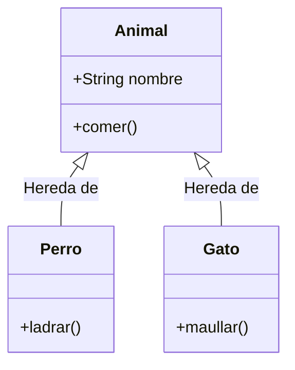
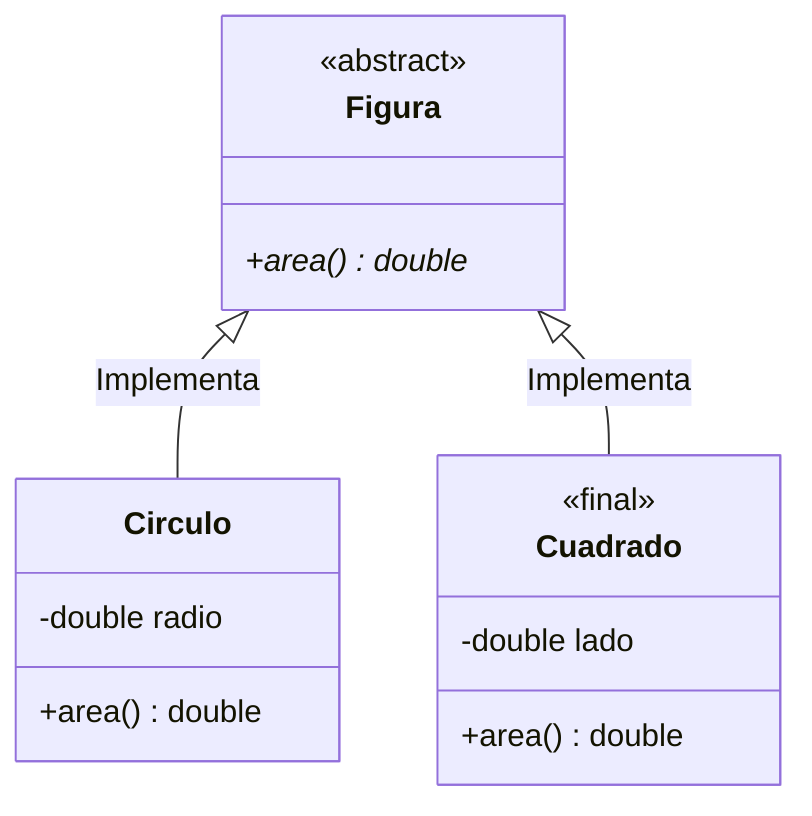
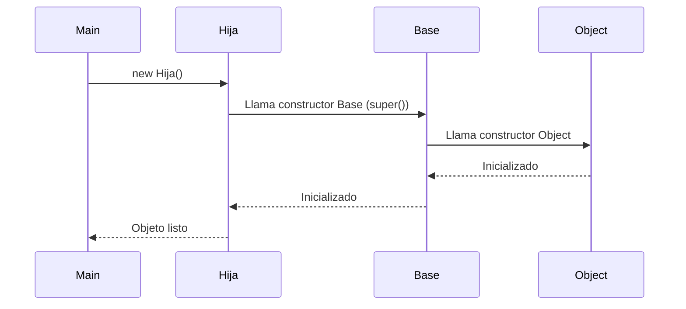

# 1. Fundamentos de la Herencia

En este módulo sentaremos las bases de la Programación Orientada a Objetos avanzada, entendiendo cómo extender clases, controlar el acceso a sus miembros e inicializarlas correctamente.

---

<iframe width="780" height="440" src="https://www.youtube.com/embed/jYFNH3jeD0g?list=PLGIH-7eZDbVw6q2AdcAUe2r6YxJYBkfCi" title="Programación Avanzada Orientada a Objetos. Herencia" frameborder="0" allow="accelerometer; autoplay; clipboard-write; encrypted-media; gyroscope; picture-in-picture; web-share" referrerpolicy="strict-origin-when-cross-origin" allowfullscreen></iframe>

> 💡 **Nota:**
> Algunos conceptos en el video están aplicados al lenguaje C#.<br>
> Por ejemplo, la palabra clave `base` en C# es equivalente a `super` en Java.


## 1.1 Herencia en Java

### ¿Qué es la herencia?

La herencia permite crear nuevas clases a partir de una clase existente, obteniendo sus campos y métodos, y pudiendo ampliar o modificar su comportamiento.

Las clases se agrupan en una **jerarquía**:
- **Clase base** (superclase): de la que se hereda.
- **Clase derivada** (subclase): que hereda y puede ampliar o modificar.

El objetivo es reutilizar código y organizar el programa de manera lógica y extensible.



En los lenguajes orientados a objetos, la herencia es un pilar fundamental que permite la creación de nuevas clases basadas en clases existentes. Esto facilita la reutilización de código, la organización lógica y la extensibilidad del software. Además tenemos varios tipos de herencia según los lenguajes de programación:

- **Herencia simple:** Una clase derivada hereda de una sola clase base. (Java, C#)
- **Herencia múltiple:** Una clase derivada hereda de múltiples clases base. (C++). Java no soporta herencia múltiple de clases, pero sí permite implementar múltiples interfaces.

Cada tipo de herencia tiene sus pros y contras, y la elección depende del diseño y los requisitos del software.

### Ventajas y Desventajas

| Tipo | Ventajas | Desventajas |
| :--- | :--- | :--- |
| **Herencia simple** | Simplicidad, menor complejidad, fácil de entender y mantener. | Menos flexible, puede requerir más clases para representar relaciones complejas. |
| **Herencia múltiple** | Mayor flexibilidad, permite combinar comportamientos de múltiples clases. | Mayor complejidad, problemas como la "ambigüedad del diamante", difícil de mantener. |

El **uso adecuado de la herencia** es crucial para un buen diseño orientado a objetos. Se recomienda usarla cuando existe una relación "es un" clara entre la clase base y la derivada, y evitarla cuando la composición (relación "tiene un") es más apropiada.

!!! tip "Consejo Pedagógico"
    Antes de heredar, hazte la pregunta del "ES UN".
    
    * ¿Un Perro **ES UN** Animal? -> **SÍ** (Herencia correcta).
    * ¿Un Coche **ES UN** Motor? -> **NO** (Un coche *TIENE UN* motor -> Usa Composición).

**El problema de la ambigüedad del diamante:** Es un problema que surge en la herencia múltiple cuando una clase derivada hereda de dos clases base que a su vez heredan de una misma clase base. Esto puede causar ambigüedad sobre qué versión de un método o propiedad debe utilizar la clase derivada. ¿Cómo se resuelve? Cada lenguaje tiene sus propias reglas y mecanismos para manejar este problema, como el uso de interfaces en Java o la especificación explícitamente de la clase base en C++.


### Ejemplo didáctico

En Java, utilizamos los métodos `get` y `set` (Getters y Setters) para acceder y modificar atributos privados, siguiendo el principio de encapsulamiento.

```java
public class Animal {
    private String nombre;

    public String getNombre() {
        return nombre;
    }

    public void setNombre(String nombre) {
        this.nombre = nombre;
    }

    public void comer() {
        System.out.println(nombre + " está comiendo.");
    }
}

// 'extends' es la palabra clave para herencia en Java
public class Perro extends Animal {
    public void ladrar() {
        System.out.println("Guau guau!");
    }
}
```

El `Perro` puede acceder y usar los métodos públicos de la clase base `Animal`.

### Ejemplo avanzado

```java
public class Animal {
    private String nombre;

    public String getNombre() {
        return nombre;
    }
    
    public void setNombre(String nombre) {
        this.nombre = nombre;
    }

    // En Java, los métodos no estáticos y no privados son virtuales por defecto.
    public void mover() {
        System.out.println("Animal se mueve.");
    }
}

public class Ave extends Animal {
    // Usamos la anotación @Override para indicar que estamos sobrescribiendo un método.
    @Override
    public void mover() {
        System.out.println(getNombre() + " vuela.");
    }
}

public class Pez extends Animal {
    @Override
    public void mover() {
        System.out.println(getNombre() + " nada.");
    }
}
```

En este ejemplo, el método `mover` tiene un comportamiento diferente dependiendo de la subclase.

---

## 1.2 Modificadores de acceso y de herencia

### Acceso

Los modificadores de acceso definen la visibilidad de los miembros de una clase. Es fundamental entenderlos para aplicar correctamente el principio de **encapsulamiento**.

- **public:** Accesible desde cualquier parte.
- **private:** Solo desde la clase actual.
- **protected:** Desde la clase actual, subclases (mismo o diferente paquete) y clases del mismo paquete.
- **(default/package-private):** Sin modificador explícito. Solo accesible desde clases del mismo paquete.

#### Tabla de Visibilidad (Guía rápida)

| Modificador | Clase Base | Clase (mismo paquete) | Subclase (dif. paquete) | Mundo Exterior |
| :--- | :---: | :---: | :---: | :---: |
| **public** | ✅ | ✅ | ✅ | ✅ |
| **protected** | ✅ | ✅ | ✅ | ❌ |
| **(default)** | ✅ | ✅ | ❌ | ❌ |
| **private** | ✅ | ❌ | ❌ | ❌ |

### De herencia

Modificadores que controlan la herencia y sobrescritura:

- **abstract:** Indica que una clase no se puede instanciar o un método no tiene implementación (debe ser implementado por hijas).
- **final:** Impide que una clase sea heredada o un método sea sobrescrito (equivalente a `sealed` en C# para clases).
- **@Override:** Anotación que asegura que estamos sobrescribiendo correctamente un método de la superclase.

#### Representación Visual



#### Ejemplo

```java
// Clase abstracta, no se puede instanciar.
public abstract class Figura {
    public abstract double area();
}

// Clase derivada concreta
public class Circulo extends Figura {
    private double radio;
    
    public Circulo(double radio) {
        this.radio = radio;
    }
    
    @Override
    public double area() {
        return Math.PI * radio * radio;
    }
}

// Clase final, no se puede heredar de ella.
public final class Cuadrado extends Figura {
    private double lado;
    
    public Cuadrado(double lado) {
        this.lado = lado;
    }
    
    @Override
    public double area() {
        return lado * lado;
    }
}
```

---

## 1.3 Uso de `super` en Herencia: constructores, métodos e inicializadores

La palabra clave `super` en Java cumple funciones similares a `base` en C#:
- Permite acceder a miembros de la superclase.
- Invoca al constructor de la superclase.

**Inicialización en herencia**:
El orden de inicialización es:
1. Constructores de la superclase (hasta llegar a Object).
2. Inicializadores de instancia y constructor de la clase derivada.



### 1.3.1. Invocando el constructor de la clase base con `super`

```java
public class Vehiculo {
    public String marca;
    public Vehiculo(String marca) {
        this.marca = marca;
        System.out.println("Constructor Vehiculo");
    }
}

public class Coche extends Vehiculo {
    public String modelo;
    public Coche(String marca, String modelo) {
        super(marca); // Llama explícitamente al constructor de la base. DEBE ser la primera línea.
        this.modelo = modelo;
        System.out.println("Constructor Coche");
    }
}

// Uso:
// Coche coche = new Coche("Volkswagen", "Golf");
// Salida:
// Constructor Vehiculo
// Constructor Coche
```

### 1.3.2. Extendiendo y reutilizando métodos heredados con `super`

```java
public class Vehiculo {
    public void arrancar() {
        System.out.println("Vehículo arrancando genéricamente.");
    }
}

public class Moto extends Vehiculo {
    @Override
    public void arrancar() {
        super.arrancar(); // Llama al método de la base
        System.out.println("La moto acelera tras arrancar.");
    }
}

// Uso:
// Moto moto = new Moto();
// moto.arrancar();
// Salida:
// Vehículo arrancando genéricamente.
// La moto acelera tras arrancar.
```

### 1.3.3. Sobrescribir métodos "getter" y acceder a la base

En Java no hay "propiedades" como en C#, pero podemos sobrescribir los métodos get.

```java
public class Electrodomestico {
    private String marca = "Sin marca";
    
    public void setMarca(String marca) { this.marca = marca; }
    public String getMarca() { return marca; }

    public String getDescripcion() {
        return "Electrodoméstico de marca " + getMarca();
    }
}

public class Lavadora extends Electrodomestico {
    private String tipoCarga = "Frontal";
    
    public void setTipoCarga(String tipoCarga) { this.tipoCarga = tipoCarga; }
    public String getTipoCarga() { return tipoCarga; }

    @Override
    public String getDescripcion() {
        return super.getDescripcion() + ", tipo de carga: " + getTipoCarga();
    }
}
```

### 1.3.4. Orden de inicialización de campos y constructores

```java
public class Animal {
    public String especie = "Desconocida"; // Inicializador
    public Animal() {
        System.out.println("Animal: Constructor ejecutado. Especie: " + especie);
    }
}

public class Perro extends Animal {
    public String raza = "Sin raza";       // Inicializador
    public Perro() {
        System.out.println("Perro: Constructor ejecutado. Raza: " + raza);
    }
}

// Uso:
// Perro perro = new Perro();
```

**Salida esperada:**
```
Animal: Constructor ejecutado. Especie: Desconocida
Perro: Constructor ejecutado. Raza: Sin raza
```

### Resumen didáctico

- `super` permite acceder a la implementación del padre.
- La llamada a `super()` en el constructor debe ser la primera instrucción.
- Los constructores se ejecutan en cadena desde la clase más alta (Object) hacia abajo.
- `@Override` es una buena práctica para asegurar que realmente estás sobrescribiendo.

---

## 1.4. Miembros Estáticos y Herencia (¡Importante!)

### ¿Se heredan los métodos estáticos?
**SÍ**, los métodos estáticos se heredan. Puedes llamar a `Hija.metodoEstatico()` si está definido en el Padre.

### ¿Son polimórficos? (¿Funcionan con `@Override`?)
**NO**. No existe el polimorfismo dinámico con métodos estáticos. Se resuelven en **tiempo de compilación**.

!!! warning "Regla de oro"
    Los métodos estáticos pertenecen a la clase, no a la instancia. No se pueden sobrescribir (`@Override`). Si defines un método estático con el mismo nombre en la hija, estás **ocultando** el del padre.

```java
public class Persona {
    public static int contadorPersonas = 0;
    
    public Persona() {
        contadorPersonas++;
    }
    
    public static void mostrarContador() {
        System.out.println("Total personas: " + contadorPersonas);
    }
    
    public void presentarse() {
        System.out.println("Hola, soy una persona.");
    }
}

public class Estudiante extends Persona {
    
    // Esto es OCULTACIÓN (Hiding), NO sobrescritura (Overriding).
    // En Java no se usa 'new' como en C#, simplemente se declara igual.
    // Poner @Override aquí daría ERROR de compilación.
    public static void mostrarContador() {
        System.out.println("Contador estático Estudiante: " + contadorPersonas);
    }
    
    @Override
    public void presentarse() {
        System.out.println("Hola, soy un estudiante.");
    }
}

// USO:
// Persona.mostrarContador();    // Llama al de Persona
// Estudiante.mostrarContador(); // Llama al de Estudiante
```

```mermaid
flowchart TD
    subgraph "Métodos de Instancia (Polimorfismo)"
        A[p.presentarse()] --> E["Hola, soy una persona"]
        C[e.presentarse()] --> F["Hola, soy un estudiante"]
        style E fill:#e1ffe1
        style F fill:#e1ffe1
    end
    
    subgraph "Métodos Estáticos (Ocultación)"
        G[Persona.mostrarContador()] --> H["Total personas..."]
        I[Estudiante.mostrarContador()] --> J["Contador estático Estudiante..."]
        style H fill:#fff4e1
        style J fill:#fff4e1
    end
```

### Ejemplo de "Ocultación" Estática

Si defines un método estático con el mismo nombre en la hija, ocultas el del padre. La versión que se ejecuta depende de la referencia de la clase que uses en el código, no del objeto en memoria.

**Conclusión pedagógica:** Usa métodos estáticos para utilidades, pero no intentes construir jerarquías polimórficas con ellos.
