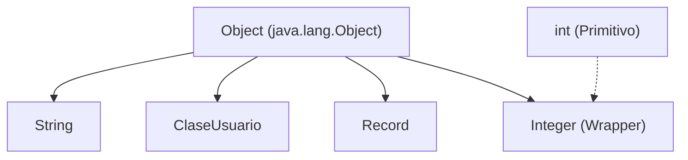

# 3. Tipado y Datos

En Java, casi todo es un objeto, pero existen diferencias fundamentales entre tipos primitivos y objetos, así como nuevos tipos como los `records` que simplifican el modelado de datos.

---

## 3.1 El tipo `Object` en Java

El tipo **`java.lang.Object`** es la superclase raíz de todas las clases en Java. Cualquier clase que crees hereda implícitamente de `Object`.

> **Nota Importante:** A diferencia de C# donde "todo" hereda de Object, en Java los **tipos primitivos** (`int`, `boolean`, `double`, etc.) **NO** heredan de `Object`. Sin embargo, tienen clases envoltorios ("Wrappers") como `Integer`, `Boolean`, `Double` que sí son objetos.

### ¿Por qué es importante el tipo `Object`?

1.  **Polimorfismo Universal**: Permite que una variable de tipo `Object` pueda almacenar una referencia a cualquier objeto (pero no primitivos directamente, aunque el *autoboxing* lo hace transparente).
2.  **Métodos Estándar**: Proporciona métodos básicos que toda clase tiene:
    - `equals(Object)`: Para comparar si dos objetos son iguales.
    - `hashCode()`: Para obtener un código hash único del objeto.
    - `toString()`: Para obtener la representación en texto del objeto.
    - `getClass()`: Para conocer el tipo exacto en tiempo de ejecución.

### Jerarquía en Java



### Ejemplo:

```java
Object obj = "Hola";
System.out.println(obj.getClass().getName()); // Imprime java.lang.String

obj = 10; // Autoboxing: convierte int primitivo a Integer automáticamente
System.out.println(obj.getClass().getName()); // Imprime java.lang.Integer
```

---

## 3.2 Tipos especiales: class, record

Aunque todos los objetos heredan de `Object`, la semántica cambia según el tipo de construcción que usemos.

- **`class` (Clase)**: Es la base de la POO. Entidades con identidad, estado mutable (generalmente) y comportamiento.
- **`record` (Registro)**: Introducido oficialmente en Java 16. Es una clase inmutable diseñada para almacenar datos. Su principal característica es que genera automáticamente constructor, getters, `equals()`, `hashCode()` y `toString()` basándose en sus componentes.

### Tabla Comparativa

| Característica | `class` | `record` |
| :--- | :--- | :--- |
| **Propósito** | Entidades complejas, lógica de negocio | Contenedores de datos inmutables (DTOs) |
| **Mutabilidad** | Mutable (por defecto) | Inmutable (por diseño) |
| **Boilerplate** | Alto (requiere escribir getters/setters/equals) | Mínimo (todo generado automáticamente) |
| **Igualdad** | Por referencia (salvo que sobrescribas equals) | Por valor (compara el contenido de los campos) |
| **Herencia** | Puede heredar y ser heredada | No puede heredar (salvo interfaces). Es implícitamente `final`. |

### Ejemplo

=== "Clase Tradicional"
    ```java
    public class Vehiculo {
        private String matricula;
        public String getMatricula() { return matricula; }
        public void setMatricula(String matricula) { this.matricula = matricula; }
    }
    ```

=== "Record (Java 16+)"
    ```java
    // Todo en una línea: Constructor, Getters, Equals, HashCode, ToString
    public record Persona(String nombre, int edad) {}
    ```

---

## 3.3 Casting y Type Safety

Java es un lenguaje de tipado fuerte y estático. Si usamos `Object` para generalizar, perderemos acceso a los métodos específicos de la clase real, a menos que hagamos un **casting** explícito.

### Uso de `Object` y Casting

```java
Object obj = "Hola Mundo";
// System.out.println(obj.length()); // Error de compilación: Object no tiene el método length()

// Casting explícito: Le decimos al compilador "confía en mí, esto es un String"
System.out.println(((String)obj).length()); // OK
```

Es importante verificar el tipo antes de hacer casting para evitar errores en tiempo de ejecución (`ClassCastException`):

```java
if (obj instanceof String) {
    System.out.println(((String)obj).length());
}
```

O usando **Pattern Matching para instanceof** (Java 16+):

```java
if (obj instanceof String s) {
    System.out.println(s.length()); // 's' ya es un String
}
```

---

## 3.4 ¿Cuándo usar cada uno?

*   Usa **`class`** para entidades con identidad propia y comportamiento complejo.
*   Usa **`record`** para modelos de datos simples (DTOs), respuestas de API o clases que no tengan comportamiento.
*   Evita usar **`Object`** como tipo de variable a menos que sea estrictamente necesario para algoritmos muy genéricos; prefiere siempre el polimorfismo mediante interfaces o genéricos.
