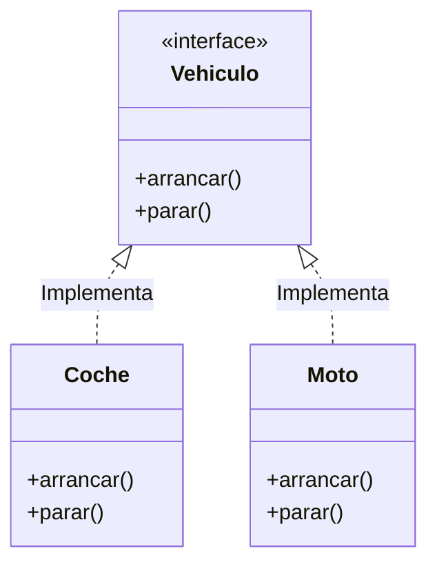

# 4. Interfaces

<iframe width="780" height="440" src="https://www.youtube.com/embed/KVCVNVBw9AI?list=PLGIH-7eZDbVw6q2AdcAUe2r6YxJYBkfCi" title="Programación Avanzada Orientada a Objetos. Interfaces" frameborder="0" allow="accelerometer; autoplay; clipboard-write; encrypted-media; gyroscope; picture-in-picture; web-share" referrerpolicy="strict-origin-when-cross-origin" allowfullscreen></iframe>

## 4.1. Definición y propósito

Una **interface** en Java es un contrato que define **métodos**, pero no su implementación. Una clase que implementa una interface debe proporcionar una implementación para todos los métodos abstractos definidos en ella.

Se puede decir que una interface es un conjunto de reglas que una clase debe seguir si decide "firmar" ese contrato y estar de acuerdo con él y obligarse a cumplirlo.



A su vez, es un mecanismo fundamental para lograr **abstracción**, **polimorfismo múltiple** y **desacoplamiento** en el diseño de software. Java no tiene herencia múltiple de clases, pero sí permite implementar múltiples interfaces.

*   **Las interfaces permiten:**
    *   Definir “lo que algo puede hacer” sin establecer cómo lo hace.
    *   El polimorfismo múltiple: una clase puede implementar varias interfaces.
    *   La programación orientada a interfaces en vez de a clases: tu código depende de contratos, no de implementaciones concretas.
    *   Tipar variables y colecciones, facilitando la reutilización y pruebas unitarias.

---

## 4.2. Ejemplo básico de interface y uso como tipo

*   Al contrario que una clase, una interface tradicionalmente no contiene estado (campos de instancia), aunque puede contener constantes (`static final`).
*   Los miembros de una interface son **públicos** por defecto.
*   Una interface no puede ser instanciada directamente.
*   Una clase implementa una interface usando la palabra clave `implements`.
*   A partir de Java 8, existen métodos `default` y `static` con código.

```java
public interface IVehiculo {
    void arrancar();
    void parar();
    
    // Método estático en interface (Java 8+)
    static boolean crear() {
        return true;
    }
}

public class Coche implements IVehiculo {
    @Override
    public void arrancar() {
        System.out.println("El coche arranca");
    }
    
    @Override
    public void parar() {
        System.out.println("El coche para");
    }
}

// Uso:
IVehiculo vehiculo = new Coche();
vehiculo.arrancar(); // "El coche arranca"
vehiculo.parar();    // "El coche para"
IVehiculo.crear();    // true, llamada estática a la interfaz
```

---

## 4.3. Implementación de múltiples interfaces

Una clase puede implementar varias interfaces separadas por comas (`implements A, B`):

```java
public interface Electrico {
    void recargar();
}

public class CocheElectrico implements Vehiculo, Electrico {
    @Override
    public void arrancar() { System.out.println("Arranca el coche eléctrico"); }
    
    @Override
    public void parar() { System.out.println("Para el coche eléctrico"); }
    
    @Override
    public void recargar() { System.out.println("Recarga..."); }
}
```

Esto permite mezclar distintos "contratos" en una misma clase.

---

## 4.4. Herencia múltiple de interfaces

Una interface puede heredar de múltiples interfaces (`extends A, B`):

```java
public interface VehiculoTerrestre {
    void conducir();
}
public interface VehiculoAereo {
    void volar();
}

// Herencia múltiple de interfaces
public interface VehiculoHibrido extends VehiculoTerrestre, VehiculoAereo {
    void cambiarModo();
}

public class AvionCoche implements VehiculoHibrido {
    @Override
    public void conducir() { System.out.println("Conduciendo en tierra"); }
    
    @Override
    public void volar() { System.out.println("Volando en el aire"); }
    
    @Override
    public void cambiarModo() { System.out.println("Cambiando modo..."); }
}
```

---

## 4.5. Métodos por defecto (default methods)

Desde Java 8, se pueden proporcionar implementaciones por defecto en interfaces usando la palabra clave `default`.
Esto significa que si una clase no implementa ese método, usará la versión por defecto de la interface.

```java
public interface Vehiculo {
    void arrancar();
    
    default void parar() {
        System.out.println("Parando de forma genérica (default)");
    }
}

public class Patinete implements Vehiculo {
    @Override
    public void arrancar() { System.out.println("El patinete arranca"); }
    // parar() no implementado: usará el default del padre
}

// Patinete p = new Patinete();
// p.arrancar(); // "El patinete arranca"
// p.parar();    // "Parando de forma genérica (default)"
```

---

## 4.6. Uso de interfaces para tipar

Una de las ventajas más poderosas es usar interfaces como **tipo de variables, listas o argumentos**:

```java
public interface Animal {
    void hacerSonido();
}

public class Perro implements Animal {
    @Override
    public void hacerSonido() { System.out.println("Guau guau"); }
}

public class Gato implements Animal {
    @Override
    public void hacerSonido() { System.out.println("Miau miau"); }
}

public void hacerSonarAnimal(Animal animal) {
    animal.hacerSonido();
}

// Uso polimórfico
Animal[] animales = { new Perro(), new Gato() };

for (Animal a : animales) {
    hacerSonarAnimal(a);
}
```

---

## 4.7. Resolución de conflictos de métodos

### Caso 1: Conflicto, misma firma, sin implementación por defecto

Si dos interfaces definen el mismo método abstracto, la clase simplemente lo implementa una vez y esa implementación satisface a ambas.

```java
public interface Zumbador {
    void arrancar();
}
// Vehiculo también tiene void arrancar()

public class Coche implements Vehiculo, Zumbador {
    // Una sola implementación sirve a ambas interfaces
    @Override
    public void arrancar() { 
        System.out.println("Arranca según ambos contratos"); 
    }
}
```

### Caso 2: Conflicto de métodos default

Si dos interfaces tienen métodos `default` con la misma firma, se produce un conflicto que el compilador **te obliga a resolver** sobrescribiendo el método.

```java
public interface A {
    default void muestra() { System.out.println("Muestra A"); }
}
public interface B {
    default void muestra() { System.out.println("Muestra B"); }
}

public class Demo implements A, B {
    // Error de compilación si no sobrescribimos: "inherits unrelated defaults"
    
    @Override
    public void muestra() {
        // Opción 1: Implementación propia nueva
        // System.out.println("Mi propia lógica");
        
        // Opción 2: Elegir explícitamente una de las interfaces
        A.super.muestra(); 
        // B.super.muestra();
    }
}
```

!!! warning "Importante"
    Java no tiene "implementación explícita de interfaz" (ocultar métodos según el cast) como C#. En Java, el método siempre es público en la clase.

---

## 4.8. Uso de Herencia e Interfaces juntos

Primero `extends` (clase base), luego `implements` (interfaces).

```java
public class Base {
    public void muestra() { System.out.println("Muestra Base"); }
}

public interface A {
    default void muestra() { System.out.println("Muestra A"); }
}

public class Derivada extends Base implements A {
    // Regla "Clases ganan": La implementación de la clase Base tiene prioridad sobre el default de la interfaz.
    // No hace falta sobrescribir (salvo que quieras).
}

// Derivada d = new Derivada();
// d.muestra(); // Imprime "Muestra Base"
```

---

## 4.9. Resumen de ventajas y mejores prácticas

- Las interfaces permiten una programación orientada a contratos.
- Facilitan el polimorfismo y el desacoplamiento.
- Permiten métodos `default` para evolución de APIs.
- **Inversión de Dependencia:** Depende de abstracciones (`List`, `Map`, `Vehiculo`), no de concreciones (`ArrayList`, `HashMap`, `Coche`).

```java
// Código desacoplado usando interfaces
public class GestorNotificaciones {
    private Notificable notificador;
    
    public GestorNotificaciones(Notificable notificador) {
        this.notificador = notificador;
    }
    
    public void notificar(String msg) {
        notificador.enviar(msg);
    }
}
```
