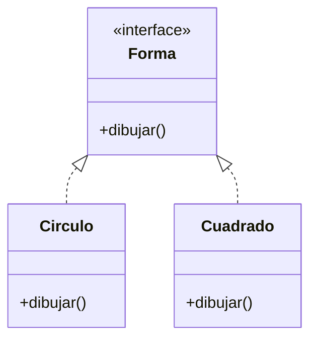

# 5. Polimorfismo

<iframe width="780" height="440" src="https://www.youtube.com/embed/1zSUaBudbWQ?list=PLGIH-7eZDbVw6q2AdcAUe2r6YxJYBkfCi" title="Programación Avanzada Orientada a Objetos. Polimorfismo" frameborder="0" allow="accelerometer; autoplay; clipboard-write; encrypted-media; gyroscope; picture-in-picture; web-share" referrerpolicy="strict-origin-when-cross-origin" allowfullscreen></iframe>


El **polimorfismo** permite que diferentes clases respondan de manera distinta a la misma interfaz o método. Esto se logra principalmente mediante la herencia y las interfaces. ¿Por qué es útil? Porque permite escribir código más flexible y reutilizable.

De esta manera **en tiempo de ejecución, el método que se ejecuta depende del tipo real del objeto, no del tipo de la referencia**.

Es decir, puedes tener una variable de tipo base o interface que apunte a objetos de diferentes clases derivadas, y al llamar a un método, se ejecutará la versión correspondiente a la clase real del objeto.

> **Analogía:** Es como un mando universal. El botón "Encender" funciona para la TV, el DVD y el Aire Acondicionado, pero cada uno reacciona de forma distinta. Tú solo pulsas "Encender" (la interfaz), y el dispositivo (el objeto) sabe qué hacer.



¿Por qué funciona? Pues en tiempo de ejecución se resuelve el método correcto mediante una tabla de métodos virtuales (vtable) que asocia cada clase con sus implementaciones y con ello se consigue el comportamiento polimórfico.

Diferencia entre sobrecarga (compile-time) y polimorfismo (run-time):
- **Sobrecarga de métodos:** Mismo nombre, diferentes parámetros. Resuelto en tiempo de compilación.
- **Polimorfismo:** Mismo método, diferentes implementaciones (sobrescritura). Resuelto en tiempo de ejecución.

La ligadura dinámica (dynamic binding) es el mecanismo que permite que la llamada a un método se resuelva en tiempo de ejecución, basándose en el tipo real del objeto.

## 5.1 Polimorfismo por herencia

```java
class Animal {
    public void hacerSonido() { System.out.println("El animal hace un sonido"); }
}

class Vaca extends Animal {
    @Override
    public void hacerSonido() { System.out.println("Muuuu"); }
}

class Perro extends Animal {
    @Override
    public void hacerSonido() { System.out.println("Guau guau"); }
}

class Gato extends Animal {
    @Override
    public void hacerSonido() { System.out.println("Miau miau"); }
}


Animal[] animales = {
    new Vaca(), new Perro(), new Gato()
};

for (Animal a : animales) {
    a.hacerSonido(); // Cada animal ejecuta su propio método
}
```

## 5.2 Polimorfismo con interfaces

```java
public interface Pintable {
    void pintar();
}

public class Coche implements Pintable {
    @Override
    public void pintar() { System.out.println("Pintando coche"); }
}
public class Casa implements Pintable {
    @Override
    public void pintar() { System.out.println("Pintando casa"); }
}

Pintable[] objetos = {
    new Coche(),
    new Casa()
};

for (Pintable obj : objetos) {
    obj.pintar(); // Cada objeto ejecuta su propio método Pintar
}
```

---

## 5.3 Casting y comprobación de tipos para polimorfismo seguro

A la hora de trabajar con polimorfismo, a veces es necesario convertir (cast) una referencia de un tipo base o interface a un tipo derivado específico para acceder a miembros particulares.

### Evolución del Casting y comprobación de tipos

=== "1. Casting Explícito (Inseguro)"
    ```java
    Vehiculo v = new Coche("Seat", "Rojo");
    
    // Si no verificas antes, te arriesgas a una ClassCastException
    Coche c = (Coche)v; 
    c.arrancar();
    ```

=== "2. instanceof Clásico (Seguro pero verboso)"
    ```java
    // Forma típica antes de Java 16
    if (v instanceof Coche) {
        Coche c = (Coche) v; // Cast repetitivo
        c.arrancar();
    }
    ```

=== "3. Pattern Matching (Java 16+)"
    ```java
    // Comprobación + Cast + Declaración en un solo paso
    if (v instanceof Coche c) {
        c.arrancar();
    }
    
    // Con condiciones extra (Guardas)
    if (v instanceof Coche c && "Rojo".equals(c.color)) {
        System.out.println("Es rojo");
    }
    ```

---

## 5.4 Polimorfismo en Colecciones y Métodos

Siempre que trabajes con colecciones o métodos, usa el tipo más genérico posible (Clase Base o Interfaz).

```java
interface Forma {
    double area();
}

class Circulo implements Forma {
    public double radio;
    public Circulo(double r) { this.radio = r; }
    @Override public double area() { return Math.PI * radio * radio; }
}

class Rectangulo implements Forma {
    public double ancho, alto;
    public Rectangulo(double ancho, double alto) { 
        this.ancho = ancho; 
        this.alto = alto; 
    }
    @Override public double area() { return ancho * alto; }
    public double perimetro() { return 2 * (ancho + alto); }
}

Forma[] formas = {
    new Circulo(5),
    new Rectangulo(4, 6)
};

for (Forma forma : formas) {
    System.out.println("Área: " + forma.area());
    
    // Pattern Matching para acceder a métodos específicos
    if (forma instanceof Rectangulo r) {
        System.out.println("Perímetro: " + r.perimetro());
    }
}
```

> 📝 **Nota técnica:** Al igual que en C#, Java usa internamente una **vtable** (tabla de métodos virtuales) para resolver qué método llamar en tiempo de ejecución. El coste de rendimiento es insignificante.
