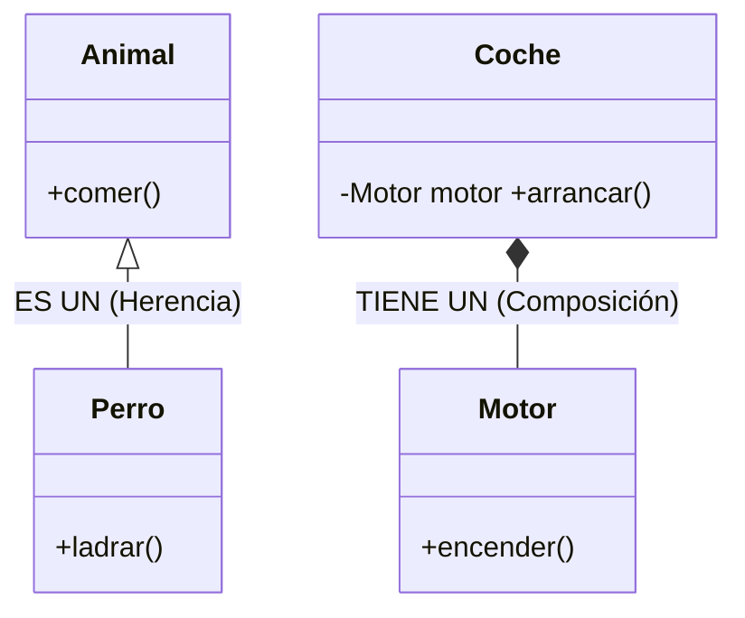

# 6. Arquitectura y Diseño

Escribir código que funcione es fácil; escribir código que perdure es un arte. En esta sección abordaremos cómo estructurar nuestras clases para que sean mantenibles, flexibles y testables.

---

<iframe width="780" height="440" src="https://www.youtube.com/embed/YEDWx6_1aEc?list=PLGIH-7eZDbVw6q2AdcAUe2r6YxJYBkfCi" title="Prog. Avanzada Orientada a Objetos. Herencia vs Composición" frameborder="0" allow="accelerometer; autoplay; clipboard-write; encrypted-media; gyroscope; picture-in-picture; web-share" referrerpolicy="strict-origin-when-cross-origin" allowfullscreen></iframe>

> 💡 **Nota:**
> Algunos conceptos en el video no se pueden aplicar directamente a Java, ya que están aplicados al lenguaje C#.<br>

## 6.1. Herencia vs Composición

### Conceptos fundamentales

**Herencia** y **Composición** son los dos principales mecanismos para organizar y reutilizar código en la programación orientada a objetos.



#### Herencia (`IS-A` o "Es un")
- Una clase *hereda* (`extends`) de otra.
- Ejemplo: Un `Perro` hereda de `Animal`.

#### Composición (`HAS-A` o "Tiene un")
- Una clase *contiene* instancias de otras clases como campos.
- Ejemplo: Un `Coche` tiene un `Motor`.

### Pros y contras de la Herencia

**Ventajas:**
- Reutilización de código.
- Polimorfismo.

**Desventajas:**
- **Acoplamiento fuerte**.
- Frágil para evolución (Ripple Effect).
- Posible violación del principio de Liskov.

### Pros y contras de la Composición

**Ventajas:**
- **Desacoplamiento**: Usas interfaces, puedes cambiar la implementación.
- **Flexibilidad**: Puedes cambiar comportamientos en tiempo de ejecución (Strategy Pattern).
- Base de la **inyección de dependencias**.

### ¿Por qué la composición suele ser preferible en el diseño moderno?

Actualmente, se prefiere composición a herencia ("composition over inheritance") porque facilita el cumplimiento de los **principios SOLID** y hace el código más testeaable.

### Ejemplo comparativo y con interfaces

#### Ejemplo de herencia (IS-A):

```java
public class Animal {
    public void hacerSonido() { System.out.println("Sonido genérico"); }
}

public class Perro extends Animal {
    @Override
    public void hacerSonido() { System.out.println("Guau guau!"); }
}
```

#### Ejemplo de composición (HAS-A):

Usando composición con interfaces para máximo desacoplamiento:

```java
public interface Motor {
    void encender();
}

public class MotorGasolina implements Motor {
    @Override
    public void encender() { System.out.println("Motor gasolina encendido"); }
}

public class MotorElectrico implements Motor {
    @Override
    public void encender() { System.out.println("Motor eléctrico encendido"); }
}

public class Coche {
    private Motor motor; // Composición: Tiene un motor
    
    // Inyección de dependencia por constructor
    public Coche(Motor motor) {
        this.motor = motor;
    }
    
    public void arrancar() {
        motor.encender();
    }
}

// Uso:
Coche coche1 = new Coche(new MotorGasolina());
Coche coche2 = new Coche(new MotorElectrico());
coche1.arrancar();
coche2.arrancar();
```

---

## 6.2. Principios SOLID (explicaciones y ejemplos reales)

SOLID es un acrónimo de los 5 principios esenciales del diseño OO:

| Letra | Principio | Concepto Clave |
| :---: | :--- | :--- |
| **S** | Single Responsibility | Una clase, una razón para cambiar. |
| **O** | Open/Closed | Abierto a extensión, cerrado a modificación. |
| **L** | Liskov Substitution | Las subclases deben comportarse como sus padres. |
| **I** | Interface Segregation | Interfaces pequeñas y específicas. |
| **D** | Dependency Inversion | Depender de abstracciones, no de concreciones. |

### S - Single Responsibility Principle (Responsabilidad Única)

### S - Single Responsibility Principle (Responsabilidad Única)

=== "❌ Mal Diseño (Viola SRP)"
    ```java
    // Esta clase hace dos cosas: Generar datos e Imprimir. Violando SRP.
    public class Reporte {
        public void generar() {
            System.out.println("Reporte generado");
        }
        public void imprimir() {
            System.out.println("Reporte impreso");
        }
    }
    ```

=== "✅ Bien Diseñado (Aplica SRP)"
    ```java
    // Separamos responsabilidades en clases distintas
    public class Reporte {
        public void generar() {
            System.out.println("Reporte generado");
        }
    }

    public class Impresora {
        public void imprimir(Reporte reporte) {
            System.out.println("Imprimiendo reporte...");
        }
    }
    ```

### O - Open/Closed Principle (Abierto/Cerrado)

El código debe estar abierto para extenderse pero cerrado para modificarse.

=== "❌ Mal Diseño (Viola OCP)"
    ```java
    public class CalculadoraDeAreas {
        public double total(Object[] figuras) {
            double total = 0;
            for (Object f : figuras) {
                // Si añadimos 'Triangulo', tenemos que modificar esta clase. ¡MAL!
                if (f instanceof Circulo c) {
                    total += Math.PI * c.radio * c.radio;
                } else if (f instanceof Cuadrado q) {
                    total += q.lado * q.lado;
                }
            }
            return total;
        }
    }
    ```

=== "✅ Bien Diseñado (Aplica OCP)"
    ```java
    // Polimorfismo al rescate. 'Forma' define el contrato.
    public interface Forma {
        double area();
    }
    
    // Si añadimos 'Triangulo', NO tocamos la lógica principal.
    public class Circulo implements Forma { 
        /* ... */ 
        public double area() { return Math.PI * radio * radio; }
    }
    
    public double calcularAreaTotal(Forma[] formas) {
        double total = 0;
        for (Forma f : formas) {
            total += f.area(); // Abierto a extensión (nuevas formas), Cerrado a modificación
        }
        return total;
    }
    ```

### L - Liskov Substitution Principle (Sustitución de Liskov)

Si `Pinguino extends Pajaro`, `Pinguino` debe poder hacer todo lo que hace `Pajaro`.

=== "❌ Mal Diseño (Viola LSP)"
    ```java
    public class Pajaro {
        public void volar() { System.out.println("Volando"); }
    }
    
    public class Pinguino extends Pajaro {
        @Override
        public void volar() {
             // Rompe la expectativa del padre. No es sustituible.
             throw new UnsupportedOperationException("No puedo volar");
        }
    }
    ```

=== "✅ Bien Diseñado (Aplica LSP)"
    ```java
    // Segregamos interfaces por capacidades
    public interface Ave { void comer(); }
    public interface AveVoladora extends Ave { void volar(); }
    public interface AveNadadora extends Ave { void nadar(); }
    
    public class Pinguino implements AveNadadora {
        public void comer() { /* ... */ }
        public void nadar() { /* ... */ }
    }
    
    public class Aguila implements AveVoladora {
        public void volar() { /* ... */ }
    }
    ```

### I - Interface Segregation Principle (Segregación de Interfaces)

No obligues a una clase a implementar métodos que no usa.

=== "❌ Mal Diseño (Viola ISP)"
    ```java
    // Interfaz gigante. Un Pinguino no vuela pero le obligas a tener el método.
    public interface Animal {
        void volar();
        void nadar();
        void correr();
    }
    ```

=== "✅ Bien Diseñado (Aplica ISP)"
    ```java
    // Interfaces pequeñas y específicas
    public interface Volador { void volar(); }
    public interface Nadador { void nadar(); }
    public interface Corredor { void correr(); }
    
    public class Pinguino implements Nadador, Corredor {
        public void nadar() { /* ... */ }
        public void correr() { /* ... */ }
    }
    ```

### D - Dependency Inversion Principle (Inversión de dependencias)

Depende de abstracciones, no de concreciones.

=== "❌ Mal Diseño (Viola DIP)"
    ```java
    public class Coche {
        // Dependencia oculta y acoplada a una clase concreta
        private MotorGasolina motor = new MotorGasolina(); 
        
        public void arrancar() {
            motor.encender();
        }
    }
    ```

=== "✅ Bien Diseñado (Aplica DIP)"
    ```java
    public class Coche {
        private Motor motor;
        
        // Inyectamos la abstracción (Interfaz Motor)
        public Coche(Motor motor) {
            this.motor = motor;
        }
        
        public void arrancar() {
            motor.encender();
        }
    }
    ```

### Ejemplo completo aplicando SOLID

```java
// 1. ISP: Interfaces pequeñas
public interface Enviable { void enviar(String destinatario, String mensaje); }

// 2. OCP, LSP: Implementaciones intercambiables
public class EmailService implements Enviable {
    @Override
    public void enviar(String dest, String msg) {
        System.out.println("EMAIL a " + dest + ": " + msg);
    }
}

public class SMSService implements Enviable {
    @Override
    public void enviar(String dest, String msg) {
        System.out.println("SMS a " + dest + ": " + msg);
    }
}

// 3. DIP, SRP: Notificador usa abstracción
public class Notificador {
    private final Enviable servicioEnvio;
    
    // Inyección de dependencia
    public Notificador(Enviable servicioEnvio) {
        this.servicioEnvio = servicioEnvio;
    }
    
    public void notificar(String mensaje) {
        servicioEnvio.enviar("cliente@test.com", mensaje);
    }
}

// Uso
Notificador notif = new Notificador(new EmailService());
notif.notificar("Hola mundo");
```

---

## 6.3. Caso Práctico Web: Patrón Repositorio y SOLID

El patrón repositorio permite desacoplar la lógica de negocio del acceso a datos.

### El Problema
Queremos guardar usuarios. A veces en SQL, a veces en Memoria (para tests).

### La Solución: El Patrón Repositorio

1.  **Abstracción (Interface):** `UsuarioRepository`
2.  **Concreción:** `UsuarioRepositorySQL`, `UsuarioRepositoryMemoria`
3.  **Consumo:** `UsuarioController` (pide la interfaz).

### Código Real

```java
// Modelo
public class Usuario {
    public String nombre;
}

// 1. La Interfaz (El Contrato)
public interface UsuarioRepository {
    void guardar(Usuario u);
    Usuario[] obtenerTodos();
}

// 2. Implementación Real (SQL simulado)
public class UsuarioRepositorySQL implements UsuarioRepository {
    @Override
    public void guardar(Usuario u) {
        System.out.println("Guardando usuario " + u.nombre + " en SQL Server...");
    }
    @Override
    public Usuario[] obtenerTodos() {
        return new Usuario[0]; // Simulado
    }
}

// 3. Implementación de Mentira (Mock para Tests)
// Usamos arrays para evitar Listas dinámicas como se pidió, aunque es más laborioso.
public class UsuarioRepositoryMemoria implements UsuarioRepository {
    private Usuario[] fakeDb = new Usuario[100];
    private int contador = 0;

    @Override
    public void guardar(Usuario u) {
        System.out.println("Guardando usuario " + u.nombre + " en Memoria.");
        if (contador < fakeDb.length) {
            fakeDb[contador++] = u;
        }
    }
    
    @Override
    public Usuario[] obtenerTodos() {
        // Devolvemos una copia ajustada al tamaño real
        Usuario[] resultado = new Usuario[contador];
        System.arraycopy(fakeDb, 0, resultado, 0, contador);
        return resultado;
    }
}

// 4. El Consumidor (Controlador)
public class UsuarioController {
    private final UsuarioRepository repositorio;

    // DIP: Pedimos la INTERFAZ en el constructor
    public UsuarioController(UsuarioRepository repositorio) {
        this.repositorio = repositorio;
    }

    public void registrarNuevoUsuario(String nombre) {
        Usuario u = new Usuario();
        u.nombre = nombre;
        repositorio.guardar(u);
    }
}

// 5. Configuración (Main)

// Entorno Producción
UsuarioRepository repoProd = new UsuarioRepositorySQL();
UsuarioController ctrlProd = new UsuarioController(repoProd);
ctrlProd.registrarNuevoUsuario("Cliente Real");

// Entorno Test
UsuarioRepository repoTest = new UsuarioRepositoryMemoria();
UsuarioController ctrlTest = new UsuarioController(repoTest);
ctrlTest.registrarNuevoUsuario("Usuario Prueba");
```

**Conclusión Docente:** Este es el motivo real por el que estudiamos interfaces. Desacoplamiento total entre tu lógica y tus datos.
