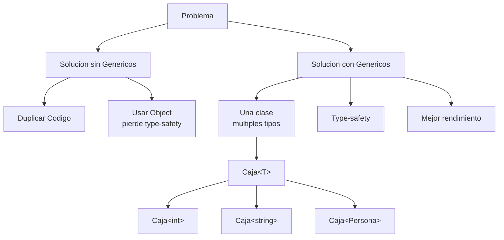

# 2. Tipos Genéricos en Java

Los **genéricos** (generics en inglés) son una característica del lenguaje que permite escribir código que funciona con diferentes tipos de datos, garantizando la **seguridad de tipos (type-safety)** en tiempo de compilación y evitando la duplicación de código. 

Fueron introducidos en Java 5 (2004) y han evolucionado significativamente en versiones recientes.

## 2.1. Introducción a los Genéricos



### 2.1.1. ¿Qué son y para qué sirven?

Imagina que necesitas crear una clase que almacene un valor. Podrías hacerlo así:

```csharp
// Clase que almacena un entero
public class CajaDeEnteros
{
    private int valor;

    public CajaDeEnteros(int valor)
    {
        this.valor = valor;
    }

    public int ObtenerValor()
    {
        return valor;
    }
}
```

Pero, ¿qué pasa si ahora necesitas una caja para strings? ¿Y para doubles? ¿Y para objetos de tu clase Persona? Tendrías que crear una clase diferente para cada tipo:

```csharp
public class CajaDeStrings { /* ... */ }
public class CajaDeDoubles { /* ... */ }
public class CajaDePersonas { /* ... */ }
```

Esto es tedioso, propenso a errores y difícil de mantener. **Los genéricos resuelven este problema**.

Con genéricos, puedes escribir una única clase que funciona con cualquier tipo:

```csharp
// Clase genérica que funciona con cualquier tipo T
public class Caja<T>
{
    private T valor;

    public Caja(T valor)
    {
        this.valor = valor;
    }

    public T ObtenerValor()
    {
        return valor;
    }
}
```

Ahora puedes usar esta clase con cualquier tipo:

```csharp
Caja<int> cajaEntero = new Caja<int>(42);
int numeroGuardado = cajaEntero.ObtenerValor(); // 42

Caja<string> cajaTexto = new Caja<string>("Hola");
string textoGuardado = cajaTexto.ObtenerValor(); // "Hola"

Caja<Persona> cajaPersona = new Caja<Persona>(new Persona("Ana", 25));
Persona personaGuardada = cajaPersona.ObtenerValor();
```

La letra `T` es un **parámetro de tipo** (type parameter). Es como una variable, pero para tipos en lugar de valores. Por convención, se suele usar `T` (de "Type"), aunque puedes usar cualquier identificador válido.

**🧠 Analogía:** El Molde de Galletas

Imagina que tienes un molde de galletas en forma de estrella:
- Si usas masa de chocolate → Obtienes galletas de chocolate con forma de estrella
- Si usas masa de vainilla → Obtienes galletas de vainilla con forma de estrella
- Si usas masa de avena → Obtienes galletas de avena con forma de estrella

El molde es como la clase genérica `Caja<T>`. La masa es el tipo que le pasas (`int`, `string`, `Persona`). El resultado es una caja específica para ese tipo.

> 💡 **Tip del Examinador**: En examen, siempre preguntan qué es `T`. Respuesta: "Es un parámetro de tipo genérico que representa el tipo con el que trabajará la clase o método. Es una especie de 'placeholder' que se sustituye por un tipo concreto al usar la clase."

### 2.1.2. Ventajas: reutilización, type-safety, rendimiento

Los genéricos proporcionan tres ventajas fundamentales:

**1. Reutilización de código**

Escribes el código una sola vez y funciona con múltiples tipos. Esto reduce la duplicación y facilita el mantenimiento.

```csharp
// Una sola clase genérica para todos los tipos
public class Pila<T>
{
    private T[] elementos;
    private int contador;

    public void Push(T elemento) { /* ... */ }
    public T Pop() { /* ... */ }
}

// Uso con diferentes tipos
Pila<int> pilaNumeros = new Pila<int>();
Pila<string> pilaTextos = new Pila<string>();
Pila<Persona> pilaPersonas = new Pila<Persona>();
```

**2. Type-safety (Seguridad de tipos)**

El compilador verifica en tiempo de compilación que estás usando los tipos correctamente, evitando errores en tiempo de ejecución.

Sin genéricos (usando object):

```csharp
// Enfoque antiguo: usar object
public class CajaSinGenericos
{
    private object valor;

    public CajaSinGenericos(object valor)
    {
        this.valor = valor;
    }

    public object ObtenerValor()
    {
        return valor;
    }
}

// Uso: propenso a errores
CajaSinGenericos caja = new CajaSinGenericos(42);
string texto = (string)caja.ObtenerValor(); // ¡ERROR en tiempo de ejecución!
// InvalidCastException: Unable to cast object of type 'System.Int32' to type 'System.String'
```

Con genéricos:

```csharp
Caja<int> caja = new Caja<int>(42);
string texto = caja.ObtenerValor(); // ERROR en tiempo de COMPILACIÓN
// Cannot implicitly convert type 'int' to 'string'
```

## 2.2. Clases e Interfaces Genéricas

### 2.2.1. Definición y sintaxis

Una clase o interfaz genérica se declara colocando el parámetro de tipo entre corchetes angulares `< >`.

```java
public class Caja<T> {
    private T contenido;

    public Caja(T contenidoInicial) {
        this.contenido = contenidoInicial;
    }

    public T getContenido() { return contenido; }
    public void setContenido(T contenido) { this.contenido = contenido; }
}
```

A partir de Java 7, se usa el **Operador Diamante (`<>`)** para inferir automáticamente el tipo en la instanciación:
```java
Caja<String> cajaTexto = new Caja<>("Hola Java");
```

### 2.2.2. Parámetros de tipo múltiples y Records (Java 14+)

Se pueden usar múltiples parámetros. En las últimas versiones de Java, los genéricos se integran perfectamente con los **Records** (estructuras inmutables):

```java
// Un Record genérico para un Par clave-valor
public record Par<K, V>(K clave, V valor) {}

Par<String, Integer> edad = new Par<>("Ana", 25);
```

## 2.3. Métodos Genéricos

Los métodos también pueden ser genéricos de manera independiente a la clase. El parámetro de tipo se declara **antes** del tipo de retorno.

```java
public class Utilidades {
    // Método genérico
    public static <T> void imprimirArray(T[] array) {
        for (T elemento : array) {
            System.out.println(elemento);
        }
    }
}
```

De esta forma, podemos usar el método genérico con cualquier tipo de array:

```java
Integer[] numeros = {1, 2, 3};
String[] textos = {"a", "b", "c"};

Utilidades.imprimirArray(numeros); // Funciona
Utilidades.imprimirArray(textos);  // Funciona
```

## 2.4. Varianza y Comodines (Wildcards)

Se llama "varianza" a la capacidad de un genérico de aceptar tipos derivados o ancestros. Java utiliza varianza en el punto de uso mediante **comodines (`?`)**.

!!! abstract "La regla de oro: PECS"
    En Java, la regla mnemotécnica para recordar cómo usar los comodines es **PECS**: **P**roducer **E**xtends, **C**onsumer **S**uper.
    
    * **Producer Extends**: Usa `? extends T` cuando necesites un productor (sólo vas a *leer* datos del genérico).
    * **Consumer Super**: Usa `? super T` cuando necesites un consumidor (sólo vas a *escribir* o insertar datos en la colección).

### 2.4.1. Invarianza (Comportamiento por defecto)

!!! info "Definición de Invarianza"
    Por defecto, los genéricos en Java son **invariantes**. Esto significa que no hay relación de herencia entre dos tipos genéricos, aunque sus parámetros de tipo sí la tengan.

Por ejemplo, aunque `String` hereda de `Object`, una `List<String>` **no** es un subtipo de `List<Object>`. Son tipos completamente distintos para el compilador.

!!! example "Ejemplo de Invarianza"
    ```java
    List<String> listaStrings = new ArrayList<>();
    
    // ❌ Error de compilación: List<String> no es List<Object>
    List<Object> listaObjetos = listaStrings;
    ```

!!! warning "¿Por qué funciona así?"
    Si Java permitiera esto, podríamos cometer errores desapercibidos:
    ```java
    List<Object> listaObjetos = listaStrings; // Si esto fuera válido...
    listaObjetos.add(100); // Insertaríamos un Integer (es un Object)
    String texto = listaStrings.get(0); // ¡Excepción ClassCastException en ejecución!
    ```
    La invarianza nos protege de estos errores en tiempo de compilación para garantizar el *type-safety*.

### 2.4.2. Covarianza (`? extends T`)

!!! info "Definición de Covarianza (Lectura)"
    La covarianza permite que un genérico acepte **cualquier tipo que herede de T**. Se expresa con el comodín `? extends T` y se utiliza para **PRODUCIR** o leer datos de la estructura. 
    Equivale a la palabra clave `out` en C#.

!!! example "Ejemplo de Covarianza"
    Al usar `? extends Animal`, podemos aceptar una lista de `Animal` o de cualquier clase que herede de ella (como `Perro` o `Gato`).
    ```java
    public void procesarAnimales(List<? extends Animal> animales) {
        // ✅ OK: Podemos leer porque estamos seguros de que, sea cual sea el 
        // tipo de la lista original, todos sus elementos serán al menos "Animal".
        Animal a = animales.get(0); 
        
        // ❌ ERROR: El compilador no sabe de qué tipo es exactamente la lista. 
        // Podría ser una List<Gato>, ¡no podemos meterle un Perro!
        // animales.add(new Perro()); 
    }
    ```

### 2.4.3. Contravarianza (`? super T`)

!!! info "Definición de Contravarianza (Escritura)"
    La contravarianza permite que un genérico acepte **el tipo T o cualquiera de sus clases padre o superclases**. Se expresa con el comodín `? super T` y se utiliza para **CONSUMIR** o escribir datos en la estructura.
    Equivale a la palabra clave `in` en C#.

!!! example "Ejemplo de Contravarianza"
    Al usar `? super Perro`, podemos aceptar una lista de `Perro` o de cualquier de sus superclases (`Animal`, `Object`).
    ```java
    public void agregarPerros(List<? super Perro> lista) {
        // ✅ OK: Podemos guardar Perros porque la lista destino tiene garantizado
        // poder almacenar Perros (ya que será List<Perro>, List<Animal> o List<Object>).
        lista.add(new Perro()); 
        
        // ❌ ERROR: Al leer, el compilador solo nos puede garantizar que obtendremos
        // un Object, ya que no sabemos de qué clase superior es la lista en realidad.
        // Perro p = lista.get(0); // Requiere un casting explícito
    }
    ```

## 2.5. Restricciones de Tipos (Bounds)

Java permite limitar los tipos que puede aceptar un genérico mediante la palabra clave `extends` (sirve tanto para clases como para interfaces).

```java
// T debe heredar de Animal e implementar IIdentificable
public class Veterinaria<T extends Animal & IIdentificable> {
    public void revisar(T paciente) {
        paciente.hacerSonido(); // Método de Animal
        int id = paciente.getId(); // Método de IIdentificable
    }
}
```
*Nota: Solo se puede especificar como máximo UNA clase, y debe ir primero, seguida de cualquier número de interfaces.*

