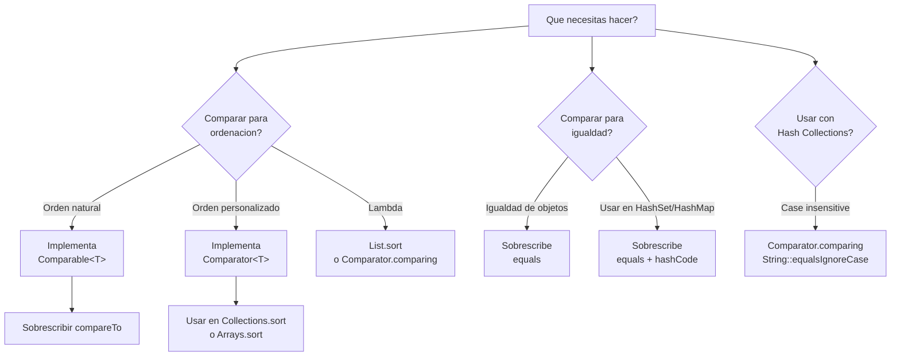

# 4. Comparación y Ordenación en Java

La comparación y ordenación son operaciones fundamentales en programación. Java proporciona interfaces y mecanismos robustos para definir cómo se comparan y ordenan los objetos mediante el **Java Collections Framework**.

## Diagrama de Decisión: ¿Qué elegir?



## ¿Cuándo Usar Cada Interfaz?

| **Escenario**                                    | **Interfaz/Método**                | **Método Principal**          |
| ------------------------------------------------ | ---------------------------------- | ------------------- |
| Definir orden natural de un tipo                 | `Comparable<T>`                    | `compareTo(T)`      |
| Múltiples formas de ordenar                      | `Comparator<T>`                    | `compare(T x, T y)` |
| Comparación de igualdad lógica                   | `Object.equals()`                  | `equals(Object)`    |
| Ordenación rápida mediante Lambdas               | `Comparator.comparing()`           | Lambda expression   |
| Comparación ignorando mayúsculas                 | `String.CASE_INSENSITIVE_ORDER`    | `Comparator`        |

Para entender la diferencia, piensa en quién tiene la responsabilidad de comparar:

| Característica | **Comparable** | **Comparator** |
| :--- | :--- | :--- |
| **Responsabilidad** | La clase se compara **a sí misma**. | Una clase **externa** compara dos objetos. |
| **Uso principal** | Definir el **orden natural**. | Definir **órdenes alternativos**. |
| **Ubicación** | Dentro de la propia clase (modifica código). | Fuera de la clase (no necesita modificarla). |
| **Método** | `obj1.compareTo(obj2)` | `comparador.compare(obj1, obj2)` |
| **Flexibilidad** | Solo puedes tener **un** orden natural. | Puedes tener **múltiples** comparadores. |

!!! abstract "Analogía: La Carrera"
    *   **Comparable**: Es como si cada corredor tuviera una regla interna para saber si ha llegado antes que otro (por ejemplo, por su dorsal). Es su comportamiento por defecto.
    *   **Comparator**: Es como un **juez externo**. Dependiendo del juez, el ganador puede ser el más rápido, el más joven, o el que tiene la camiseta más brillante. Puedes cambiar de juez sin cambiar la naturaleza de los corredores.

!!! tip "¿Cuál elegir?"
    -   **Usa `Comparable`** si hay un criterio de orden que es el "lógico" o "por defecto" para esa clase (ej: ID de empleado, orden alfabético) y tienes acceso al código de la clase.
    -   **Usa `Comparator`** cuando necesites otros criterios secundarios (por fecha, por precio, por relevancia) o cuando la clase **no sea tuya** (librerías externas).

---

## 4.1. Interfaz `Comparable<T>`

### 4.1.1. Fundamentos

La interfaz `Comparable<T>` se implementa en la propia clase para definir su **orden natural** (por ejemplo, el orden alfabético para Strings o numérico para Integers).

```java
public interface Comparable<T> {
    int compareTo(T other);
}
```

**Método `compareTo(T other)`:**

- **Número negativo**: si `this` es menor que `other`.
- **Cero (0)**: si `this` es igual a `other`.
- **Número positivo**: si `this` es mayor que `other`.

### 4.1.2. Implementación

```java
public class Persona implements Comparable<Persona> {
    private String nombre;
    private String apellido;
    private int edad;

    // Constructores, getters y setters...

    @Override
    public int compareTo(Persona other) {
        if (other == null) return 1;
        
        // Comparación por apellido
        int comparacion = this.apellido.compareTo(other.apellido);
        if (comparacion != 0) return comparacion;
        
        // Si el apellido es igual, comparar por nombre
        return this.nombre.compareTo(other.nombre);
    }
}
```

!!! warning "Importante: El Contrato de `Comparable`"
    Al implementar `compareTo`, debes cumplir:

    1.  **Simetría**: Si `x.compareTo(y) > 0`, entonces `y.compareTo(x) < 0`.
    2.  **Transitividad**: Si `x < y` y `y < z`, entonces `x < z`.
    3.  **Consistencia**: Se recomienda que si `x.compareTo(y) == 0`, entonces `x.equals(y)` sea `true`.

### 4.1.3. Uso con Arrays y Listas

```java
Persona[] personasArray = { /* ... */ };
Arrays.sort(personasArray); // Usa compareTo interno

List<Persona> lista = new ArrayList<>();
Collections.sort(lista); // Usa compareTo interno
```

### 4.1.4. Casos de uso habituales en colecciones

Implementar `Comparable` no solo sirve para "poder ordenar", sino que es un requisito fundamental para que muchas piezas del Java Collections Framework funcionen correctamente:

1.  **Ordenación Automática (`TreeSet` y `TreeMap`)**:
    Si añades objetos a un `TreeSet` o los usas como clave en un `TreeMap`, Java necesita `compareTo` para saber dónde colocar cada elemento en el árbol interno. Sin él, el código lanzará una `ClassCastException`.
    
    !!! example "Ejemplo: Ranking de jugadores"
        Si los jugadores se comparan por puntos, el `TreeSet` los mantendrá ordenados siempre.

2.  **Obtención de extremos (`min` y `max`)**:
    La clase `Collections` proporciona métodos para encontrar el elemento más pequeño o más grande de cualquier colección que implemente `Comparable`.
    ```java
    List<Double> temperaturas = Arrays.asList(21.5, 18.0, 32.2, 15.0);
    Double minima = Collections.min(temperaturas); // Usa el compareTo de Double
    Double maxima = Collections.max(temperaturas);
    ```

3.  **Búsqueda eficiente (`binarySearch`)**:
    Para buscar un elemento en una lista gigante de forma instantánea (tiempo logarítmico), la lista debe estar ordenada y sus elementos deben ser comparables.
    ```java
    Collections.sort(miLista); // Primero ordenamos
    int posicion = Collections.binarySearch(miLista, objetoBuscado);
    ```

!!! tip "¿Cuándo es obligatorio implementar Comparable?"
    Siempre que crees una clase que represente una **entidad con un orden lógico único** (como `Factura` por número, `Producto` por código o `Estudiante` por expediente), impleméntala. Facilitará enormemente su uso con cualquier estructura de datos de Java.

---

## 4.2. Interfaz `Comparator<T>`

### 4.2.1. Fundamentos

`Comparator<T>` es una interfaz funcional que permite definir **órdenes alternativos** sin modificar la clase original.

```java
public interface Comparator<T> {
    int compare(T o1, T o2);
}
```

### 4.2.2. Implementación Tradicional

```java
public class ComparadorPorEdad implements Comparator<Persona> {
    @Override
    public int compare(Persona p1, Persona p2) {
        return Integer.compare(p1.getEdad(), p2.getEdad());
    }
}

// Uso
Collections.sort(listaPersonas, new ComparadorPorEdad());
```

### 4.2.3. Uso moderno con Lambdas y Factory Methods

Java 8+ permite crear comparadores de forma muy fluida:

```java
// 1. Usando Lambda
listaPersonas.sort((p1, p2) -> Integer.compare(p1.getEdad(), p2.getEdad()));

// 2. Usando Comparator.comparing (Recomendado)
listaPersonas.sort(Comparator.comparing(Persona::getEdad));

// 3. Orden descendente
listaPersonas.sort(Comparator.comparing(Persona::getEdad).reversed());

// 4. Múltiples criterios
listaPersonas.sort(Comparator.comparing(Persona::getApellido)
                             .thenComparing(Persona::getNombre));
```

---

## 4.3. Igualdad: `equals()` y `hashCode()`

La comparación de igualdad se basa en sobrescribir los métodos heredados de `Object`.

### 4.3.1. Implementación de Equality

Cuando sobrescribes `equals`, **obligatoriamente** debes sobrescribir `hashCode`.

```java
public class Punto {
    private int x;
    private int y;

    @Override
    public boolean equals(Object o) {
        if (this == o) return true;
        if (o == null || getClass() != o.getClass()) return false;
        Punto punto = (Punto) o;
        return x == punto.x && y == punto.y;
    }

    @Override
    public int hashCode() {
        return Objects.hash(x, y);
    }
}
```

---

## 4.4. Ordenación y Búsqueda

Java ofrece dos clases de utilidad fundamentales para estas tareas: `java.util.Arrays` (para arrays estáticos) y `java.util.Collections` (para listas y otras colecciones).

### 4.4.1. Ordenación eficiente

Ambas clases utilizan algoritmos de ordenación altamente optimizados (como [Timsort](https://en.wikipedia.org/wiki/Timsort)), que garantizan un rendimiento excelente de **O(n log n)**.

*   **Para Arrays**:
    ```java
    int[] numeros = {5, 3, 8, 1};
    Arrays.sort(numeros); // Orden natural
    
    String[] nombres = {"Zoe", "Ana", "Pedro"};
    Arrays.sort(nombres, Collections.reverseOrder()); // Con un comparador
    ```
*   **Para Listas**:
    ```java
    List<String> lista = new ArrayList<>(Arrays.asList("C", "A", "B"));
    
    // Opción antigua (pero vigente)
    Collections.sort(lista);
    
    // Opción moderna (Java 8+) - RECOMENDADA
    lista.sort(Comparator.naturalOrder());
    ```

### 4.4.2. Búsqueda Binaria (`binarySearch`)

La búsqueda binaria es un algoritmo que encuentra la posición de un elemento en tiempo logarítmico. Sin embargo, tiene un requisito ineludible: **la estructura debe estar ordenada previamente**.

!!! warning "¡Cuidado con el desorden!"
    Si intentas hacer un `binarySearch` sobre un array o lista que no está ordenado según el criterio de búsqueda, el resultado será impredecible (normalmente un número negativo erróneo).

**Ejemplo de uso:**
```java
List<Integer> numeros = new ArrayList<>(Arrays.asList(10, 20, 30, 40, 50));
// La lista ya está ordenada

int indice = Collections.binarySearch(numeros, 30); // Devuelve 2
int noEncontrado = Collections.binarySearch(numeros, 25); // Devuelve un número negativo
```

**Beneficios:**

- Búsqueda secuencial (normal): O(n) -> 1.000.000 de elementos = 1.000.000 operaciones.
- Búsqueda binaria: O(log n) -> 1.000.000 de elementos = **~20 operaciones**.


## 4.5. Errores Comunes

**1. Inconsistencia entre Compare y Equals:**
Si `compare(a, b) == 0` pero `a.equals(b)` es falso, colecciones como `TreeSet` o `TreeMap` pueden comportarse de forma inesperada (pueden no permitir añadir el elemento por considerarlo duplicado).

**2. BinarySearch en desorden:**
Intentar una búsqueda binaria sin haber ordenado el array/lista previamente dará resultados impredecibles.

**3. Comparar strings con `==`:**
En Java, `==` compara referencias de memoria. Siempre usa `.equals()` o `compareTo()` para comparar el contenido de las cadenas.

!!! note "💡 Tip: Regla Nemotécnica"

    **"C-E-H" para Java:**

    - **C**ompare devuelve entero (negativo, cero, positivo).
    - **E**quals define la igualdad lógica.
    - **H**ashCode debe ser coherente con `equals`.
