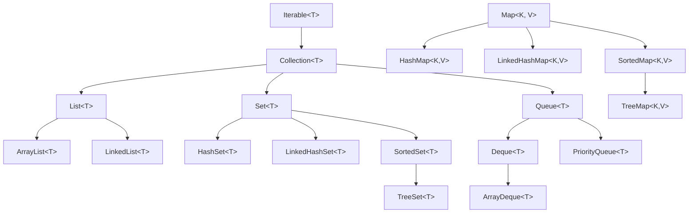

# 5. Colecciones en Java

Las **colecciones** son estructuras de datos que permiten almacenar, organizar y manipular grupos de objetos relacionados. A diferencia de los arrays de tamaño fijo, las colecciones de Java ofrecen dinamismo y una amplia funcionalidad.

## 5.1. Introducción a las Colecciones

### 5.1.1. ¿Qué son las colecciones?

| Aspecto           | Arrays    | Colecciones (JCF)                   |
| ----------------- | --------- | ----------------------------------- |
| **Tamaño**        | Fijo      | Dinámico (en la mayoría)            |
| **Tipo**          | Homogéneo | Homogéneo (Genéricos)               |
| **Funcionalidad** | Básica    | Rica (búsqueda, ordenación, etc.)   |
| **Sintaxis**      | `[]`      | Métodos y propiedades               |
| **Rendimiento**   | Excelente | Muy bueno (depende del tipo)        |

En Java, las colecciones se gestionan a través del **Java Collections Framework (JCF)**, ubicado en el paquete `java.util`.

### 5.1.2. Jerarquía de Interfaces de Java

En Java, casi todas las colecciones heredan de `Iterable` y `Collection`. Los Mapas siguen una jerarquía separada.



### 5.1.3. Colecciones Genéricas (Type-Safe)

Java usa genéricos para garantizar que una colección solo contenga un tipo específico de objetos, evitando errores de conversión en tiempo de ejecución.

```java
// === USO DE GENÉRICOS (Recomendado) ===
List<Integer> listaNumeros = new ArrayList<>();
listaNumeros.add(10);
listaNumeros.add(20);
// listaNumeros.add("texto"); // Error de compilación (Type-safety)

int numero = listaNumeros.get(0); // No requiere casting
```

---

## 5.2. Listas (`List<T>`)

**ArrayList** es la implementación de lista más común. Utiliza un array interno que crece automáticamente.

### 5.2.1. Creación e Inicialización

```java
// 1. Lista vacía
List<String> lista1 = new ArrayList<>();

// 2. Con capacidad inicial (optimiza rendimiento)
List<String> lista2 = new ArrayList<>(100);

// 3. Desde otra colección
List<String> lista3 = new ArrayList<>(lista2);  // Copia de lista2
List<String> lista4 = new ArrayList<>(Arrays.asList("A", "B", "C"));  // Desde un array

// 4. Sintaxis moderna (Java 9+, inmutable)
List<String> lista5 = List.of("uno", "dos", "tres");

// 5. Lista mutable desde una inmutable
List<String> lista6 = new ArrayList<>(List.of("X", "Y"));
```

### 5.2.2. Operaciones Básicas

```java
List<String> frutas = new ArrayList<>();

// add: agregar al final
frutas.add("Manzana");
frutas.add("Banana");
frutas.add("Cereza");

// addAll: agregar múltiples elementos
List<String> masFrutas = Arrays.asList("Pera", "Fresa", "Kiwi");
frutas.addAll(masFrutas);

// add(index, element): insertar en posición específica
frutas.add(0, "Arándano"); // Al inicio

// Acceso por índice
String primera = frutas.get(0);
String ultima = frutas.get(frutas.size() - 1);

// Modificar por índice
frutas.set(2, "Mango");

// Eliminar
frutas.remove("Banana"); // Por valor (primera ocurrencia)
frutas.remove(0);        // Por índice
```

### 5.2.3. Búsqueda y Verificación

```java
List<Integer> numeros = new ArrayList<>(Arrays.asList(10, 20, 30, 40, 50, 30));

// contains: verifica si existe
boolean existe30 = numeros.contains(30);

// indexOf: primera ocurrencia
int indice1 = numeros.indexOf(30);

// lastIndexOf: última ocurrencia
int indice2 = numeros.lastIndexOf(30);

// isEmpty: verifica si está vacía
boolean vacia = numeros.isEmpty();
```

### 5.2.4. Ordenación

En Java, usamos la clase de utilidad `Collections` o el método `sort` de la propia lista.

```java
List<Integer> numeros = new ArrayList<>(Arrays.asList(5, 2, 8, 1, 9));

// Orden natural (ascendente)
Collections.sort(numeros);

// Orden inverso (descendente)
Collections.sort(numeros, Collections.reverseOrder());

// Orden personalizado con lambdas (Java 8+)
List<String> nombres = new ArrayList<>(Arrays.asList("Ana", "Pedro", "Juan"));
nombres.sort((a, b) -> a.length() - b.length()); // Por longitud
```

---

## 5.3. Mapas (`Map<K, V>`)

El **HashMap** es una colección de pares clave-valor donde cada clave es única.

### 5.3.1. Operaciones Básicas

```java
Map<String, Double> precios = new HashMap<>();

// put: agregar o modificar
precios.put("Laptop", 1200.0);
precios.put("Mouse", 25.5);
precios.put("Teclado", 75.0);
precios.put("Mouse", 29.99); // Sobrescribe el valor anterior

// putIfAbsent: solo agrega si la clave no existe
precios.putIfAbsent("Monitor", 300.0);

// get: obtener valor (devuelve null si no existe)
Double precioLaptop = precios.get("Laptop");

// getOrDefault: valor por defecto si no existe
Double precioWebcam = precios.getOrDefault("Webcam", 0.0);

// containsKey / containsValue
boolean tieneMonitor = precios.containsKey("Monitor");

// remove: eliminar por clave
precios.remove("Teclado");
```

### 5.3.2. Recorrer Mapas

```java
Map<String, Integer> edades = new HashMap<>();
edades.put("Ana", 25);
edades.put("Juan", 30);

// 1. Recorrer entradas (Clave + Valor)
for (Map.Entry<String, Integer> entry : edades.entrySet()) {
    System.out.println(entry.getKey() + ": " + entry.getValue());
}

// 2. Usando forEach con Lambdas (Java 8+)
edades.forEach((nombre, edad) -> System.out.println(nombre + " tiene " + edad));

// 3. Recorrer solo claves
for (String nombre : edades.keySet()) {
    System.out.println("Nombre: " + nombre);
}

// 4. Recorrer solo valores
for (Integer edad : edades.values()) {
    System.out.println("Edad: " + edad);
}
```

---

## 5.4. Conjuntos (`Set<T>`)

El **HashSet** no permite duplicados y no garantiza el orden.

### 5.4.1. Operaciones Matemáticas de Conjuntos

```java
Set<Integer> conjuntoA = new HashSet<>(Arrays.asList(1, 2, 3, 4));
Set<Integer> conjuntoB = new HashSet<>(Arrays.asList(3, 4, 5, 6));

// UNIÓN: A ∪ B
Set<Integer> union = new HashSet<>(conjuntoA);
union.addAll(conjuntoB); // {1, 2, 3, 4, 5, 6}

// INTERSECCIÓN: A ∩ B
Set<Integer> interseccion = new HashSet<>(conjuntoA);
interseccion.retainAll(conjuntoB); // {3, 4}

// DIFERENCIA: A - B
Set<Integer> diferencia = new HashSet<>(conjuntoA);
diferencia.removeAll(conjuntoB); // {1, 2}
```

---

## 5.5. Colas y Pilas (`Queue` y `Deque`)

En Java moderno, se recomienda usar **ArrayDeque** tanto para colas como para pilas por su alto rendimiento.

### 5.5.1. Cola (Queue - FIFO)

```java
Queue<String> cola = new LinkedList<>(); // También puede ser ArrayDeque

// add / offer: agregar al final
cola.add("Primer cliente");
cola.offer("Segundo cliente");

// peek: ver el primero sin quitarlo
String primero = cola.peek();

// poll / remove: extraer y quitar el primero
String atendido = cola.poll();
```

### 5.5.2. Pila (Deque como Stack - LIFO)

```java
Deque<String> pila = new ArrayDeque<>();

// push: agregar arriba
pila.push("Plato 1");
pila.push("Plato 2");

// peek: ver el de arriba
String arriba = pila.peek();

// pop: quitar el de arriba
String quitado = pila.pop();
```

---

## 5.6. LinkedList (Lista Enlazada)

Ideal cuando hay muchas inserciones o eliminaciones al principio o en medio de la lista.

```java
LinkedList<String> listaEnlazada = new LinkedList<>();

listaEnlazada.addFirst("Inicio");
listaEnlazada.addLast("Fin");

// Uso de Iteradores para recorrer y modificar de forma segura
Iterator<String> it = listaEnlazada.iterator();
while (it.hasNext()) {
    String valor = it.next();
    if (valor.equals("Borrar")) {
        it.remove(); // Elimina el elemento actual de forma segura
    }
}
```

---

## 5.7. Colecciones Ordenadas (`TreeMap` y `TreeSet`)

Estas colecciones mantienen los elementos ordenados automáticamente.

```java
// TreeMap: Ordenado por clave
Map<String, String> capitales = new TreeMap<>();
capitales.put("España", "Madrid");
capitales.put("Alemania", "Berlín");
// Al recorrer, saldrán por orden alfabético: Alemania, España...

// TreeSet: Ordenado por valor
Set<Integer> ranking = new TreeSet<>();
ranking.add(100);
ranking.add(50);
ranking.add(150);
// Al recorrer: 50, 100, 150
```

---

## 5.8. Resumen y Guía de Selección

| Necesidad | Colección Recomendada | Característica Principal |
| :--- | :--- | :--- |
| Lista de propósito general | **ArrayList** | Acceso rápido por índice O(1) |
| Lista con muchos cambios al inicio | **LinkedList** | Inserción/Borrado rápido O(1) |
| Evitar elementos duplicados | **HashSet** | Búsqueda muy rápida O(1) |
| Mantener elementos ordenados | **TreeSet / TreeMap** | Ordenación automática O(log n) |
| Mapeo Clave-Valor rápido | **HashMap** | Acceso por clave en O(1) |
| Implementar una Pila o Cola | **ArrayDeque** | Más eficiente que `Stack` o `Vector` |

### 5.8.1. Tabla de Complejidad (Big O)

| Colección | Acceso | Búsqueda | Inserción |
| :--- | :--- | :--- | :--- |
| **ArrayList** | O(1) | O(n) | O(1) (amortizado) |
| **LinkedList** | O(n) | O(n) | O(1) |
| **HashSet** | N/A | O(1) | O(1) |
| **HashMap** | O(1) | O(n) | O(1) |
| **TreeMap** | O(log n) | O(log n) | O(log n) |

> **📝 Nota del Profesor**: En Java, evita usar las clases antiguas (legacy) como `Vector`, `Stack` (clase) o `Hashtable`. Estas clases están sincronizadas internamente y son más lentas que sus equivalentes modernas (`ArrayList`, `ArrayDeque`, `HashMap`).
