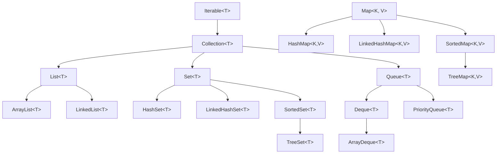
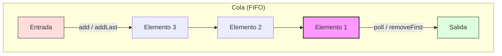
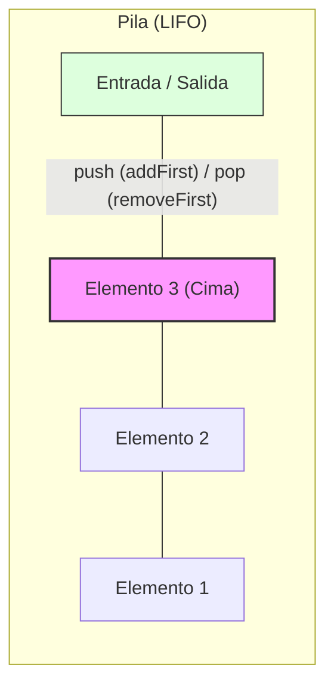
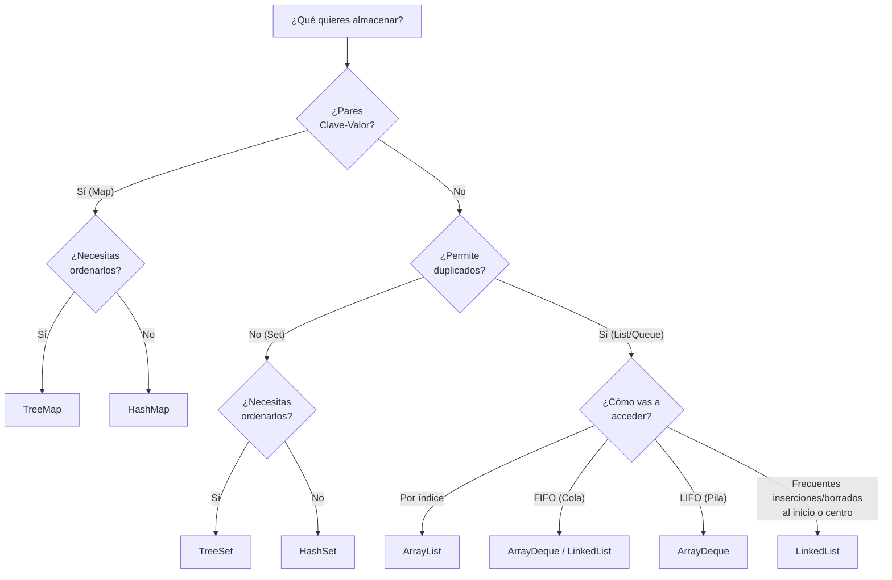
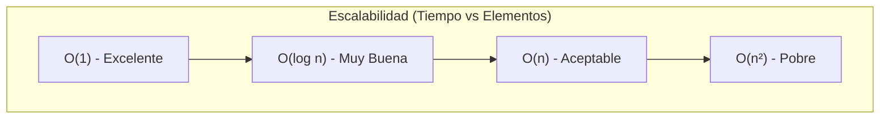

# 5. Colecciones en Java

Las **colecciones** son estructuras de datos que permiten almacenar, organizar y manipular grupos de objetos relacionados. A diferencia de los arrays de tamaño fijo, las colecciones de Java ofrecen dinamismo y una amplia funcionalidad.

## 5.1. Introducción a las Colecciones

### 5.1.1. ¿Qué son las colecciones?

| Aspecto           | Arrays    | Colecciones (JCF)                   |
| ----------------- | --------- | ----------------------------------- |
| **Tamaño**        | Fijo      | Dinámico (en la mayoría)            |
| **Tipo**          | Homogéneo | Homogéneo (Genéricos)               |
| **Funcionalidad** | Básica    | Rica (búsqueda, ordenación, etc.)   |
| **Sintaxis**      | `[]`      | Métodos y propiedades               |
| **Rendimiento**   | Excelente | Muy bueno (depende del tipo)        |

En Java, las colecciones se gestionan a través del **Java Collections Framework (JCF)**, ubicado en el paquete `java.util`.

### 5.1.2. Jerarquía de Interfaces de Java

En Java, casi todas las colecciones heredan de `Iterable` y `Collection`. Los Mapas siguen una jerarquía separada.



### 5.1.3. Colecciones Genéricas (Type-Safe)

Java usa genéricos para garantizar que una colección solo contenga un tipo específico de objetos, evitando errores de conversión en tiempo de ejecución.

```java
// === USO DE GENÉRICOS (Recomendado) ===
List<Integer> listaNumeros = new ArrayList<>();
listaNumeros.add(10);
listaNumeros.add(20);
// listaNumeros.add("texto"); // Error de compilación (Type-safety)

int numero = listaNumeros.get(0); // No requiere casting
```

---

## 5.2. Listas (`List<T>`)

**ArrayList** es la implementación de lista más común. Utiliza un array interno que crece automáticamente.

### 5.2.1. Creación e Inicialización

```java
// 1. Lista vacía
List<String> lista1 = new ArrayList<>();

// 2. Con capacidad inicial (optimiza rendimiento)
List<String> lista2 = new ArrayList<>(100);

// 3. Desde otra colección
List<String> lista3 = new ArrayList<>(lista2);  // Copia de lista2
List<String> lista4 = new ArrayList<>(Arrays.asList("A", "B", "C"));  // Desde un array

// 4. Sintaxis moderna (Java 9+, inmutable)
List<String> lista5 = List.of("uno", "dos", "tres");

// 5. Lista mutable desde una inmutable
List<String> lista6 = new ArrayList<>(List.of("X", "Y"));
```

### 5.2.2. Operaciones Básicas

```java
List<String> frutas = new ArrayList<>();

// add: agregar al final
frutas.add("Manzana");
frutas.add("Banana");
frutas.add("Cereza");

// addAll: agregar múltiples elementos
List<String> masFrutas = Arrays.asList("Pera", "Fresa", "Kiwi");
frutas.addAll(masFrutas);

// add(index, element): insertar en posición específica
frutas.add(0, "Arándano"); // Al inicio

// Acceso por índice
String primera = frutas.get(0);
String ultima = frutas.get(frutas.size() - 1);

// Modificar por índice
frutas.set(2, "Mango");

// Eliminar
frutas.remove("Banana"); // Por valor (primera ocurrencia)
frutas.remove(0);        // Por índice
```

### 5.2.3. Búsqueda y Verificación

```java
List<Integer> numeros = new ArrayList<>(Arrays.asList(10, 20, 30, 40, 50, 30));

// contains: verifica si existe
boolean existe30 = numeros.contains(30);

// indexOf: primera ocurrencia
int indice1 = numeros.indexOf(30);

// lastIndexOf: última ocurrencia
int indice2 = numeros.lastIndexOf(30);

// isEmpty: verifica si está vacía
boolean vacia = numeros.isEmpty();
```

### 5.2.4. Ordenación

En Java, usamos la clase de utilidad `Collections` o el método `sort` de la propia lista.

```java
List<Integer> numeros = new ArrayList<>(Arrays.asList(5, 2, 8, 1, 9));

// Orden natural (ascendente)
Collections.sort(numeros);

// Orden inverso (descendente)
Collections.sort(numeros, Collections.reverseOrder());

// Orden personalizado con lambdas (Java 8+)
List<String> nombres = new ArrayList<>(Arrays.asList("Ana", "Pedro", "Juan"));
nombres.sort((a, b) -> a.length() - b.length()); // Por longitud
```

---

## 5.3. Mapas (`Map<K, V>`)

El **HashMap** es una colección de pares clave-valor donde cada clave es única.

### 5.3.1. Operaciones Básicas

```java
Map<String, Double> precios = new HashMap<>();

// put: agregar o modificar
precios.put("Laptop", 1200.0);
precios.put("Mouse", 25.5);
precios.put("Teclado", 75.0);
precios.put("Mouse", 29.99); // Sobrescribe el valor anterior

// putIfAbsent: solo agrega si la clave no existe
precios.putIfAbsent("Monitor", 300.0);

// get: obtener valor (devuelve null si no existe)
Double precioLaptop = precios.get("Laptop");

// getOrDefault: valor por defecto si no existe
Double precioWebcam = precios.getOrDefault("Webcam", 0.0);

// containsKey / containsValue
boolean tieneMonitor = precios.containsKey("Monitor");

// remove: eliminar por clave
precios.remove("Teclado");
```

### 5.3.2. Recorrer Mapas

```java
Map<String, Integer> edades = new HashMap<>();
edades.put("Ana", 25);
edades.put("Juan", 30);

// 1. Recorrer entradas (Clave + Valor)
for (Map.Entry<String, Integer> entry : edades.entrySet()) {
    System.out.println(entry.getKey() + ": " + entry.getValue());
}

// 2. Usando forEach con Lambdas (Java 8+)
edades.forEach((nombre, edad) -> System.out.println(nombre + " tiene " + edad));

// 3. Recorrer solo claves
for (String nombre : edades.keySet()) {
    System.out.println("Nombre: " + nombre);
}

// 4. Recorrer solo valores
for (Integer edad : edades.values()) {
    System.out.println("Edad: " + edad);
}
```

---

## 5.4. Conjuntos (`Set<T>`)

El **HashSet** no permite duplicados y no garantiza el orden.

### 5.4.1. Operaciones Matemáticas de Conjuntos

```java
Set<Integer> conjuntoA = new HashSet<>(Arrays.asList(1, 2, 3, 4));
Set<Integer> conjuntoB = new HashSet<>(Arrays.asList(3, 4, 5, 6));

// UNIÓN: A ∪ B
Set<Integer> union = new HashSet<>(conjuntoA);
union.addAll(conjuntoB); // {1, 2, 3, 4, 5, 6}

// INTERSECCIÓN: A ∩ B
Set<Integer> interseccion = new HashSet<>(conjuntoA);
interseccion.retainAll(conjuntoB); // {3, 4}

// DIFERENCIA: A - B
Set<Integer> diferencia = new HashSet<>(conjuntoA);
diferencia.removeAll(conjuntoB); // {1, 2}
```

---

## 5.5. Colas y Pilas (`Queue` y `Deque`)

En Java, aunque existen interfaces específicas, la implementación más eficiente para ambas estructuras suele ser **ArrayDeque**. También se puede usar `LinkedList`, ya que implementa tanto `List` como `Deque`.

### 5.5.1. Cola (Queue - FIFO: First In, First Out)

Una **Cola** funciona como una fila de supermercado: el primero en llegar es el primero en ser atendido. Se inserta por un extremo (final) y se extrae por el otro (frente).



**Métodos principales:**

- `add(e)` / `addLast(e)`: Añade un elemento al final de la cola.
- `poll()` / `removeFirst()`: Recupera y elimina el primer elemento. Devuelve `null` si está vacía.
- `peek()` / `getFirst()`: Recupera el primer elemento sin eliminarlo.

!!! example "Ejemplo de uso: Fila de Impresión"
    Imagina una impresora que recibe documentos de varios usuarios. Los documentos deben imprimirse en el orden en que llegaron.
    ```java
    Queue<String> filaImpresion = new ArrayDeque<>();

    // Llegan documentos
    filaImpresion.add("Examen_Final.pdf");
    filaImpresion.add("Lista_Clase.docx");
    filaImpresion.addLast("Horario.pdf");

    // Procesamos la cola
    while (!filaImpresion.isEmpty()) {
        System.out.println("Imprimiendo: " + filaImpresion.poll());
    }
    ```

### 5.5.2. Pila (Stack - LIFO: Last In, First Out)

Una **Pila** funciona como una pila de platos: el último que pones encima es el primero que quitas. Solo se tiene acceso al elemento superior (cima).



**Métodos principales:**

- `push(e)` / `addFirst(e)`: Añade un elemento en la parte superior.
- `pop()` / `removeFirst()`: Elimina y devuelve el elemento superior.
- `peek()` / `getFirst()`: Devuelve el elemento superior sin eliminarlo.

!!! example "Ejemplo de uso: Historial del Navegador"
    Cuando navegas por internet, cada nueva página se añade al historial. Al pulsar "Atrás", vuelves a la última página visitada (la cima de la pila).
    ```java
    Deque<String> historial = new ArrayDeque<>();

    // Visitamos páginas
    historial.push("google.com");
    historial.push("github.com");
    historial.push("stackoverflow.com");

    // El usuario pulsa el botón "Atrás"
    String ultimaPagina = historial.pop(); // Devuelve "stackoverflow.com"
    System.out.println("Volviendo de: " + ultimaPagina);
    System.out.println("Ahora estás en: " + historial.peek()); // Estás en "github.com"
    ```

---

## 5.6. LinkedList vs ArrayList

Aunque ambas implementan la interfaz `List`, su funcionamiento interno es radicalmente distinto, lo que afecta a su rendimiento según el uso.

### 5.6.1. Diferencias Clave

| Característica | ArrayList | LinkedList |
| :--- | :--- | :--- |
| **Estructura** | Basada en un Array dinámico. | Basada en Nodos doblemente enlazados. |
| **Acceso Aleatorio** | Muy rápido: `get(index)` es **O(1)**. | Lento: debe recorrer la lista hasta el índice **O(n)**. |
| **Inserción/Borrado** | Lento: debe desplazar el resto de elementos. | Muy rápido en los extremos **O(1)**. |
| **Memoria** | Menor consumo (solo almacena datos). | Mayor consumo (almacena dato + punteros). |

### 5.6.2. ¿Cuándo usar cada una?

- Usa **`ArrayList`** por defecto. Es el más eficiente para lectura y para añadir elementos al final (que es lo más común).
- Usa **`LinkedList`** solo si tu aplicación realiza constantemente inserciones y eliminaciones en el **inicio** o en el **medio** de la lista, o si la usas específicamente como una **Cola** o **Pila**.

```java
// Ejemplo de eficiencia en inserción de LinkedList
LinkedList<String> lista = new LinkedList<>();
lista.addFirst("Cabeza"); // Operación O(1)
lista.addLast("Cola");   // Operación O(1)
```

---

## 5.7. Colecciones Ordenadas (`TreeMap` y `TreeSet`)

A diferencia de `HashMap` y `HashSet`, que no garantizan ningún orden, estas colecciones mantienen sus elementos ordenados de forma automática siguiendo una estructura de **Árbol Roji-Negro** (un tipo de árbol binario de búsqueda auto-equilibrado).

### 5.7.1. El mecanismo de ordenación

Para que estas estructuras funcionen, los elementos (o las claves en el mapa) deben ser comparables entre sí. Existen dos formas de definir este orden:

1.  **Orden Natural (`Comparable<T>`)**: El objeto guardado implementa la interfaz `Comparable` y define el método `compareTo`. Es el que usan por defecto tipos como `String`, `Integer` o `LocalDate`.
2.  **Orden Personalizado (`Comparator<T>`)**: Se le proporciona un objeto `Comparator` al constructor de la colección para definir una regla de ordenación distinta (por ejemplo, ordenar cadenas por su longitud en lugar de alfabéticamente).

### 5.7.2. TreeSet (Conjunto Ordenado)

Es ideal cuando necesitas un conjunto de elementos únicos que siempre estén ordenados y quieres realizar búsquedas de rangos.

!!! example "Ejemplo: Gestión de una Agenda alfabética"
    ```java
    Set<String> alumnos = new TreeSet<>();
    alumnos.add("Zaira");
    alumnos.add("Bernardo");
    alumnos.add("Álvaro");
    alumnos.add("Bernardo"); // Duplicado, se ignora

    // Al imprimir, el orden será: Álvaro, Bernardo, Zaira
    System.out.println("Lista de alumnos: " + alumnos);
    ```

### 5.7.3. TreeMap (Mapa Ordenado por Clave)

Mantiene los pares clave-valor ordenados según la **clave**. Es muy útil para generar listados ordenados o diccionarios.

!!! example "Ejemplo: Diccionario de Códigos de Error"
    ```java
    Map<Integer, String> errores = new TreeMap<>();
    errores.put(500, "Internal Server Error");
    errores.put(404, "Not Found");
    errores.put(200, "OK");
    errores.put(403, "Forbidden");

    // Al recorrerlo, saldrán ordenados por el código numérico: 200, 403, 404, 500
    for (var entry : errores.entrySet()) {
        System.out.println(entry.getKey() + " -> " + entry.getValue());
    }
    ```

!!! tip "Rendimiento O(log n)"
    Debido a su estructura de árbol, operaciones como `add`, `remove` y `contains` tienen una complejidad logarítmica. Son ligeramente más lentas que las versiones `Hash` (que son O(1)), pero ofrecen el beneficio del orden.

---

## 5.8. Resumen y Guía de Selección

### 5.8.1. Diagrama de Decisión: ¿Qué elegir?



### 5.8.2. Tabla Comparativa General

| Necesidad | Colección Recomendada | Característica Principal |
| :--- | :--- | :--- |
| Lista de propósito general | **ArrayList** | Acceso rápido por índice O(1) |
| Lista con muchos cambios al inicio | **LinkedList** | Inserción/Borrado rápido O(1) |
| Evitar elementos duplicados | **HashSet** | Búsqueda muy rápida O(1) |
| Mantener elementos ordenados | **TreeSet / TreeMap** | Ordenación automática O(log n) |
| Mapeo Clave-Valor rápido | **HashMap** | Acceso por clave en O(1) |
| Implementar una Pila o Cola | **ArrayDeque** | Más eficiente que `Stack` o `Vector` |

### 5.8.1. Tabla de Complejidad (Big O)

| Colección | Acceso | Búsqueda | Inserción |
| :--- | :--- | :--- | :--- |
| **ArrayList** | O(1) | O(n) | O(1) (amortizado) |
| **LinkedList** | O(n) | O(n) | O(1) |
| **HashSet** | N/A | O(1) | O(1) |
| **HashMap** | O(1) | O(n) | O(1) |
| **TreeMap** | O(log n) | O(log n) | O(log n) |

!!! note "Nota del Profesor"
    En Java, evita usar las clases antiguas (legacy) como `Vector`, `Stack` (clase) o `Hashtable`. Estas clases están sincronizadas internamente y son más lentas que sus equivalentes modernas (`ArrayList`, `ArrayDeque`, `HashMap`).

---

# Anexo: Complejidad Algorítmica (Notación Big O)

La **Notación Big O** es la forma en que los programadores medimos la eficiencia de un algoritmo o una estructura de datos. No medimos segundos (porque eso depende del procesador), sino **cómo aumenta el tiempo de ejecución a medida que crece el número de elementos ($n$)**.

### Principales Niveles de Complejidad

| Notación | Nombre | ¿Qué significa? | Ejemplo en Colecciones |
| :--- | :--- | :--- | :--- |
| **O(1)** | **Constante** | El tiempo es siempre el mismo, sea 1 elemento o 1 millón. | `ArrayList.get(i)`, `HashMap.put()` |
| **O(log n)** | **Logarítmica** | El tiempo crece muy poco aunque los datos crezcan mucho. | `TreeSet.add()`, `TreeMap.get()` |
| **O(n)** | **Lineal** | El tiempo crece en la misma proporción que los datos. | Recorrer una lista con un `for`, `contains()` en una lista |
| **O(n²)** | **Cuadrática** | El tiempo aumenta al cuadrado. Muy ineficiente para datos grandes. | Bucles anidados (ej. comparar todos con todos) |

### Comparativa Visual Proporcional



### ¿Por qué es vital elegir bien?
Si tienes 100 elementos, la diferencia entre O(n) y O(n^2) es pequeña. Pero si tienes **1.000.000** de elementos:

- Un algoritmo **O(n)** daría 1.000.000 de pasos (instantáneo).
- Un algoritmo **O(n²)** daría **1.000.000.000.000** de pasos (podría tardar horas o días).

Por eso, entender la complejidad te permite elegir la colección adecuada (como un `HashMap` en lugar de un `ArrayList` para búsquedas frecuentes) y escribir código que escale correctamente.
