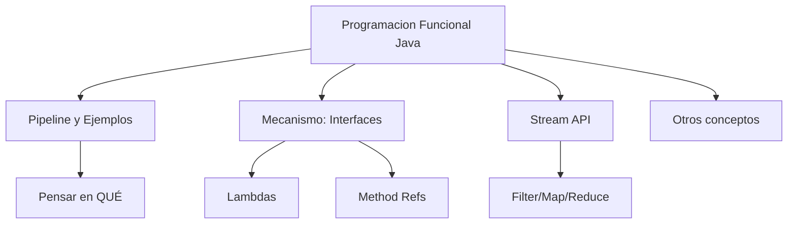
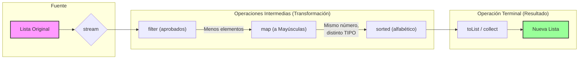

# 3. Programación Funcional en Java

Históricamente, hemos aprendido a programar de forma **imperativa**. Sin embargo, el mundo del software ha evolucionado hacia un modelo más **declarativo** (funcional). Entender este cambio es clave para cualquier desarrollador moderno.

## 3.1. De lo Imperativo a lo Declarativo

Para entender la diferencia, imagina que estás en un restaurante:

*   **Estilo Imperativo (El "Cómo"):** Entras en la cocina y le das instrucciones detalladas al chef: *"Coge un tomate, lávalo, trocéalo en dados de 1cm, ponlo en un bol, añade 5g de sal..."*. Tú controlas cada detalle del proceso y el estado de los ingredientes.
*   **Estilo Declarativo (El "Qué"):** Te sientas en la mesa y pides: *"Quiero una ensalada de tomate"*. No te importa cómo se prepare internamente, solo defines el resultado esperado.

### 3.1.1. ¿Por qué evolucionar?

El código imperativo tiende a llenarse de bucles `for`, variables temporales que cambian de valor (estado mutable) y detalles lógicos que ocultan la verdadera intención del programa. La **Programación Funcional** nace para:

1.  **Reducir Errores:** Al evitar cambiar el estado de las variables (Inmutabilidad).
2.  **Mejorar la Legibilidad:** El código se lee como una serie de transformaciones, no como una lista de tareas.
3.  **Facilitar el Paralelismo:** Es mucho más fácil ejecutar código en varios procesadores si los datos no cambian mientras se procesan.

### 3.1.2. Ciudadanos de Primera Clase

La base de este cambio en Java es que las funciones ahora son **ciudadanos de primera clase**. Esto significa que una función puede:

- **Asignarse a variables.**
- **Pasarse como argumentos** a otros métodos (Inyección de comportamiento).
- **Devolverse como resultado** de otro método.



### 3.1.3. Inmutabilidad y Records

Java moderno fomenta la inmutabilidad mediante los **Records** (introducidos en Java 16). En funcional, preferimos crear "objetos nuevos" en lugar de modificar los existentes.

```java
// Un Record es inmutable por defecto: campos final, sin setters
public record Persona(String nombre, int edad) {
    // En lugar de cambiar 'edad', devolvemos una NUEVA Persona
    public Persona cumplirAnio() {
        return new Persona(this.nombre, this.edad + 1);
    }
}
```

---

## 3.2. ¿Cómo pensamos en funcional? (Mentalidad Pipeline)

Antes de ver la sintaxis técnica, lo más importante es cambiar el "chip". En programación funcional, pensamos en **Pipelines** (tuberías de datos).

!!! example "Ejemplo 1: Filtrar y transformar estudiantes"
    **Reto:** Obtener los nombres en MAYÚSCULAS de los alumnos aprobados (nota >= 5), ordenados alfabéticamente.

    === "Antes (Imperativo)"
        ```java
        // 1. Necesitamos una lista auxiliar para ir guardando resultados
        List<String> resultado = new ArrayList<>();
        
        // 2. Recorremos manualmente toda la colección
        for (Estudiante e : estudiantes) {
            // 3. Comprobamos la condición (Filtro)
            if (e.getNota() >= 5) {
                // 4. Transformamos el dato y lo añadimos a la lista
                resultado.add(e.getNombre().toUpperCase());
            }
        }
        
        // 5. Ordenamos la lista final (Estado mutable)
        Collections.sort(resultado);
        ```

    === "Ahora (Declarativo / Pipeline)"
        ```java
        List<String> resultado = estudiantes.stream()
            .filter(e -> e.getNota() >= 5)      // 1. Qué quiero filtrar
            .map(e -> e.getNombre().toUpperCase()) // 2. Qué quiero transformar
            .sorted()                          // 3. Qué quiero ordenar
            .toList();                         // 4. Qué quiero obtener
        ```

### 3.2.1. Anatomía Visual de un Pipeline

Es fundamental entender que un pipeline **no modifica la lista original**. Imaginalo como una cinta transportadora donde en cada estación ocurre algo:

1.  **`filter`**: Algunos elementos se caen de la cinta (cambia el **número** de elementos).
2.  **`map`**: Los elementos que quedan se transforman en otra cosa (puede cambiar el **tipo** del dato).
3.  **`sorted`**: Se reorganiza el orden de lo que hay en la cinta.



!!! tip "Diferencia entre Filter y Map"
    *   **Filter:** Entran `N` elementos y salen `M` (donde $M \le N$). El tipo de objeto sigue siendo el mismo.
    *   **Map:** Entran `N` elementos y salen `N` elementos, pero transformados (por ejemplo, pasamos de un objeto `Estudiante` a un simple `String`).
    **Reto:** Encontrar el primer producto que cueste menos de 10€ o devolver un aviso de "No encontrado".

    === "Antes (Imperativo)"
        ```java
        // 1. Variable auxiliar para seguir el estado de la búsqueda
        Producto barato = null;
        
        // 2. Recorremos los productos
        for (Producto p : productos) {
            // 3. Si cumple la condición...
            if (p.getPrecio() < 10) {
                // 4. Guardamos y cortamos el bucle (Eficiencia manual)
                barato = p;
                break;
            }
        }
        
        // 5. Gestión manual de posibles nulos (Null Check)
        if (barato != null) {
            System.out.println(barato.getNombre());
        } else {
            System.out.println("No hay productos baratos");
        }
        ```

    === "Ahora (Declarativo / Pipeline)"
        ```java
        productos.stream()
            .filter(p -> p.getPrecio() < 10)
            .findFirst()
            .map(Producto::getNombre)
            .ifPresentOrElse(
                System.out::println,
                () -> System.out.println("No hay productos baratos")
            );
        ```

---

## 3.3. El Mecanismo: Interfaces Funcionales

¿Cómo puede Java tratar una "lógica" como si fuera un objeto? La respuesta son las **Interfaces Funcionales**.

Una interfaz funcional es un **contrato** que tiene exactamente **un método abstracto**.

!!! info "Nota histórica: Las Clases Anónimas"
    Una **Clase Anónima** en Java es una clase que **no tiene nombre** y que se **declara e instancia en una única expresión**. 

    *   **¿Para qué se usan?** Se emplean cuando necesitamos implementar una interfaz (o extender una clase) para un solo uso puntual, sin necesidad de crear un archivo `.java` dedicado para ello.
    *   **¿Por qué no usamos `implements`?** En su sintaxis, el nombre que sigue al `new` es el del "padre" (interfaz o clase). Java sobreentiende la relación: si pones un nombre de Interfaz, *estás implementando*; si pones un nombre de Clase, *estás extendiendo*. Por eso no se escriben esas palabras clave.
    *   **Importancia en Funcional:** Eran la única forma técnica de "pasar comportamiento" como argumento antes de la llegada de las Lambdas (Java 8). Son el puente lógico que conecta la Orientación a Objetos pura con el mundo funcional.

    ```java
    // 1. FORMA NORMAL: Crear una clase con nombre que implementa la interfaz
    class MiSaludador implements Saludador {
        public void saludar(String n) { System.out.println("Hola " + n); }
    }
    Saludador s1 = new MiSaludador();

    // 2. CLASE ANÓNIMA: Se crea la implementación y el objeto "al vuelo"
    Saludador s2 = new Saludador() {
        @Override
        public void saludar(String n) { System.out.println("Hola " + n); }
    };
    ```

### 3.3.1. La evolución: De Clase Anónima a Lambda

Imagina que queremos que un método salude de diferentes formas:

```java
@FunctionalInterface
interface Saludador {
    void saludar(String nombre); 
}
```

=== "Antes (Clase Anónima)"
    ```java
    Saludador formal = new Saludador() {
        @Override
        public void saludar(String nombre) {
            System.out.println("Estimado " + nombre);
        }
    };
    ```

=== "Ahora (Lambda)"
    ```java
    Saludador informal = (nombre) -> System.out.println("¡Hola " + nombre + "!");
    ```

### 3.3.2. El "Kit de herramientas" estándar (`java.util.function`)

| Interfaz | Analogía | Recibe | Devuelve | Uso común |
| :--- | :--- | :--- | :--- | :--- |
| **`Predicate<T>`** | El **Filtro** | Un objeto | `boolean` | `filter()` |
| **`Function<T, R>`**| El **Transformador** | Un objeto | Otro objeto | `map()` |
| **`Consumer<T>`** | El **Gasto** | Un objeto | `nothing` | `forEach()` |
| **`Supplier<T>`** | El **Grifo** | Nada | Un objeto | Generar datos |

### 3.3.3. Inyección de Comportamiento

```java
public class Tienda {
    // Recibe la lógica como un parámetro (Function)
    public static double aplicarDescuento(double precio, Function<Double, Double> logica) {
        return logica.apply(precio);
    }

    public static void main(String[] args) {
        double p = 100.0;
        double conIva = aplicarDescuento(p, precio -> precio * 1.21);
        double oferta = aplicarDescuento(p, precio -> precio - 10);
    }
}
```

---

## 3.4. Referencias a Métodos (`::`)

Es el nivel máximo de síntesis. Si una Lambda solo llama a un método que ya existe, usamos `::`.

| Tipo | Lambda equivalente | Referencia a Método |
| :--- | :--- | :--- |
| **Estático** | `(n1, n2) -> Math.max(n1, n2)` | `Math::max` |
| **Objeto específico** | `s -> System.out.println(s)` | `System.out::println` |
| **Objeto arbitrario** | `s -> s.toLowerCase()` | `String::toLowerCase` |
| **Constructor** | `() -> new ArrayList<>()` | `ArrayList::new` |

---

## 3.5. El Stream API

Los **Streams** son la implementación real de los Pipelines en Java.

### 3.5.1. Partes de un Stream
1. **Source (Fuente)**: `lista.stream()`
2. **Operaciones Intermedias**: Son "lazy" (no se ejecutan hasta el final). Devuelven un nuevo Stream.
3. **Operación Terminal**: Cierra el stream y genera el resultado.

### 3.5.2. Operaciones Comunes

```java
List<Integer> numeros = List.of(1, 2, 3, 4, 5, 6, 7, 8, 9, 10);

int resultado = numeros.stream()
    .filter(n -> n % 2 == 0)             // Filter: Solo pares
    .map(n -> n * 2)                     // Map: Duplicar
    .sorted()                            // Sort: Ordenar
    .limit(3)                            // Limit: Solo los 3 primeros
    .reduce(0, Integer::sum);            // Reduce: Sumar todo (terminal)

System.out.println(resultado); // (2+4+6) = 12
```

---

## 3.6. Manejo de Nulos: `Optional<T>`

`Optional` es un contenedor que evita el uso de `null`.

```java
Optional<String> nombre = buscarEnBaseDeDatos(id);

nombre.map(String::toUpperCase)
      .ifPresentOrElse(
          System.out::println,
          () -> System.out.println("No se encontró el nombre")
      );
```

---

## 3.7. Pattern Matching en Java (v17+)

```java
public String obtenerDescripcion(Object obj) {
    return switch (obj) {
        case Integer i -> "Es un entero de valor " + i;
        case String s && s.length() > 5 -> "Es un texto largo: " + s;
        case null -> "Es nulo";
        default -> "Tipo desconocido";
    };
}
```

!!! important "Regla de Oro"
    Un **Stream** no es una estructura de datos (no almacena datos), es una **vía de paso** de datos donde aplicas funciones de transformación. Una vez que usas una operación terminal, el stream se cierra y no se puede reutilizar.
