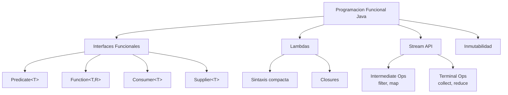

# 3. Programación Funcional en Java

La programación funcional es un paradigma que trata las funciones como **ciudadanos de primera clase**. En Java, este enfoque se introdujo con fuerza en Java 8 y ha seguido evolucionando, permitiéndonos escribir código más declarativo, expresivo y menos propenso a errores.

## 3.1. Conceptos Fundamentales

En el paradigma funcional, las funciones pueden:
- **Asignarse a variables** (usando Interfaces Funcionales).
- **Pasarse como argumentos** (Inyección de comportamiento).
- **Devolverse como resultado** (Fábricas de lógica).



### 3.1.1. Inmutabilidad y Records

Java moderno fomenta la inmutabilidad mediante los **Records** (introducidos en Java 16).

```java
// Un Record es inmutable por defecto: campos final, sin setters
public record Persona(String nombre, int edad) {
    // Podemos crear métodos que devuelven nuevas instancias
    public Persona cumplirAnio() {
        return new Persona(this.nombre, this.edad + 1);
    }
}
```

---

## 3.2. Interfaces Funcionales

Para que Java pueda tratar una función como un objeto, utiliza **Interfaces Funcionales** (aquellas que tienen exactamente **un** método abstracto).

### 3.2.1. Las 4 interfaces clave en `java.util.function`

| Interfaz | Firma | Propósito | Ejemplo Lambda |
| :--- | :--- | :--- | :--- |
| **`Predicate<T>`** | `T -> boolean` | Filtrar / Validar | `n -> n > 10` |
| **`Function<T, R>`**| `T -> R` | Transformar datos | `s -> s.length()` |
| **`Consumer<T>`** | `T -> void` | Consumir / Acción | `s -> System.out.println(s)` |
| **`Supplier<T>`** | `() -> T` | Proveer / Generar | `() -> Math.random()` |

### 3.2.2. Pasar funciones como parámetros

Esta es la base de la **Inyección de Comportamiento**.

```java
public class Calculadora {
    // El tercer parámetro es una función que acepta dos Double y devuelve un Double
    public static double ejecutar(double a, double b, BinaryOperator<Double> operacion) {
        return operacion.apply(a, b);
    }

    public static void main(String[] args) {
        // Pasamos la lógica como si fuera un dato
        double suma = ejecutar(10, 5, (x, y) -> x + y);
        double multi = ejecutar(10, 5, (x, y) -> x * y);
    }
}
```

---

## 3.3. Referencias a Métodos (`::`)

Las referencias a métodos son una sintaxis aún más compacta que las lambdas cuando estas solo llaman a un método existente.

| Tipo de Referencia | Sintaxis | Equivalente Lambda |
| :--- | :--- | :--- |
| **Método Estático** | `Integer::sum` | `(a, b) -> Integer.sum(a, b)` |
| **Instancia Específica** | `objeto::metodo` | `x -> objeto.metodo(x)` |
| **Instancia Arbitraria** | `String::toUpperCase` | `s -> s.toUpperCase()` |
| **Constructor** | `ArrayList::new` | `() -> new ArrayList<>()` |

**Ejemplo de uso:**

```java
List<String> nombres = Arrays.asList("ana", "pedro", "juan");

// Usando Lambda
nombres.forEach(s -> System.out.println(s));

// Usando Referencia a Método (más limpio)
nombres.forEach(System.out::println);
```

---

## 3.4. El Stream API

Los **Streams** son la joya de la corona de la programación funcional en Java. Permiten procesar colecciones de datos de forma fluida y declarativa.

### 3.4.1. El Pipeline de un Stream

Un Stream siempre se compone de tres partes:

1. **Source (Fuente)**: `lista.stream()`
2. **Intermediate Operations (Transformación)**: Son "lazy", no se ejecutan hasta el final.
3. **Terminal Operation (Resultado)**: Ejecuta todo el proceso.

### 3.4.2. Operaciones Principales

```java
List<Integer> numeros = List.of(1, 2, 3, 4, 5, 6, 7, 8, 9, 10);

int resultado = numeros.stream()
    .filter(n -> n % 2 == 0)             // Filter: Solo pares
    .map(n -> n * 2)                     // Map: Duplicar
    .sorted()                            // Sort: Ordenar
    .limit(3)                            // Limit: Solo los 3 primeros
    .reduce(0, Integer::sum);            // Reduce: Sumar todo (terminal)

System.out.println(resultado); // (2+4+6) = 12
```

### 3.4.3. Recolección de resultados (`collect`)

```java
List<String> filtrados = nombres.stream()
    .filter(s -> s.startsWith("A"))
    .map(String::toUpperCase)
    .collect(Collectors.toList()); // Convierte el stream de vuelta a una lista
```

---

## 3.5. Manejo de Nulos: `Optional<T>`

En programación funcional, se evitan los `null` para prevenir el famoso `NullPointerException`. `Optional` es un contenedor que puede o no tener un valor.

```java
Optional<String> nombre = buscarEnBaseDeDatos(id);

// Forma funcional de manejar el resultado
nombre.map(String::toUpperCase)
      .ifPresent(System.out::println);

// Proporcionar un valor por defecto
String valor = nombre.orElse("Desconocido");
```

---

## 3.6. Pattern Matching en Java (v17+)

Java ha introducido expresiones `switch` mucho más potentes similares a la programación funcional.

```java
public String obtenerDescripcion(Object obj) {
    return switch (obj) {
        case Integer i -> "Es un entero de valor " + i;
        case String s && s.length() > 5 -> "Es un texto largo: " + s;
        case null -> "Es nulo";
        default -> "Tipo desconocido";
    };
}
```

!!! important "Regla de Oro"
    Un **Stream** no es una estructura de datos (no almacena datos), es una **vía de paso** de datos donde aplicas funciones de transformación. Una vez que usas una operación terminal, el stream se cierra y no se puede reutilizar.
