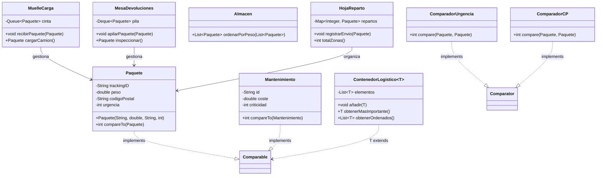

En esta serie de ejercicios, vamos a subir de nivel. Te convertirás en el desarrollador principal del centro logístico **Amazon-Z**. Tendrás que gestionar paquetes, devoluciones y rutas de reparto utilizando estructuras FIFO, LIFO y sistemas de ordenación avanzada.

En lugar de un menú interactivo, trabajaremos con **Desarrollo Guiado por Tests (TDD)**. Tienes a tu disposición un proyecto base con los esqueletos de las clases y un test que validará tu código.

## 🛠️ Estructura del Proyecto

El código base se encuentra en el archivo [`03-base-amazon-z.zip`](./03-base-amazon-z.zip). Debes implementar la lógica en las clases dentro de `src/main/java`.

---

## 📊 Mapa del Sistema (Diagrama de Clases)

Antes de empezar, visualiza cómo interactúan las piezas de tu sistema:



---

## 📦 Ejercicio 0: La Entidad `Paquete`

**Tarea**: Implementa la clase `Paquete`.
- **Atributos**: `trackingID` (String), `peso` (double), `codigoPostal` (String), `urgencia` (int).
- **Constructor**: Debe inicializar todos los atributos.
- **Getters**: Para todos los atributos mencionados.

---

## 🚛 Ejercicio 1: La Cinta de Carga (FIFO - Queue)

**Escenario**: Los paquetes llegan al muelle de salida y se colocan en una cinta transportadora. El primero en llegar a la cinta debe ser el primero en entrar al camión.

??? info "Concepto: FIFO (First-In, First-Out)"
    Es como una fila de espera. Usaremos la interfaz `Queue` y la implementación `ArrayDeque` o `LinkedList`.

**Tarea**: Implementa la clase `MuelleCarga`.
- **Método** `void recibirPaquete(Paquete p)`: Añade el paquete a la cola.
- **Método** `Paquete cargarCamion()`: Extrae el siguiente paquete de la cinta.
    - **Retorno**: El objeto `Paquete` extraído o `null` si la cinta está vacía.

---

## 🔄 Ejercicio 2: El Almacén de Devoluciones (LIFO - Stack)

**Escenario**: Las devoluciones se van apilando en una mesa. El operario siempre coge el que está **arriba de la pila**.

??? info "Concepto: LIFO (Last-In, First-Out)"
    Es como una pila de platos. Usaremos la interfaz `Deque` (Double Ended Queue).

**Tarea**: Implementa la clase `MesaDevoluciones`.
- **Método** `void apilarPaquete(Paquete p)`: El paquete llega y se pone encima de los demás.
- **Método** `Paquete inspeccionar()`: Extrae el paquete que está en la cima de la pila.
    - **Retorno**: El objeto `Paquete` de la cima o `null` si no hay nada.

---

## ⚖️ Ejercicio 3: Orden Natural de Carga (Comparable)

**Escenario**: Queremos que, por defecto, los paquetes se ordenen por su **peso** (menor a mayor).

**Tarea**: Haz que `Paquete` implemente `Comparable<Paquete>`. Luego, en `Almacen`, implementa:
- **Método** `List<Paquete> ordenarPorPeso(List<Paquete> lista)`: Ordena la lista recibida por peso.
    - **Retorno**: La lista ya ordenada.

---

## 🚨 Ejercicio 4: Filtros Especiales (Comparator)

**Escenario**: El jefe quiere dos listados nuevos: por **Urgencia** (descendente) y por **Código Postal** (ascendente).

**Tarea**: Crea las clases `ComparadorUrgencia` y `ComparadorCP`.
- **Método** `int compare(Paquete p1, Paquete p2)` en cada clase.

---

## 🗺️ Ejercicio 5: Reparto por Zonas (TreeMap)

**Escenario**: Queremos un mapa donde la clave sea el **Código Postal** y el valor sea el **Paquete**. Las zonas deben estar ordenadas numéricamente de forma automática.

**Tarea**: Implementa la clase `HojaReparto`.
- **Método** `void registrarEnvio(Paquete p)`: Guarda el paquete asociado a su Código Postal.
- **Método** `int totalZonas()`: Indica cuántos códigos postales diferentes hay registrados.

---

## 🏗️ Ejercicio 6: El Almacén Universal (Genéricos)

**Escenario**: Amazon-Z quiere reutilizar su tecnología de organización para otros departamentos. Necesitan un contenedor genérico que funcione con cualquier objeto que se pueda comparar.

**Tarea 1**: Implementa la clase `Mantenimiento`.
- **Atributos**: `id` (String), `coste` (double), `criticidad` (int de 1 a 10).
- **Orden Natural**: Debe implementar `Comparable` basándose en la **criticidad** (de mayor a menor).

**Tarea 2**: Crea la clase genérica `ContenedorLogistico<T extends Comparable<T>>`.
- **Atributo**: Una `List<T>` de elementos.
- **Método** `void añadir(T elemento)`: Añade un elemento al contenedor.
- **Método** `T obtenerMasImportante()`: Devuelve el elemento máximo según el orden natural de T.
    - **Retorno**: El objeto `T` más importante.
- **Método** `List<T> obtenerOrdenados()`: Devuelve la lista ordenada.
    - **Retorno**: La lista de tipo `T`.

    ```